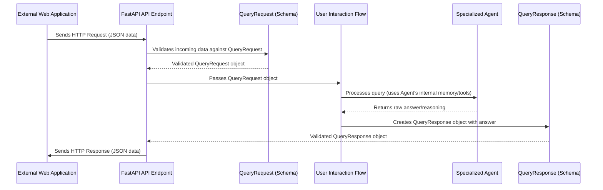

# Chapter 6: Data Schemas

In [Chapter 5: Memory Management](05_memory_management_.md), we learned how `agenticSeek` remembers past conversations and actions, making long, continuous interactions possible. But remembering isn't just about storing text; it's about storing *structured* text that all parts of the system can understand. Imagine trying to build a complex machine where different parts communicate in entirely different languages – it would be a mess!

That's where **Data Schemas** come in!

Think of Data Schemas as the **"blueprints"** or **"contracts"** for all the information exchanged within `agenticSeek`. They define exactly what kind of data should be in a message, like a user's question, and what to expect in a response, like the AI's answer or the results from a tool. This ensures that all parts of `agenticSeek` "speak the same language" and understand each other's messages perfectly, preventing confusion, misinterpretations, and errors in communication.

**The Big Problem It Solves:** Without clear data schemas, `agenticSeek` would be like a chaotic kitchen where chefs yell ingredients at each other without specifying quantities or preparation. Data schemas bring order, ensuring that when one part of the system sends information, the receiving part knows precisely how to interpret it. This is especially vital for the API (Application Programming Interface), where other computer programs interact with `agenticSeek`.

Let's look at a practical example: **A web application wants to send a question to `agenticSeek` and receive a structured answer back.** How does the web app know how to package its question, and how does `agenticSeek` know what kind of answer to send back so the web app can easily use it? Data schemas provide these precise rules.

---

### What are Data Schemas? (Key Concepts)

At their core, data schemas are about defining structure. Here are the key ideas:

1.  **Blueprints/Contracts:** They are like architectural blueprints for data. Just as a blueprint shows where every wall, window, and door should be, a data schema shows every piece of information that belongs in a message, its name, and what kind of value it should hold (e.g., text, number, true/false).
2.  **Consistency:** By using schemas, everyone (every part of `agenticSeek` or external applications) agrees on a common format. This means a "query" always has a "query text" field, and an "answer" always has an "answer text" field, for example.
3.  **Error Prevention:** If data arrives that doesn't match the schema's rules (e.g., a number is sent where text is expected), the system can immediately spot the mistake and flag it, preventing bigger problems later.
4.  **`Pydantic`:** `agenticSeek` uses a powerful Python library called `Pydantic` to create these data schemas. `Pydantic` makes it easy to define these "blueprints" using standard Python classes.
5.  **`BaseModel`:** In `Pydantic`, you create a schema by defining a Python class that "inherits from" (or is built upon) `Pydantic`'s `BaseModel`. This `BaseModel` gives your class all the smart features of `Pydantic` for validation and structure.

---

### How `agenticSeek` Uses Data Schemas (Solving Our Use Case)

Let's revisit our example: A web application sending a question to `agenticSeek` and receiving a structured answer.

As we saw in [Chapter 1: User Interaction Flow](01_user_interaction_flow_.md), `agenticSeek` has a web-based API (Application Programming Interface) handled by `api.py`. This API is where other programs can send requests and get responses. Data schemas are absolutely critical here!

Here's how schemas define the "contract" for communication:

#### 1. The Incoming Request: `QueryRequest`

When a web application sends a question to `agenticSeek`, it needs to follow a specific format. `agenticSeek` expects the question to be structured according to the `QueryRequest` schema. This schema ensures that `agenticSeek` receives all the necessary information, like the actual question text and whether text-to-speech (TTS) is enabled.

```python
# sources/schemas.py (simplified QueryRequest)
from pydantic import BaseModel

class QueryRequest(BaseModel):
    query: str
    tts_enabled: bool = True

    # ... (other helper methods like jsonify are skipped for simplicity) ...
```

**Explanation:**
*   This code defines a blueprint called `QueryRequest`.
*   It's built on `BaseModel`, which means `Pydantic` will automatically check its structure.
*   `query: str` means there *must* be a field named `query`, and its value *must* be text (a string).
*   `tts_enabled: bool = True` means there can be a field named `tts_enabled`, and its value *must* be a true/false (boolean). If not provided, it defaults to `True`.

When the `api.py` receives a web request, it uses this schema to understand the incoming data:

```python
# api.py (simplified - from Chapter 1)
from fastapi import FastAPI
from sources.interaction import Interaction
from sources.schemas import QueryRequest # Import our schema!

api = FastAPI()

# ... interaction setup ...

@api.post("/query")
async def process_query(request: QueryRequest): # Here's the schema in action!
    query_text = request.query # Easily access the query field
    # ... process the query ...
    # ... prepare a response using QueryResponse ...
```

**Explanation:** Notice `request: QueryRequest`. This tells `FastAPI` (the web server framework) to automatically check if the incoming web request matches our `QueryRequest` blueprint. If it doesn't, `FastAPI` will automatically send an error back, preventing bad data from entering the system!

#### 2. The Outgoing Response: `QueryResponse`

After `agenticSeek` processes the query and generates an answer, it needs to send that answer back to the web application. Again, it follows a specific blueprint: `QueryResponse`. This ensures the web app knows exactly where to find the answer, the agent that provided it, and other useful details.

```python
# sources/schemas.py (simplified QueryResponse)
from pydantic import BaseModel

class QueryResponse(BaseModel):
    done: str
    answer: str
    reasoning: str
    agent_name: str
    success: str
    # ... (other fields and helper methods) ...
```

**Explanation:**
*   This defines the blueprint for `agenticSeek`'s answer.
*   It specifies fields like `answer` (the actual response text), `reasoning` (why the AI did what it did), `agent_name` (which agent provided the answer, e.g., "CasualAgent"), and `success` (if the operation was successful).
*   By following this, the web application receiving the response knows exactly what fields to look for and what type of data they will contain.

So, when the `api.py` prepares the response, it ensures it matches this schema:

```python
# api.py (simplified - continued)
# ... inside the process_query function ...
    # ... processing happens, interaction.last_answer is set ...
    if success:
        return QueryResponse( # Create an instance of our response schema!
            done="true",
            answer=interaction.last_answer,
            reasoning=interaction.last_reasoning,
            agent_name=interaction.current_agent.agent_name,
            success="true",
            blocks={} # No specific blocks for this simple case
        ).jsonify() # Convert to a format suitable for web (like JSON)
    else:
        return QueryResponse(done="false", answer="Error", reasoning="",
                             agent_name="unknown", success="false", blocks={}).jsonify()
```

This clear definition of inputs and outputs through schemas makes `agenticSeek`'s API reliable and easy for other applications to use.

#### 3. Internal Data: `executorResult`

Schemas aren't just for external communication! They're also vital for internal messages, like when a [Tool System](04_tool_system_.md) tool gives feedback back to an [Agent System](02_agent_system_.md). The `executorResult` class acts as a structured contract for this internal feedback.

```python
# sources/schemas.py (simplified executorResult)
class executorResult: # Note: This is a regular class, not a Pydantic BaseModel, but still a schema
    def __init__(self, block: str, feedback: str, success: bool, tool_type: str):
        self.block = block
        self.feedback = feedback
        self.success = success
        self.tool_type = tool_type
    
    # ... (other helper methods) ...
```

**Explanation:**
*   Even though `executorResult` is a standard Python class and not a `Pydantic BaseModel`, it still serves the purpose of a schema. It defines exactly what information (block, feedback, success, tool_type) should be contained when a tool finishes its execution.
*   This ensures that when an agent receives a result from, say, the `PyInterpreter` tool, it knows exactly how to get the `feedback` or check the `success` status.

---

### Under the Hood: Building the Blueprints in `sources/schemas.py`

Let's peek behind the curtain to understand how these schemas are organized and used in `agenticSeek`. All the data schemas are centrally defined in the file `sources/schemas.py`.

Here's a simple diagram illustrating how structured data flows with schemas in an API interaction:



As you can see, the schemas act as gates and translators, ensuring that data is correctly formatted at each crucial step of the communication.

Let's look at the actual code in `sources/schemas.py` again, which provides these "blueprints."

#### The `QueryRequest` Schema

```python
# sources/schemas.py
from pydantic import BaseModel # We import BaseModel from Pydantic

class QueryRequest(BaseModel):
    query: str # This field must be text (string)
    tts_enabled: bool = True # This field must be true/false (boolean), defaults to True

    def jsonify(self): # Helper to convert to a dictionary for web responses
        return {
            "query": self.query,
            "tts_enabled": self.tts_enabled,
        }
```

**Explanation:** This class is a `Pydantic` `BaseModel`. When an incoming JSON (a common data format for web APIs) request arrives, `Pydantic` takes that JSON and tries to fit it into this `QueryRequest` shape. If a field like `query` is missing or isn't a string, `Pydantic` automatically catches the error. The `jsonify` method helps convert the Python object back into a simple dictionary, which `FastAPI` can then easily turn into JSON for sending over the web.

#### The `QueryResponse` Schema

```python
# sources/schemas.py
from pydantic import BaseModel

class QueryResponse(BaseModel):
    done: str # Status, e.g., "true" or "false"
    answer: str # The main text of the answer
    reasoning: str # AI's internal thought process
    agent_name: str # Which agent handled the request (e.g., "CasualAgent")
    success: str # Was the operation successful? "true" or "false"
    blocks: dict # Any code or special blocks returned by agents/tools
    status: str # General status message
    uid: str # Unique ID for this interaction

    def jsonify(self): # Helper to convert to a dictionary for web responses
        return {
            "done": self.done,
            "answer": self.answer,
            "reasoning": self.reasoning,
            "agent_name": self.agent_name,
            "success": self.success,
            "blocks": self.blocks,
            "status": self.status,
            "uid": self.uid
        }
```

**Explanation:** This `QueryResponse` class defines the exact structure of the answer `agenticSeek` sends back. Every field has a specific name and expected type (`str` for string, `dict` for dictionary). This makes it very clear for any application consuming `agenticSeek`'s API how to parse and display the results.

#### The `executorResult` Class (Internal Data Structure)

```python
# sources/schemas.py
class executorResult:
    """A class to store the result of a tool execution."""
    def __init__(self, block: str, feedback: str, success: bool, tool_type: str):
        """Initialize with tool execution results."""
        self.block = block # The original code/content block
        self.feedback = feedback # The output/feedback from the tool
        self.success = success # Was the tool execution successful?
        self.tool_type = tool_type # Which tool was used (e.g., "python", "bash")
    
    # ... (methods like jsonify() or show() for display) ...
```

**Explanation:** While not a `Pydantic BaseModel`, `executorResult` still serves as a blueprint for data. It's used internally by agents and tools (from [Chapter 4: Tool System](04_tool_system_.md)) to pass results back in a predictable, structured way. For example, when the `PyInterpreter` runs some code, it bundles the code, its output, and whether it succeeded into an `executorResult` object before handing it back to the agent. This consistency helps the agent understand the results of its actions.

By using these data schemas, `agenticSeek` ensures that all its internal components and external connections communicate effectively, reliably, and without misunderstanding each other.

---

### Conclusion

In this chapter, we've explored **Data Schemas**, the essential "blueprints" or "contracts" that define the structure of information flowing through `agenticSeek`. We learned that schemas, often created using `Pydantic`, ensure consistent, clear, and error-free communication, especially for the API, but also for internal data like tool execution results. This strong foundation for data exchange is what makes `agenticSeek` a robust and reliable system.

You now understand how `agenticSeek` ensures its data "speaks the same language." But what about when `agenticSeek` needs to directly interact with websites, seeing them just like a human would? That's what we'll explore in the next chapter!

[Next Chapter: Browser Automation (BrowserAgent)](07_browser_automation__browseragent__.md)

---

Generated by [AI Codebase Knowledge Builder](https://github.com/The-Pocket/Tutorial-Codebase-Knowledge)