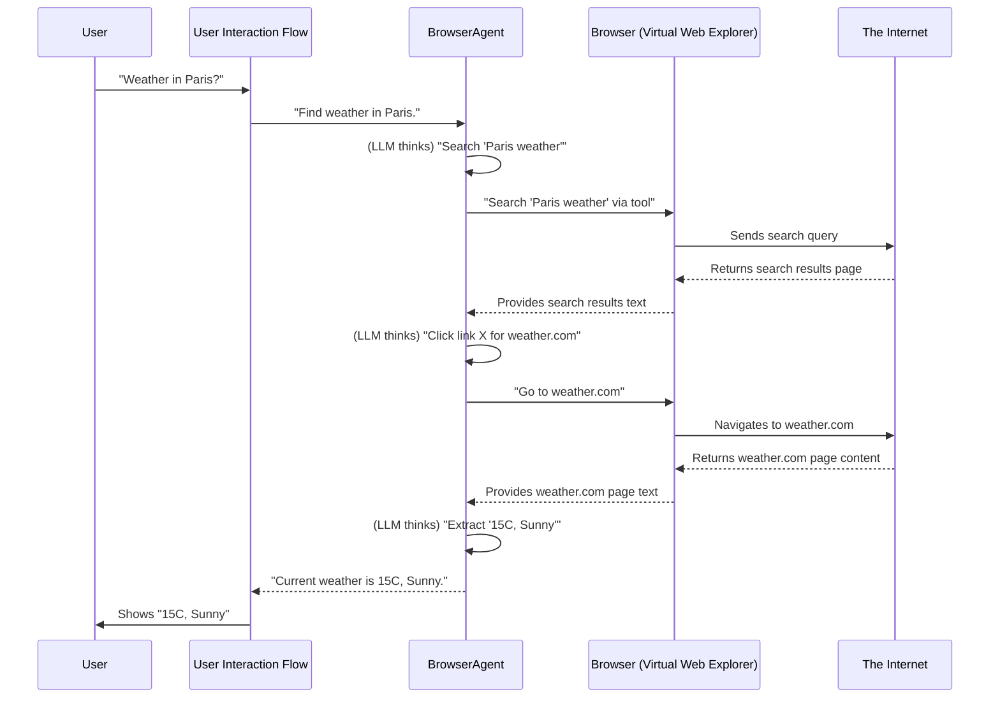

# Chapter 7: Browser Automation (BrowserAgent)

In [Chapter 6: Data Schemas](06_data_schemas_.md), we learned how `agenticSeek` ensures all its internal parts and external connections speak the same structured language. This is great for clear communication, but what if `agenticSeek` needs to find information that isn't stored in its memory or accessible via simple tools? What if it needs to interact with the ever-changing, live internet, just like you do when you open a web browser?

That's where **Browser Automation**, encapsulated within the `BrowserAgent`, comes in!

Imagine `agenticSeek` as a super-smart detective. It can think, process information, and even use tools to run code or manage files. But without a browser, it's like a detective stuck in a library, unable to go out and investigate the world in real-time. The `BrowserAgent` gives `agenticSeek` its own pair of "eyes" and "hands" for the internet. It acts as a virtual web explorer, allowing `agenticSeek` to visit websites, read what's on them, fill out forms, and basically "surf the web" just like a human would.

**The Big Problem It Solves:** A Large Language Model (LLM) on its own has a "brain" full of knowledge up to a certain point in time (its training data). It can't know about today's news, current prices on an e-commerce site, or the latest social media posts. The `BrowserAgent` solves this by giving `agenticSeek` the power to fetch *live, up-to-the-minute information* from any website. This greatly expands `agenticSeek`'s reach and usefulness beyond its internally generated knowledge.

Let's look at a concrete example: **You ask `agenticSeek`, "What is the current weather in Paris?"** This isn't something `agenticSeek` can just "know" from its training data; it needs to look it up on the internet.

---

### What is the `BrowserAgent`? (Key Concepts)

The `BrowserAgent` is a specialized AI expert within `agenticSeek` designed specifically for interacting with the web. Here are its core ideas:

1.  **Virtual Web Explorer:** It's like having a hidden web browser that `agenticSeek` can control directly.
2.  **Browser Driving Technology:** Underneath, it uses special software (like Selenium or Playwright, often called "browser driving technology") to launch a real web browser (like Chrome or Firefox) in the background. This software then sends commands to the browser to navigate, click, type, and extract content.
3.  **Navigation:** It can "type" a URL and go to any website (`go_to`).
4.  **Information Extraction:** It can "read" the text content from a web page (`get_text`).
5.  **Form Filling:** It can "type" into input fields and "click" buttons on forms (`fill_form`).
6.  **Decision Making:** The `BrowserAgent` uses its own LLM "brain" (from [Chapter 3: LLM Integration (Provider)](03_llm_integration__provider__.md)) to decide *what* to search for, *which link* to click on, or *what information* to extract from a page. This is a crucial loop of "think, act, observe, think again."
7.  **Screenshots:** For debugging and better understanding, it can even take screenshots of the web page it's currently viewing!

---

### How to Use the `BrowserAgent` (Solving Our Use Case)

Let's see how `agenticSeek` uses the `BrowserAgent` to answer "What is the current weather in Paris?".

When you give `agenticSeek` this query, the [User Interaction Flow](01_user_interaction_flow_.md) will likely route it to the `PlannerAgent` (from [Chapter 2: Agent System](02_agent_system_.md)), as this is a task requiring external research. The `PlannerAgent` will then decide to delegate this task to the `BrowserAgent`.

Here's the high-level sequence of events:

1.  The `BrowserAgent` receives the task: "Find the current weather in Paris."
2.  It "thinks" (using its LLM) about how to find this. It decides to perform a web search.
3.  It formulates a search query, something like "current weather Paris."
4.  It uses its internal `web_search` tool (from [Chapter 4: Tool System](04_tool_system_.md)) to send this query to a search engine (like SearXNG).
5.  It receives a list of search results (links and snippets).
6.  It "thinks" again, analyzing the search results to pick the most promising link (e.g., a link to a major weather site).
7.  It "navigates" its virtual browser to that chosen link.
8.  Once on the page, it "reads" the page content (gets the text).
9.  It "thinks" again, looking at the page text to find the actual weather information (e.g., "Temperature: 15°C, Sunny").
10. If it finds the answer, it then "concludes" its task and summarizes the findings.
11. If it doesn't find the answer, it might decide to click on another link, go back to search results, or refine its search query.

This continuous cycle of thinking, acting, and observing allows the `BrowserAgent` to autonomously explore the web.

You can initialize `agenticSeek` with the `BrowserAgent` via `cli.py` or `api.py`. Here's a snippet from `cli.py` showing its setup:

```python
# cli.py (simplified)
import asyncio
from sources.interaction import Interaction
from sources.agents import BrowserAgent, PlannerAgent # Import BrowserAgent
from sources.browser import Browser, create_driver # For controlling the browser

async def main():
    # ... setup (LLM Provider, config, etc.) ...

    # 1. Create a browser driver (the actual web browser control)
    browser = Browser(create_driver(headless=True, stealth_mode=False, lang="en"))

    # 2. Add BrowserAgent to the list of available agents
    agents = [
        # ... other agents like CasualAgent, CoderAgent ...
        BrowserAgent(name="Browser",
                     prompt_path="prompts/base/browser_agent.txt",
                     provider=provider, verbose=False, browser=browser),
        PlannerAgent(name="Planner", # Planner often orchestrates BrowserAgent
                     prompt_path="prompts/base/planner_agent.txt",
                     provider=provider, verbose=False, browser=browser)
    ]

    # 3. Initialize Interaction with these agents
    interaction = Interaction(agents, tts_enabled=False, stt_enabled=False)

    # ... main conversation loop ...
```

**Explanation:**
*   First, we create a `Browser` object using `create_driver`. This `Browser` object is what directly controls the underlying web browser (like Chrome). `headless=True` means the browser runs in the background without a visible window.
*   Then, we create an instance of `BrowserAgent`, giving it a `name`, its specific `prompt_path` (which defines its web-browsing personality and goals), an LLM `provider` (its brain), and crucially, the `browser` object we just created.
*   Finally, this `BrowserAgent` is added to the `agents` list, making it available for the `Interaction` flow or `PlannerAgent` to use.

When you run `agenticSeek` and ask "What is the current weather in Paris?", the `PlannerAgent` will likely choose the `BrowserAgent` and instruct it to perform the web search and navigation steps described above.

---

### Under the Hood: The BrowserAgent's Internal Journey

Let's peek behind the curtain to understand what happens step-by-step inside the `BrowserAgent` when it processes a web-related query. The core logic resides in `sources/agents/browser_agent.py`.

Here's a simplified diagram illustrating the flow for finding information:



Let's look at the simplified code snippets from `sources/agents/browser_agent.py` to see how this happens.

#### `BrowserAgent` Initialization (`__init__`)

The `BrowserAgent` needs access to the browser control and a web search tool.

```python
# sources/agents/browser_agent.py (simplified __init__)
from sources.agents.agent import Agent
from sources.tools.searxSearch import searxSearch # A web search tool
from sources.browser import Browser # Our browser control object

class BrowserAgent(Agent):
    def __init__(self, name, prompt_path, provider, verbose=False, browser=None):
        super().__init__(name, prompt_path, provider, verbose, browser)
        self.tools = {
            "web_search": searxSearch(), # The agent's web search tool
        }
        self.browser = browser # The actual browser control passed in
        self.current_page = "" # Keep track of where we are
        self.notes = [] # To store collected info
        # ... other setup like memory, logger ...
```

**Explanation:**
*   It sets up `self.tools` to include `searxSearch`, which is a tool that performs web searches (as covered in [Chapter 4: Tool System](04_tool_system_.md)).
*   Crucially, it stores the `browser` object passed in. This `browser` object (an instance of `sources/browser.py:Browser`) is the direct interface to the underlying browser driving technology.

#### The Core `process` Loop (Simplified)

The `process` method is where the `BrowserAgent`'s web-surfing magic happens. It's an ongoing loop of decision, action, and observation.

```python
# sources/agents/browser_agent.py (simplified process method)
async def process(self, user_prompt: str, speech_module: type) -> Tuple[str, str]:
    complete = False
    
    # 1. Agent thinks: Formulate a search query
    ai_prompt, reasoning = await self.llm_decide(self.search_prompt(user_prompt))
    
    # 2. Agent acts: Perform the web search using the tool
    search_result_raw = self.tools["web_search"].execute([ai_prompt], False)
    search_result = self.jsonify_search_results(search_result_raw) # Parse results

    # Loop to navigate and extract until complete
    while not complete and not self.stop:
        # 3. Agent thinks: Decide which link to navigate to
        prompt = self.make_newsearch_prompt(user_prompt, search_result)
        answer, reasoning = await self.llm_decide(prompt)
        
        links = self.parse_answer(answer) # Extracts link from LLM's text
        link_to_visit = self.select_link(links) # Picks a relevant link
        
        if not link_to_visit: # If no good link, maybe go back or search again
            # ... logic to handle no link or go back ...
            pretty_print("No good link, re-evaluating search...", color="status")
            break # Or continue with new search
        
        # 4. Agent acts: Navigate the actual browser
        nav_ok = self.browser.go_to(link_to_visit)
        if not nav_ok:
            pretty_print(f"Failed to navigate to {link_to_visit}.", color="failure")
            continue # Try again or choose new link
        
        self.current_page = link_to_visit
        self.browser.screenshot() # Take a screenshot for visual feedback

        # 5. Agent observes: Get current page text
        page_text = self.get_page_text(limit_to_model_ctx=True)
        self.navigable_links = self.browser.get_navigable() # Get all links on page

        # 6. Agent thinks: Analyze page, decide next step (extract, fill form, or exit)
        prompt = self.make_navigation_prompt(user_prompt, page_text)
        answer, reasoning = await self.llm_decide(prompt)
        
        if "REQUEST_EXIT" in answer: # LLM indicates task is complete
            complete = True
            break
        
        # ... logic for form filling, errors, or further navigation ...

    # 7. Agent concludes: Summarize findings
    final_prompt = self.conclude_prompt(user_prompt)
    final_answer, final_reasoning = await self.llm_request()
    return final_answer, final_reasoning
```

**Explanation:**

*   **`self.llm_decide(prompt)`:** This is a key helper method within `BrowserAgent` that uses its LLM "brain" to process a `prompt` (like "What should I search for?" or "What link should I click?") and returns the AI's answer. This is where `BrowserAgent` does its "thinking."
*   **`self.tools["web_search"].execute(...)`:** This line calls the `execute` method of the `searxSearch` tool (from [Chapter 4: Tool System](04_tool_system_.md)). It sends the formulated search query to the internet and gets back raw search results.
*   **`self.browser.go_to(link_to_visit)`:** This is the direct command to the `Browser` object, telling it to navigate the actual web browser to a specific URL.
*   **`self.get_page_text(...)`:** This method calls `self.browser.get_text()` to extract all the visible text content from the current web page. This text is then given back to the LLM so it can "read" the page.
*   **`self.browser.screenshot()`:** This instructs the `Browser` object to take a picture of the current page, which can be useful for debugging or verifying actions.
*   The `while not complete` loop is the heart of the autonomous browsing. The agent keeps performing steps (think, act, observe) until its LLM decides the task is `REQUEST_EXIT` (complete).

The prompts like `make_newsearch_prompt` and `make_navigation_prompt` are dynamically generated by the `BrowserAgent` to give its LLM a clear context and instructions based on the current state of the browsing session. This iterative process of thinking, acting through the `Browser` object and `web_search` tool, and then observing the results, is what allows `BrowserAgent` to accomplish complex web-based tasks.

---

### Conclusion

In this chapter, we've explored **Browser Automation (BrowserAgent)**, the powerful capability that gives `agenticSeek` its "eyes" and "hands" to interact with the live internet. We learned that the `BrowserAgent` acts as a virtual web explorer, using underlying browser driving technology and its own LLM brain to navigate, extract information, fill forms, and ultimately find real-time answers to your questions, greatly expanding `agenticSeek`'s knowledge and action capabilities.

You now understand how `agenticSeek` can independently browse the web! This concludes our beginner-friendly tutorial series on the core concepts of `agenticSeek`.

---

Generated by [AI Codebase Knowledge Builder](https://github.com/The-Pocket/Tutorial-Codebase-Knowledge)