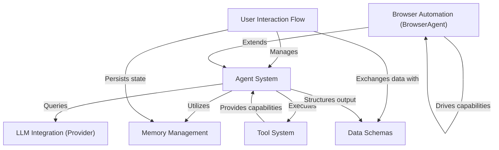

# Tutorial: agenticSeek

AgenticSeek is an **advanced AI system** that acts like a team of specialized experts, each designed to tackle *specific tasks* like coding, browsing the web, or managing files. It functions by intelligently **routing your requests** to the most suitable AI "agent," which then uses various "tools" to perform actions in the real world. The system ensures a **seamless conversation** by remembering past interactions and understanding structured data, allowing it to solve complex problems by *breaking them down* and assigning them to the right specialist.

**Source Repository:** [https://github.com/Fosowl/agenticSeek](https://github.com/Fosowl/agenticSeek)

## Chapters

1. [User Interaction Flow
](01_user_interaction_flow_.md)
2. [Agent System
](02_agent_system_.md)
3. [LLM Integration (Provider)
](03_llm_integration__provider__.md)
4. [Tool System
](04_tool_system_.md)
5. [Memory Management
](05_memory_management_.md)
6. [Data Schemas
](06_data_schemas_.md)
7. [Browser Automation (BrowserAgent)
](07_browser_automation__browseragent__.md)

---

Generated by [AI Codebase Knowledge Builder](https://github.com/The-Pocket/Tutorial-Codebase-Knowledge)