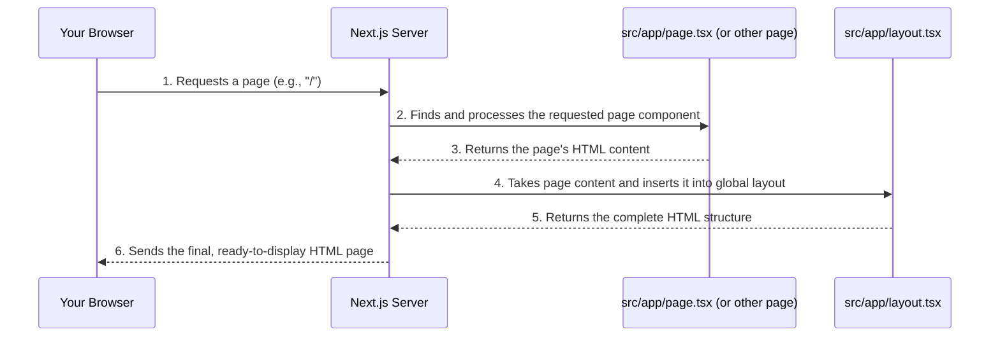

# Chapter 1: Next.js Application Framework

Imagine you want to build a cool website, like `codalytix-web`, which has different sections such as a homepage, a "Vertical Solutions" page, and more. Building a website from scratch, organizing all the files, making sure it loads quickly, and handling different pages can get complicated very fast!

This is where a "framework" comes in handy. Think of a framework like a **pre-built house frame**. Instead of starting with just a plot of land and building everything from scratch (walls, roof, wiring), you get a strong, organized frame already in place. You then just need to add the details like the paint, furniture, and decorations.

For our `codalytix-web` project, that pre-built house frame is **Next.js**.

## What is Next.js?

Next.js is a powerful framework built on top of **React**. React is a JavaScript library used for building user interfaces (the things you see and interact with on a website). Next.js takes React a step further by providing a structured way to:

*   **Create web pages**: Easily make new pages for your website.
*   **Handle routes**: When someone types `www.yourwebsite.com/about` or `www.yourwebsite.com/contact`, Next.js knows which page to show.
*   **Optimize assets**: Make your website fast by automatically handling things like images and code.
*   **Simplify development**: It takes care of many tricky web development tasks behind the scenes, so you can focus on what your website does.

Essentially, Next.js makes building powerful and fast web applications much simpler!

## Building Our Website's Pages with Next.js

Let's look at how Next.js helps us build the main pages for `codalytix-web`.

### The Homepage (`src/app/page.tsx`)

Every website needs a homepage, right? In Next.js, the homepage is usually defined in a file named `page.tsx` (or `.js`, `.jsx`, etc.) inside the `src/app` folder.

For `codalytix-web`, our homepage is defined in `src/app/page.tsx`. This file contains all the content you see when you first visit `http://localhost:3000`.

Here's a simplified look at what that file contains:

```typescript
// src/app/page.tsx
'use client' // This tells Next.js this is client-side code

import Image from 'next/image'

export default function Home() {
  return (
    <>
      <section>
        {/* This is the big headline and description on the homepage */}
        <h1>
          <span>Illuminate Your Code</span> Universe
        </h1>
        <p>
          <b>Codalytix 360 IQ™</b> converts sprawling source-code...
        </p>
        <Image
          src="/codalytix2.gif"
          alt="Codalytix Animated Architecture"
          width={1600}
          height={600}
          unoptimized={true}
        />
      </section>
      {/* ... more sections for features, IFRS, etc. */}
    </>
  )
}
```

**Explanation:**
*   `export default function Home() { ... }` is a React Component. In Next.js, a component exported as `default` from a `page.tsx` file becomes a route.
*   Whatever this `Home` component returns (the stuff inside `return (...)`) is what will be displayed on the page. Here, you can see a main headline (`<h1>`), a description (`<p>`), and an image (`<Image>`).
*   The `Image` component from `next/image` is a special Next.js feature that automatically optimizes images for faster loading!

### Other Pages (`src/app/verticals/page.tsx`)

What if we want another page, like `www.yourwebsite.com/verticals`?

Next.js uses a clever system called **File-system Routing**. This means you just create a new folder inside `src/app` with the name you want for your URL, and then put a `page.tsx` file inside it.

For example, to create the `/verticals` page, we have:

```
src/app/
├── layout.tsx
├── page.tsx          // This creates the "/" homepage
└── verticals/
    └── page.tsx      // This creates the "/verticals" page
```

The `src/app/verticals/page.tsx` file looks very similar to the homepage file:

```typescript
// src/app/verticals/page.tsx
import TechDebtDonut from '@/components/TechDebtDonut'

export default function Verticals() {
  // ... data for solution packs
  return (
    <main>
      <section>
        <h1>Industry Solution Packs</h1>
        <p>Repeatable, high-impact blueprints...</p>
      </section>
      {/* ... grid of solution packs */}
      <div>
        <h3>Typical Tech-Debt Mix</h3>
        <TechDebtDonut />
      </div>
    </main>
  )
}
```

**Explanation:**
This `Verticals` component defines all the content specific to the `/verticals` page, including a heading, description, and even a chart (which we'll learn more about in [Reusable UI Components (Charts)](04_reusable_ui_components__charts__.md)).

### The Global Layout (`src/app/layout.tsx`)

Just like a house frame provides a consistent structure (like where the front door always is, or where the roof always goes), websites often have parts that appear on *every* page, like a navigation bar, a footer, or general styling.

In Next.js, this shared structure is handled by a special file called `src/app/layout.tsx`. This file acts as the **root layout** for your entire website.

```typescript
// src/app/layout.tsx
import type { Metadata } from 'next'
import LayoutShell from '@/components/LayoutShell' // We'll learn about components later!
import './globals.css' // This imports global styles

export const metadata: Metadata = {
  title: 'Codalytix 360 IQ™',
  description: 'AI-powered code-intelligence platform',
}

export default function RootLayout({ children }: { children: React.ReactNode }) {
  return (
    <html lang="en" suppressHydrationWarning>
      <LayoutShell>{children}</LayoutShell> {/* This is where your page content goes! */}
    </html>
  )
}
```

**Explanation:**
*   `export default function RootLayout({ children }) { ... }`: This component wraps around *all* your pages.
*   The magic happens with `{children}`. When Next.js renders a page (like `page.tsx` or `verticals/page.tsx`), it takes that page's content and places it exactly where `{children}` is in `layout.tsx`.
*   `metadata` defines information about your website, like the title that appears in the browser tab.
*   `LayoutShell` is a component that provides the common navigation bar and footer (we'll cover this in detail in [Global Layout and Navigation](02_global_layout_and_navigation_.md)).

This way, all your pages automatically get the same header, footer, and overall structure without you having to add it to every single page file!

## How Next.js Works Under the Hood (A Simple Flow)

Let's understand how Next.js uses these files when you visit `codalytix-web`.



**Step-by-step:**

1.  **You open your browser** and type `http://localhost:3000` (or `codalytix.com`).
2.  **Your browser sends a request** to the Next.js server.
3.  **Next.js looks at the URL** (`/` in this case) and finds the corresponding `page.tsx` file (`src/app/page.tsx`).
4.  **It processes the `page.tsx` file** to generate the specific content for the homepage (the headlines, images, etc.).
5.  **Then, Next.js takes this homepage content** and inserts it into the `RootLayout` component defined in `src/app/layout.tsx`, replacing the `{children}` placeholder.
6.  **Finally, Next.js sends the complete, finished HTML page** back to your browser, which then displays the `codalytix-web` homepage!

This process is super fast and happens automatically. Next.js does a lot of work to make sure this is efficient, even before the page is sent to your browser, which helps your website feel snappy!

You can run this process yourself using the commands in the `README.md` file:

```bash
# From your project folder, run this command
npm run dev
```
This command, defined in `package.json` under the `scripts` section (`"dev": "next dev"`), starts the Next.js development server. You can then open `http://localhost:3000` in your browser.

## Conclusion

In this chapter, we've learned that Next.js acts as the fundamental "house frame" for our `codalytix-web` project. It provides a clear, structured way to build web applications by organizing pages (like `src/app/page.tsx` and `src/app/verticals/page.tsx`) and shared layouts (`src/app/layout.tsx`). This approach simplifies development, handles routing automatically, and optimizes our website for performance.

Next, we'll dive deeper into how `src/app/layout.tsx` and other related files work to create the consistent look and feel of `codalytix-web`, including things like navigation bars and footers.

[Global Layout and Navigation](02_global_layout_and_navigation_.md)

---

Generated by [AI Codebase Knowledge Builder](https://github.com/The-Pocket/Tutorial-Codebase-Knowledge)