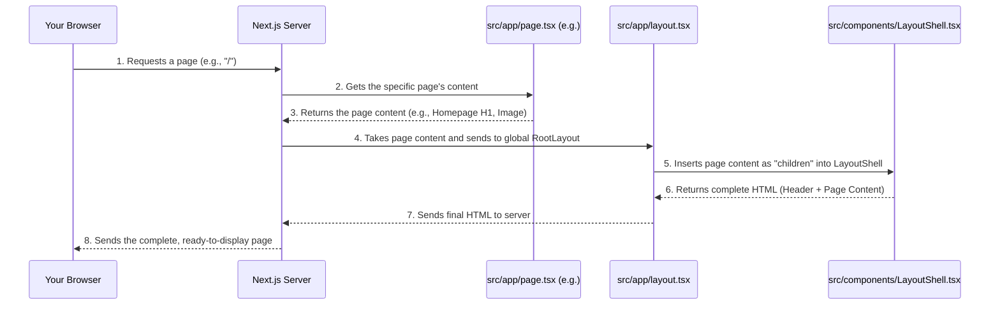

# Chapter 2: Global Layout and Navigation

In [Chapter 1: Next.js Application Framework](01_next_js_application_framework_.md), we learned that Next.js acts like the sturdy "house frame" for our `codalytix-web` project, helping us organize individual pages and providing a main `layout.tsx` file for shared structure.

Now, imagine you're decorating this house. You want every room (every page) to have a consistent look and feel – maybe the same paint color, a similar style of lighting, and a front door that's always in the same place. You wouldn't paint each room's walls individually and then try to make them all match later, would you? That would be a lot of work and easy to get wrong!

This is where "Global Layout and Navigation" comes in. For `codalytix-web`, we need a consistent header with our logo and navigation links, and an overall consistent style across *all* pages. We also want our navigation bar to be smart, highlighting the current section as you scroll down the page.

## What is a Global Layout?

A "global layout" is like a **master blueprint** or a **cookie cutter** for your website. It defines the parts that stay the same on every single page. Think of it as the container that holds all your unique page content.

For `codalytix-web`, this is handled by a special component called `LayoutShell`.

## The `LayoutShell` Component: Your Website's Consistent Blueprint

The `LayoutShell` component is the heart of `codalytix-web`'s global layout. It's responsible for:

1.  **Consistent Structure:** Ensuring every page has the same header (with the Codalytix logo and navigation menu) and overall style.
2.  **Global Styles:** Setting the default fonts and background colors for the entire website.
3.  **Interactive Navigation:** Making the navigation menu "smart" so it automatically highlights the current section as you scroll down a long page.

### Where Does `LayoutShell` Live? (`src/components/LayoutShell.tsx`)

`LayoutShell` is a regular React component, much like the `Home` or `Verticals` components we saw in the previous chapter. It lives in `src/components/LayoutShell.tsx`.

But how does it get applied to *every* page?

Remember `src/app/layout.tsx` from Chapter 1? That's the global layout file for Next.js. It's the file that *uses* our `LayoutShell` component.

Here's a reminder of `src/app/layout.tsx`:

```typescript
// src/app/layout.tsx
import type { Metadata } from 'next'
import LayoutShell from '@/components/LayoutShell' // <--- Here it is!
import './globals.css'

export const metadata: Metadata = {
  title: 'Codalytix 360 IQ™',
  description: 'AI-powered code-intelligence platform',
}

export default function RootLayout({ children }: { children: React.ReactNode }) {
  return (
    <html lang="en" suppressHydrationWarning>
      <LayoutShell>{children}</LayoutShell> {/* <--- Wrapping all pages! */}
    </html>
  )
}
```

**Explanation:**
*   `import LayoutShell from '@/components/LayoutShell'` tells Next.js to bring in our blueprint component.
*   `LayoutShell>{children}</LayoutShell>` is the key. Whatever content `Next.js` prepares for a specific page (like your homepage from `src/app/page.tsx` or the Verticals page from `src/app/verticals/page.tsx`) gets placed exactly where `{children}` is inside `LayoutShell`.

This means `LayoutShell` provides the "frame," and your page content (the `children`) fills that frame!

## Under the Hood: How `LayoutShell` Works

Let's trace how a page is built with `LayoutShell`:



**Step-by-step:**

1.  **You open your browser** and type `http://localhost:3000`.
2.  **Your browser requests** the homepage from the Next.js server.
3.  **Next.js finds** `src/app/page.tsx` and generates its specific content (like the big headline and image).
4.  **Next, Next.js sees** that `src/app/layout.tsx` is wrapping all pages. It sends the homepage content to `RootLayout`.
5.  **Inside `RootLayout`,** our `LayoutShell` component is used. The homepage content is passed into `LayoutShell` as its `children`.
6.  **`LayoutShell` then builds the full page:** it puts together its predefined header (with the logo and navigation), then places the homepage content exactly where `{children}` is, and finally adds any other global elements (like a footer, if it had one).
7.  **The complete HTML** (header + homepage content) is sent back to your browser.
8.  **Your browser displays** the fully structured `codalytix-web` homepage!

This happens seamlessly for every page you visit on `codalytix-web`, ensuring a consistent experience.

## Diving into `LayoutShell.tsx` Code

Let's look at the simplified code for `src/components/LayoutShell.tsx` to understand how it builds the header and manages navigation.

```typescript
// src/components/LayoutShell.tsx
'use client' // Important: This tells Next.js this code runs in the user's browser

import Link from 'next/link'
import Image from 'next/image'
import { useEffect, useState } from 'react' // For interactive features
import { Link as ScrollLink } from 'react-scroll' // For smooth scrolling
import clsx from 'clsx' // Helps apply styles conditionally

// (1) --- Font Setup ---
// These lines import specific fonts for headlines and body text.
// They are used to set the overall look of text on the website.
import { Inter_Tight, IBM_Plex_Sans } from 'next/font/google'
const interTight = Inter_Tight({ /* ... config ... */ variable: '--font-heading' })
const plexSans = IBM_Plex_Sans({ /* ... config ... */ variable: '--font-body' })

export default function LayoutShell({ children }: { children: React.ReactNode }) {
  // (2) --- State for Active Navigation ---
  // `active` keeps track of which navigation item should be highlighted.
  // `useState` helps manage this piece of changing data.
  const [active, setActive] = useState('home')

  // (3) --- Scroll Tracking ---
  // `useEffect` runs code when the component first appears and when it cleans up.
  // Here, it listens for scroll events to update the `active` navigation item.
  useEffect(() => {
    const handleScroll = () => {
      const sections = ['home', 'verticals', 'ifrs', 'contact']
      const scrollY = window.scrollY + 140 // Add offset for sticky header
      for (const id of sections) {
        const el = document.getElementById(id)
        if (el && el.offsetTop <= scrollY && scrollY < el.offsetTop + el.offsetHeight) {
          setActive(id) // Set the active section based on scroll position
        }
      }
    }
    window.addEventListener('scroll', handleScroll) // Start listening
    return () => window.removeEventListener('scroll', handleScroll) // Stop listening when component unmounts
  }, []) // Empty array means this runs once on mount and cleans up on unmount

  // (4) --- The Visual Structure (JSX) ---
  return (
    // The <body> tag sets global font styles and background color.
    <body className={`${interTight.variable} ${plexSans.variable} bg-slate-50 text-slate-900 antialiased font-body`}>
      {/* The <header> contains the logo and navigation bar. */}
      <header className="sticky top-0 z-50 bg-white/80 backdrop-blur">
        <div className="mx-auto flex max-w-6xl items-center justify-between px-6 py-3">
          {/* Logo - clicking takes you to the homepage */}
          <Link href="/" className="text-xl font-semibold font-heading">
            <Image
              src="/Codalytix_logo.png"
              alt="Codalytix Logo"
              width={300}
              height={150}
              className="object-contain"
            />
          </Link>

          {/* Navigation Menu */}
          <nav className="hidden gap-6 md:flex font-body text-sm font-medium">
            {/* Map over section IDs to create navigation links */}
            {['home', 'verticals', 'ifrs', 'contact'].map((id) => (
              <ScrollLink // This component is for smooth scrolling to sections on the same page
                key={id}
                to={id} // The ID of the section to scroll to
                spy // Activates tracking the scroll position
                smooth // Makes the scroll animation smooth
                offset={-100} // Adjusts scroll position due to sticky header
                duration={500} // How long the scroll animation takes
                className={clsx( // `clsx` conditionally applies styles
                  'cursor-pointer hover:text-violet-600 transition-colors capitalize',
                  active === id && 'text-violet-600 font-semibold' // Highlight if active
                )}
              >
                {id} {/* Display the link text (e.g., "Home", "Verticals") */}
              </ScrollLink>
            ))}

            {/* External link to documentation */}
            <Link
              href="https://docs.codalytix.com"
              target="_blank"
              rel="noreferrer"
              className="hover:text-violet-600"
            >
              Docs
            </Link>
          </nav>

          {/* Call to action button */}
          <ScrollLink // Another smooth scroll link, this one for the "Contact" section
            to="contact"
            smooth
            offset={-100}
            duration={500}
            className="rounded-xl bg-violet-600 px-4 py-2 text-white text-sm font-semibold shadow hover:bg-violet-700 cursor-pointer"
          >
            Request Pilot
          </ScrollLink>
        </div>
      </header>

      {/* The <main> tag is where the specific page content will be placed */}
      <main>{children}</main>
    </body>
  )
}
```

**Key parts of the `LayoutShell` explained:**

1.  **`'use client'`:** This is a Next.js special instruction. It tells Next.js that this component needs to run in the user's web browser, not just on the server. This is crucial because `LayoutShell` uses interactive features like `useState` (to track active navigation) and `useEffect` (to listen for scroll events), which only work in a browser environment.
2.  **Font Setup:** The `Inter_Tight` and `IBM_Plex_Sans` lines import custom fonts. The `variable` property makes them available as CSS variables, which means we can easily apply them to different parts of our website's text. We'll learn more about styling in [Styling with Tailwind CSS](03_styling_with_tailwind_css_.md).
3.  **`useState` for Active Navigation (`active`):** Imagine a little sticky note that says "Current Section: Home." `useState` is like that sticky note. It's a special tool from React that lets a component remember a piece of information that might change (like which navigation item is currently highlighted). Here, `active` starts as 'home', and `setActive` is the function we use to change it.
4.  **`useEffect` for Scroll Tracking:** This is a powerful React tool that lets `LayoutShell` react to things happening outside of rendering, like someone scrolling the page.
    *   It adds an "event listener" to the window, so whenever you scroll, `handleScroll` is called.
    *   `handleScroll` checks your current scroll position (`window.scrollY`) and compares it to the positions of different sections on the page (like "home", "verticals", etc., which have `id` attributes).
    *   Based on where you are, it updates the `active` sticky note using `setActive(id)`.
    *   The `return () => window.removeEventListener(...)` part is very important! It's like cleaning up after yourself. When `LayoutShell` is no longer on the screen, it stops listening for scroll events, which is good for performance.
5.  **The Visual Structure (JSX):**
    *   **`<body>`:** This is the main body of your web page. It uses the imported fonts and sets default background and text colors.
    *   **`<header>`:** This section holds the content that appears at the top of every page.
        *   **`Image`:** `LayoutShell` uses the `Image` component from Next.js (just like in `src/app/page.tsx`) to display the Codalytix logo. It's inside a `Link` component, so clicking the logo takes you back to the homepage.
        *   **`<nav>`:** This is where the main navigation links live.
            *   **`ScrollLink`:** For links that scroll smoothly to a section *within* the current page (like "Home" or "Verticals" on the homepage), we use `ScrollLink` from the `react-scroll` library. This provides a much nicer user experience than an abrupt jump.
            *   **`clsx`:** This is a small helper library that makes it easy to add CSS classes conditionally. When `active === id` (meaning the current section matches the navigation item), `clsx` adds the `text-violet-600 font-semibold` classes, making the text purple and bold.
            *   **`Link`:** For external links (like "Docs" which goes to `docs.codalytix.com`), we use the regular `Link` component from Next.js.
    *   **`<main>`:** This is where the magic of `{children}` happens. The unique content of each page (whether it's the homepage, the Vertical Solutions page, or any other) gets inserted right here.

By putting all this logic in `LayoutShell`, we ensure that every page automatically gets the same beautiful and interactive header, without having to write the code again and again!

## Conclusion

In this chapter, we've explored the crucial role of `LayoutShell` in creating a consistent and user-friendly experience for `codalytix-web`. We learned how it acts as the master blueprint, defining the header, navigation, and overall styling, and how `src/app/layout.tsx` uses it to wrap all our page content. We also saw how `LayoutShell` provides dynamic navigation, highlighting the current section as you scroll.

This consistent structure is visually defined using styling. In the next chapter, we'll dive into how `codalytix-web` applies its visual design and styling using a powerful tool called Tailwind CSS.

[Styling with Tailwind CSS](03_styling_with_tailwind_css_.md)

---

Generated by [AI Codebase Knowledge Builder](https://github.com/The-Pocket/Tutorial-Codebase-Knowledge)