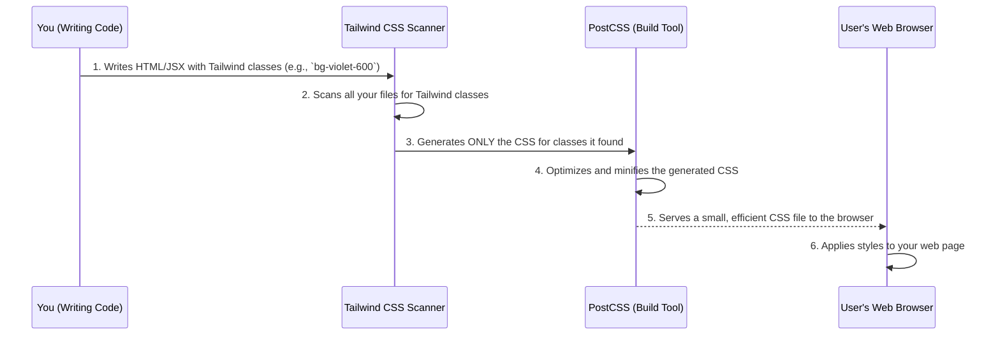

# Chapter 3: Styling with Tailwind CSS

In [Chapter 1: Next.js Application Framework](01_next_js_application_framework_.md), we built the basic "house frame" for `codalytix-web` with Next.js, and in [Chapter 2: Global Layout and Navigation](02_global_layout_and_navigation_.md), we added the consistent "master blueprint" (`LayoutShell`) for our header and overall structure. But imagine you have a house with a perfect frame and blueprint, but all the walls are just plain, unfinished wood. It doesn't look very inviting, does it?

This is where **styling** comes in! Styling is about making your website look good – adding colors, choosing fonts, arranging elements neatly, and making buttons feel clickable. Traditionally, you'd write a lot of custom CSS code in separate files, like telling a painter exactly how to mix every color and where to put every brushstroke. This can become a lot of work, especially on a big website, and sometimes things don't look consistent across different pages.

For `codalytix-web`, we use a special tool called **Tailwind CSS** for styling. Think of Tailwind CSS like a **huge toolbox filled with pre-made, labeled Lego bricks** or a **"paint-by-numbers" kit** for your website. Instead of mixing custom colors or designing shapes from scratch, you pick up a specific "Lego brick" (a small CSS class) and attach it directly to your HTML element.

This approach makes building the look of our website incredibly fast, easy, and consistent!

## What is Tailwind CSS? (The Utility-First Approach)

Tailwind CSS follows a "utility-first" approach. This means it provides thousands of very small, single-purpose CSS classes, called **utility classes**. Each class does one specific thing.

For example:
*   Want to center text? Use `text-center`.
*   Want to make the background a nice violet color? Use `bg-violet-600`.
*   Want to add some space around an element? Use `p-4` (for padding) or `m-8` (for margin).
*   Want bold text? Use `font-bold`.

Instead of writing a custom CSS rule like this:

```css
/* Traditional CSS */
.my-custom-button {
  background-color: #6d28d9; /* A shade of violet */
  padding: 16px 24px;       /* Top/bottom and left/right padding */
  border-radius: 12px;     /* Rounded corners */
  color: white;            /* White text */
  font-weight: 600;        /* Semi-bold text */
  box-shadow: 0 4px 6px rgba(0, 0, 0, 0.1); /* A subtle shadow */
}
```

You would apply a set of Tailwind utility classes directly in your HTML (or JSX, which is like HTML in React/Next.js):

```html
<!-- Styling with Tailwind CSS -->
<button className="bg-violet-600 px-6 py-4 rounded-xl text-white font-semibold shadow">
  Click Me
</button>
```

At first glance, this might look like a lot of classes in one place, but you'll quickly find it's very powerful:

*   **Rapid Development:** You don't leave your HTML file to write CSS. You just add classes directly.
*   **Consistency:** Because you're using pre-defined sizes, colors, and spacings from the Tailwind system, your design naturally stays consistent across your entire application.
*   **Maintainability:** If you need to change how a button looks, you change its classes in one place, right where the button is defined.

## Styling in `codalytix-web`: A Concrete Example

Let's look at the "Request Pilot" button from our `LayoutShell` component (which we discussed in [Chapter 2: Global Layout and Navigation](02_global_layout_and_navigation_.md)). This button is a great example of Tailwind CSS in action.

Here's the simplified JSX for that button:

```typescript
// src/components/LayoutShell.tsx (simplified)
import { Link as ScrollLink } from 'react-scroll'

export default function LayoutShell({ children }: { children: React.ReactNode }) {
  return (
    <body>
      <header>
        {/* ... other header content ... */}
        <ScrollLink
          to="contact" // Tells it to scroll to the element with id="contact"
          smooth
          offset={-100}
          duration={500}
          // (1) --- Tailwind CSS Classes for the Button ---
          className="rounded-xl bg-violet-600 px-4 py-2 text-white text-sm font-semibold shadow hover:bg-violet-700 cursor-pointer"
        >
          Request Pilot
        </ScrollLink>
      </header>
      <main>{children}</main>
    </body>
  )
}
```

**Explanation of the `className` attribute (1):**

Let's break down each Tailwind class in `className`:

*   `rounded-xl`: Makes the corners of the button very rounded (extra large radius).
*   `bg-violet-600`: Sets the background color of the button to a specific shade of violet (level 600).
*   `px-4`: Adds horizontal padding (padding on the left and right) of 16 pixels. (`px` means padding on the X-axis).
*   `py-2`: Adds vertical padding (padding on the top and bottom) of 8 pixels. (`py` means padding on the Y-axis).
*   `text-white`: Sets the text color inside the button to white.
*   `text-sm`: Makes the font size small.
*   `font-semibold`: Makes the text semi-bold.
*   `shadow`: Adds a subtle box shadow to the button, making it appear slightly raised.
*   `hover:bg-violet-700`: This is a cool one! It means "when you hover your mouse over this button, change its background color to a darker shade of violet (700)". This creates a nice interactive effect.
*   `cursor-pointer`: Changes the mouse cursor to a pointer hand when hovering, indicating it's clickable.

As you can see, with just a few short, descriptive classes, we've fully styled a button directly in our JSX, without writing any custom CSS rules!

## How Tailwind CSS Works Under the Hood

You might be wondering, "If I'm not writing CSS, where do these classes come from?" That's the magic of Tailwind's build process!

When you use Tailwind CSS, you're not actually including a giant CSS file with all possible classes in your project. Instead, Tailwind works smarter during the development and build phases.



**Step-by-step:**

1.  **You write your code:** As a developer, you add Tailwind utility classes directly to your HTML elements, like the `className` for our "Request Pilot" button.
2.  **Tailwind Scans Your Files:** During the development and build process (when you run `npm run dev` or `npm run build`), Tailwind CSS literally scans *all* your project files (HTML, JSX, etc.).
3.  **It Generates Only What's Needed:** Tailwind identifies every single utility class you've used in your code. Then, it generates a tiny, optimized CSS file containing *only* the CSS rules for those specific classes. If you don't use `bg-red-500`, that rule simply won't be included!
4.  **PostCSS Optimizes:** A tool called PostCSS (which Tailwind uses) further processes and optimizes this generated CSS, making it even smaller and faster to load.
5.  **Browser Receives Efficient CSS:** The user's web browser then downloads this compact CSS file and applies the styles to your `codalytix-web` pages.

This "scan-and-generate" process ensures that your final website's CSS file is as small as possible, leading to faster loading times!

### Where is Tailwind Configured?

Tailwind CSS has a few important files that manage its configuration and integration:

1.  **`src/app/globals.css` (Global Styles):**
    This is where Tailwind CSS is initially "imported" into your project. It also sets up global CSS variables (like the `var(--font-heading)` and `var(--font-body)` we saw in [Chapter 2: Global Layout and Navigation](02_global_layout_and_navigation_.md)) and defines some base styles.

    ```css
    /* src/app/globals.css */
    @import "tailwindcss"; /* (1) Tells PostCSS to include Tailwind's generated styles */
    @import "tw-animate-css"; /* (2) Another CSS library for animations */

    /* (3) Define custom CSS variables for colors, radius, etc. */
    :root {
      --radius: 0.625rem;
      --background: oklch(1 0 0); /* Example: white background */
      --foreground: oklch(0.147 0.004 49.25); /* Example: dark text color */
      --primary: oklch(0.216 0.006 56.043); /* Example: a primary color */
      /* ... many more color variables ... */
    }

    /* (4) Base styles: Tailwind's `@apply` feature to set default styles */
    @layer base {
      * {
        @apply border-border outline-ring/50; /* Apply default border/outline to all elements */
      }
      body {
        @apply bg-background text-foreground; /* Set body background and text color from variables */
      }
    }
    ```

    **Explanation:**
    *   `(1) `@import "tailwindcss";`: This special line tells PostCSS (the tool that processes our CSS during the build) to bring in all the CSS that Tailwind generates from your utility classes.
    *   `(2) `@import "tw-animate-css";`: `codalytix-web` also uses another utility-based CSS library for animations, imported here.
    *   `(3) `:root { ... }`: This section defines CSS variables (like `--background`, `--foreground`, etc.). These variables allow us to customize Tailwind's default colors and sizes without directly changing Tailwind's core. For example, `bg-violet-600` might actually use one of these variables under the hood. It also helps in implementing dark mode easily.
    *   `(4) `@layer base { ... }`: This is a Tailwind feature. It allows us to apply Tailwind utility classes as default styles to basic HTML elements (`*` for all elements, `body`). So, instead of adding `bg-background text-foreground` to every page, we can set it once for the `body` tag here.

2.  **`tailwind.config.js` (Customizing Tailwind):**
    This file is Tailwind CSS's main configuration. It's where you can extend Tailwind's default settings, like adding custom colors, fonts, spacing, or breakpoints for responsive design.

    ```javascript
    // tailwind.config.js
    /** @type {import('tailwindcss').Config} */
    module.exports = {
      content: ['./src/**/*.{ts,tsx}'], // (1) Tells Tailwind where to look for classes
      theme: {
        extend: { // (2) Use `extend` to add custom values without replacing defaults
          fontFamily: {
            heading: ['var(--font-heading)', 'sans-serif'], // (3) Custom font for headings
            body: ['var(--font-body)', 'sans-serif'],     // (4) Custom font for body text
          },
        },
      },
      plugins: [],
    }
    ```

    **Explanation:**
    *   `(1) `content`: This is crucial! It tells Tailwind CSS exactly which files (`.ts` and `.tsx` files inside `src/` folder) it needs to scan to find the utility classes you're using.
    *   `(2) `theme.extend`: This section is where we add our own custom values to Tailwind's design system. `extend` means we're adding *to* the existing Tailwind options, not replacing them entirely.
    *   `(3) & (4) `fontFamily`: Here, we're defining custom font families named `heading` and `body`. Notice they use `var(--font-heading)` and `var(--font-body)`. These CSS variables are defined in `src/app/globals.css` and are connected to the specific fonts imported in `src/components/LayoutShell.tsx` (like `Inter_Tight` and `IBM_Plex_Sans`). This allows us to use classes like `font-heading` or `font-body` directly in our JSX!

3.  **`postcss.config.mjs` (PostCSS Setup):**
    This file is very minimal in `codalytix-web`. It tells PostCSS (the build tool) to use the `@tailwindcss/postcss` plugin, which is essential for Tailwind to function correctly during the build process.

    ```javascript
    // postcss.config.mjs
    const config = {
      plugins: ["@tailwindcss/postcss"], // (1) Tell PostCSS to use Tailwind's plugin
    };

    export default config;
    ```

    **Explanation:**
    *   `(1) `plugins`: This array lists the PostCSS plugins to use. `@tailwindcss/postcss` is the plugin that integrates Tailwind CSS into the build pipeline, allowing it to scan your files and generate the necessary CSS.

These configuration files work together to ensure that Tailwind CSS is correctly integrated, generates optimized CSS, and allows `codalytix-web` to use a consistent design system, including custom fonts and colors.

## Conclusion

In this chapter, we've explored how `codalytix-web` uses **Tailwind CSS** to handle its styling. We learned that Tailwind provides a "toolbox" of small, single-purpose utility classes that are applied directly in your HTML (JSX). This "utility-first" approach allows for incredibly rapid development, ensures a consistent visual design across the entire application, and results in a highly optimized and small CSS file. We also saw how `globals.css` and `tailwind.config.js` are used to configure and extend Tailwind's capabilities, integrating custom fonts and colors.

Next, we'll shift our focus to **reusable UI components**, specifically how `codalytix-web` creates interactive charts that can be used throughout the application without needing to rewrite code for each one.

[Reusable UI Components (Charts)](04_reusable_ui_components__charts__.md)

---

Generated by [AI Codebase Knowledge Builder](https://github.com/The-Pocket/Tutorial-Codebase-Knowledge)