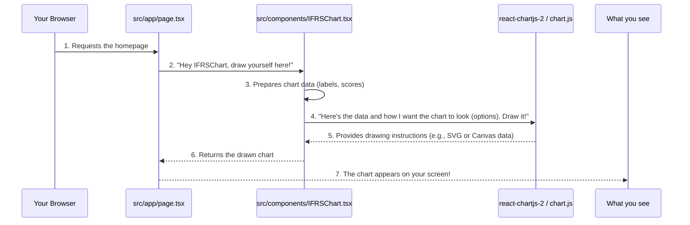

# Chapter 4: Reusable UI Components (Charts)

In [Chapter 3: Styling with Tailwind CSS](03_styling_with_tailwind_css_.md), we learned how `codalytix-web` uses a "toolbox" of small utility classes to make its pages look great. We can change colors, fonts, and spacing with ease. But what if we want to display complex information, like how well our code aligns with financial standards (IFRS) or a breakdown of technical debt, not just with text, but with engaging visuals?

Imagine you have a complex recipe. You could write out every ingredient and step each time you want to make that dish. Or, you could write the recipe once, give it a name (like "Apple Pie Recipe"), and then just refer to it whenever you want to make an apple pie.

In web development, when we have pieces of our user interface (UI) that are used in multiple places, like a chart, a button, or a navigation menu, we don't want to copy and paste their code everywhere. That would be messy and hard to update!

This is where **Reusable UI Components** come in. For `codalytix-web`, we use them to display data visualizations, especially **charts**.

## What are Reusable UI Components (Charts)?

Think of a reusable UI component as a **specialized widget** or a **"chart-making machine"**.

*   It's a self-contained piece of code that knows how to do one specific job really well.
*   For charts, this "machine" takes in some raw numbers or data as "ingredients" (we call these **props** in React).
*   Then, it processes those ingredients and "cooks up" a beautiful, easy-to-understand graphical display – a chart!

The `codalytix-web` application uses these "chart-making machines" to show important insights, like the "IFRS Readiness Snapshot" or the "Typical Tech-Debt Mix" (as seen on the homepage).

By using reusable components, we get several benefits:

*   **Consistency:** All our charts will look and behave the same way, creating a unified experience.
*   **Efficiency:** We write the chart logic once and use it many times, saving development effort.
*   **Easy Updates:** If we want to change how all bar charts look, we just change the "recipe" in one place, and all charts automatically update!

## Using Chart Components in `codalytix-web`

`codalytix-web` uses a popular set of tools for making charts: `react-chartjs-2` and `chart.js`. `chart.js` is the core library that draws the charts, and `react-chartjs-2` helps us use `chart.js` easily within our React/Next.js components.

Let's see how `codalytix-web` uses these reusable chart components on its homepage (`src/app/page.tsx`).

### The IFRS Readiness Chart

On the homepage, there's a bar chart showing "IFRS Readiness Scores". This chart is a reusable component called `IFRSChart`.

Here's how `src/app/page.tsx` uses it:

```typescript
// src/app/page.tsx (simplified)
'use client'

import IFRSChart from '@/components/IFRSChart' // 1. Import our chart component

export default function Home() {
  return (
    <>
      {/* ... other sections ... */}

      <section id="ifrs" className="bg-slate-50 py-24">
        <div className="mx-auto max-w-7xl px-6">
          {/* ... heading and text ... */}
          <div className="grid md:grid-cols-2 gap-12 items-start">
            {/* LEFT: Bullet Points (skipped) */}
            <div>{/* ... points ... */}</div>

            {/* RIGHT: Our IFRS Chart */}
            <div className="h-[480px]">
              <IFRSChart /> {/* 2. Use our chart component like any other HTML tag! */}
            </div>
          </div>
        </div>
      </section>

      {/* ... other sections ... */}
    </>
  )
  
}
```

**Explanation:**

1.  `import IFRSChart from '@/components/IFRSChart'`: This line tells Next.js to bring in our `IFRSChart` component from its file location (`src/components/IFRSChart.tsx`).
2.  `<IFRSChart />`: This is how simple it is to use the reusable component! We just place it like a regular HTML tag. When Next.js builds the page, it sees `<IFRSChart />` and knows to insert the entire bar chart generated by that component right there.

### The Tech-Debt Donut Chart

Similarly, there's a "Typical Tech-Debt Mix" donut chart. This is a reusable component called `TechDebtDonut`. What's great about this one is that it's used in *two* different places in `codalytix-web`: on the homepage (`src/app/page.tsx`) and on the "Vertical Solutions" page (`src/app/verticals/page.tsx`).

Here's a glimpse of how `src/app/verticals/page.tsx` uses `TechDebtDonut`:

```typescript
// src/app/verticals/page.tsx (simplified)
import TechDebtDonut from '@/components/TechDebtDonut' // 1. Import it

export default function Verticals() {
  // ... data for solution packs ...
  return (
    <main className="bg-white">
      {/* ... other sections ... */}
              {/* Tech-Debt Breakdown */}
        <div className="mt-16 flex flex-col items-center">
          <h3 className="mb-6 text-xl font-semibold">Typical Tech-Debt Mix</h3>
          <div className="w-72">
            <TechDebtDonut /> {/* 2. Use it here too! */}
          </div>
        </div>
    </main>
  )
}
```

**Notice:** Both pages use `<TechDebtDonut />` in the exact same way. If we decide to change the colors of the donut chart, we only need to change the code in `src/components/TechDebtDonut.tsx`, and both charts on both pages will update automatically! That's the power of reusability.

## How a Chart Component Works Under the Hood

Let's peek inside one of these "chart-making machines" to understand how it takes data and draws a chart. We'll use the `IFRSChart` (`src/components/IFRSChart.tsx`) as our example.



**Step-by-step:**

1.  **You visit the homepage** in your browser.
2.  **Next.js renders `src/app/page.tsx`**. When it reaches the spot for the IFRS chart, it essentially says to the `IFRSChart` component, "Hey, draw yourself here!"
3.  **`IFRSChart` component wakes up.** It has its own "recipe" inside. First, it identifies the "ingredients" – the categories (like 'Business', 'Technical') and their corresponding scores (numbers).
4.  **`IFRSChart` tells the `chart.js` library:** "Here's my data, and here are all the rules for how I want this bar chart to look (colors, font sizes, scales, etc.). Please draw it for me!"
5.  **The `chart.js` library does the heavy lifting.** It takes all the data and options and generates the actual visual elements of the chart.
6.  **`IFRSChart` receives the drawing instructions** from the library and inserts them into the page.
7.  **The chart appears on your screen!**

### Inside `IFRSChart.tsx`

Let's look at the simplified code for `src/components/IFRSChart.tsx`:

```typescript
// src/components/IFRSChart.tsx
'use client' // (1) Tells Next.js this code needs browser features

import { Bar } from 'react-chartjs-2' // (2) Import the Bar chart component
import 'chart.js/auto' // (3) Make sure Chart.js is ready to draw

// (4) Define the "ingredients" (data) for our chart
const categories = [
  'Business', 'Technical', 'Product Mgt', 'Sales', 'Cost-Value',
  'Marketing', 'IP/Thought', 'Hyperscaler', 'Engagement', 'Responsible AI',
]
const scores = [4, 5, 4, 4, 4, 4, 5, 3, 4, 4]

export default function IFRSChart() {
  return (
    <Bar
      data={{ // (5) This is where we pass our data
        labels: categories, // The labels for each bar (like 'Business')
        datasets: [ // We can have multiple sets of data, here's just one
          {
            label: 'Readiness Score',
            data: scores, // The actual score numbers
            backgroundColor: '#7C3AED', // Color of the bars (violet-600)
            borderRadius: 8, // Make bar corners slightly rounded
            barThickness: 24, // Width of each bar
          },
        ],
      }}
      options={{ // (6) This is where we customize how the chart looks
        indexAxis: 'y', // Makes it a horizontal bar chart
        scales: { // Configure the X and Y axes
          x: { suggestedMax: 5, ticks: { stepSize: 1, font: { size: 14 } } }, // X-axis settings
          y: { ticks: { font: { size: 14 } } }, // Y-axis settings
        },
        plugins: { legend: { display: false } }, // Hide the legend (the label 'Readiness Score')
        responsive: true, // Chart will resize with its container
        maintainAspectRatio: false, // Don't force a specific height-to-width ratio
      }}
    />
  )
}
```

**Explanation of the code:**

1.  **`'use client'`:** Just like in `LayoutShell` (from [Chapter 2: Global Layout and Navigation](02_global_layout_and_navigation_.md)), this tells Next.js that this component needs to run in the user's web browser. Chart drawing and interactivity happen in the browser, not on the server.
2.  **`import { Bar } from 'react-chartjs-2'`:** We import the specific `Bar` chart component from the `react-chartjs-2` library. This is the "chart-making machine" itself.
3.  **`import 'chart.js/auto'`:** This line makes sure that the core `chart.js` library is loaded and ready to work.
4.  **`categories` and `scores`:** These are simple JavaScript arrays holding the data that our chart will display. `categories` are the labels for each bar (e.g., "Business"), and `scores` are the numbers (e.g., 4, 5).
5.  **`data={{ ... }}`:** This is a very important `prop` (an "ingredient") that we pass to the `<Bar>` component. It's an object that tells the chart *what* data to display.
    *   `labels`: These are the names for each data point (our `categories`).
    *   `datasets`: This is an array of data series. In our case, we only have one series: "Readiness Score." It contains the `data` (our `scores` array) and styling like `backgroundColor`.
6.  **`options={{ ... }}`:** This is another crucial `prop`. It's an object that tells the chart *how* to look. You can customize almost anything here:
    *   `indexAxis: 'y'` makes the bar chart horizontal instead of vertical.
    *   `scales` lets you define how the X and Y axes behave (e.g., `suggestedMax: 5` means the X-axis goes up to 5).
    *   `plugins: { legend: { display: false } }` hides the small box that usually tells you what each color represents, as we only have one data series here.
    *   `responsive: true` ensures the chart automatically adjusts its size to fit the container it's in.
    *   `maintainAspectRatio: false` allows the chart to stretch or shrink freely without trying to keep a fixed height-to-width ratio, which is useful when its parent `div` has a fixed height (like `h-[480px]` in `page.tsx`).

### Inside `TechDebtDonut.tsx`

The `TechDebtDonut` component (`src/components/TechDebtDonut.tsx`) works on the same principles, just using the `<Doughnut>` component instead of `<Bar>` and different `data` and `options` specific to a donut chart:

```typescript
// src/components/TechDebtDonut.tsx (simplified)
'use client'

import { Doughnut } from 'react-chartjs-2' // Import the Doughnut chart component
import 'chart.js/auto'

export default function TechDebtDonut() {
  const data = {
    labels: ['Legacy APIs', 'Deprecated Libs', 'Low Test Coverage', 'Build Scripts'], // Segments of the donut
    datasets: [
      {
        data: [35, 25, 20, 20], // The percentages for each segment
        borderWidth: 2,
        backgroundColor: ['#7c3aed', '#6366f1', '#8b5cf6', '#c084fc'], // Colors for each segment
        hoverOffset: 6, // Makes segment pop out slightly on hover
      },
    ],
  }

  const options = {
    cutout: '65%', // Makes it a donut (hole in the middle)
    plugins: {
      legend: { position: 'bottom', labels: { boxWidth: 12 } }, // Show legend at the bottom
    },
    responsive: true,
    maintainAspectRatio: false,
  }

  return <div className="h-[300px] w-full"><Doughnut data={data} options={options} /></div>
}
```

As you can see, both chart components follow a similar structure: they define their specific data and then pass it along with styling `options` to the `react-chartjs-2` component (either `Bar` or `Doughnut`), which then draws the chart.

## Conclusion

In this chapter, we've explored the power of **reusable UI components** in `codalytix-web`, specifically focusing on how they're used to display interactive charts. We learned that these components act like specialized "chart-making machines" that take raw data and options to render beautiful visualizations consistently across the application. By creating components like `IFRSChart` and `TechDebtDonut`, we ensure efficient development and easy maintenance of our data displays.

Next, we'll shift our focus from displaying data to collecting it! We'll learn how `codalytix-web` handles user input through forms, particularly the "Request Pilot" form on the homepage.

[Client-side Form Handling](05_client_side_form_handling_.md)

---

Generated by [AI Codebase Knowledge Builder](https://github.com/The-Pocket/Tutorial-Codebase-Knowledge)