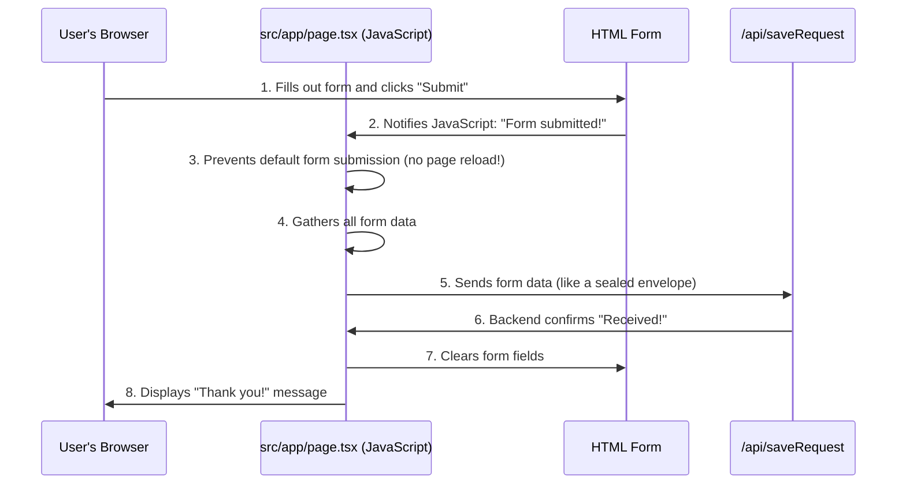

# Chapter 5: Client-side Form Handling

In [Chapter 4: Reusable UI Components (Charts)](04_reusable_ui_components__charts__.md), we learned how to build and display beautiful charts to show off data insights. But what if we want to *collect* information from our website visitors, like their name, email, or a message? For instance, on the `codalytix-web` homepage, there's a "Request Pilot" section with a contact form. When someone fills out this form, we want to capture that information and do something with it, like send it to our team.

Imagine this form as a desk in a busy office. If a visitor fills out a request form and just leaves it on the desk, no one might see it! We need a **dedicated receptionist** who, the moment the form is completed, immediately takes it, processes it, and routes it to the right department.

In web development, we want this process to be smooth and fast, ideally without the whole page reloading every time someone clicks "Submit." This is where **Client-side Form Handling** comes in. It's like having that efficient receptionist built right into your web page, managing the form submission directly in the user's browser.

## What is Client-side Form Handling?

"Client-side" simply means "happening in your web browser." When we talk about client-side form handling, it means that the entire process of managing the form submission – from collecting the data to sending it off – is done by **JavaScript code running directly in your browser**, without needing to reload the entire web page.

Here’s what our "receptionist" (our JavaScript code) needs to do for the contact form:

1.  **Intercept the Submission:** When a user clicks "Submit," forms usually try to reload the page. Our receptionist needs to say, "Hold on! I'll handle this."
2.  **Gather the Data:** Collect all the information typed into the form fields (Name, Company, Email, Message).
3.  **Send it Off:** Package this information nicely and send it to a specific address (our "backend API" – we'll learn more about this in [Chapter 6: Backend API Endpoints](06_backend_api_endpoints_.md)).
4.  **Clean Up:** Clear the form fields, ready for the next submission.
5.  **Confirm:** Show a friendly message like "Thank you! We received your request."

This entire process happens seamlessly in the browser, making the website feel much faster and more responsive.

## How `codalytix-web` Handles Forms

For `codalytix-web`, the contact form on the homepage is located within `src/app/page.tsx`. This page is special because it's the main landing page, and it includes our contact form (`id="contactForm"`).

To manage this form client-side, we use a special tool from React called `useEffect`.

### The `useEffect` Hook: Your Component's After-Party Planner

In React, components primarily deal with displaying information. But sometimes, you need to do things that affect the outside world or listen for events that happen after your component is first shown on the screen, like adding an event listener to a button or a form.

Think of `useEffect` as a **"to-do list"** that React checks *after* your component has finished setting itself up and is visible. It's perfect for things that need to interact with the web browser directly, like grabbing an HTML element by its ID or listening for when a form is submitted.

The code for handling the contact form is placed inside a `useEffect` hook in `src/app/page.tsx`:

```typescript
// src/app/page.tsx (simplified)
'use client' // (1) Remember: This means browser-side code

import { useEffect } from 'react' // (2) Import useEffect

export default function Home() {
  useEffect(() => { // (3) The useEffect "to-do list" starts here
    // (4) ... form handling logic will go here ...
  }, []) // (5) Empty array: run this code once when the page loads

  return (
    <>
      {/* ... your entire homepage content, including the form ... */}
      <section id="contact">
        <form id="contactForm"> {/* (6) Our form with a specific ID */}
          {/* ... input fields and submit button ... */}
          <p id="ackMsg" className="hidden">Thank you! We will get back to you shortly.</p> {/* (7) Confirmation message */}
        </form>
      </section>
    </>
  )
}
```

**Explanation:**

1.  **`'use client'`**: This line (seen in previous chapters) is crucial. It tells Next.js that the code inside this file needs to run in the user's web browser, not on the server. This is essential for interactive elements like forms that directly manipulate the browser's display.
2.  **`import { useEffect } from 'react'`**: We bring in the `useEffect` tool from React.
3.  **`useEffect(() => { ... }, [])`**: This is how you use `useEffect`. The code inside the curly braces `{ ... }` will run when the `Home` component (our homepage) first appears on the screen.
4.  **`// ... form handling logic will go here ...`**: This is where our "receptionist" logic lives.
5.  **`[]` (Empty Array):** This small empty array is important! It tells `useEffect` to run the code *only once* when the `Home` component first loads, and not again unless the component is removed from the screen (which it won't be, since it's the main page).
6.  **`id="contactForm"`**: We give our form a unique `id`. This allows our JavaScript code to easily find this specific form on the page.
7.  **`id="ackMsg" className="hidden"`**: This is our confirmation message. It starts `hidden` (invisible) thanks to Tailwind CSS. Our JavaScript will remove the `hidden` class to make it appear after submission.

## How the Form Submission Works Under the Hood

Let's trace what happens when a user fills out and submits the "Request Pilot" form:



**Step-by-step:**

1.  **You fill out the form** on the `codalytix-web` homepage and click the "Submit Request" button.
2.  **The browser detects the submission.** Because of the `useEffect` hook running in `src/app/page.tsx`, our JavaScript "receptionist" is already listening for this event.
3.  **The JavaScript code intercepts the submission.** It stops the browser from doing its normal page-reloading behavior.
4.  **All the data from the form fields is collected.** Our receptionist gathers all the details.
5.  **The collected data is sent to our backend API.** This is like putting the form in a digital envelope and sending it to `/api/saveRequest` on our server.
6.  **The backend API processes the request** (e.g., saves it to a database) and sends back a confirmation that it was received.
7.  **The JavaScript code clears the form fields.** The form is now empty and ready for another user.
8.  **A "Thank you!" message appears** on the page, letting you know your submission was successful.

All of this happens without a single page reload, making the user experience smooth and fast!

### Diving into the `useEffect` Code

Let's look at the specific code inside `src/app/page.tsx` that performs these steps:

```typescript
// src/app/page.tsx (excerpt for form handling)
'use client'

import { useEffect } from 'react'

export default function Home() {
  useEffect(() => {
    // (1) Find the form and the confirmation message element
    const form = document.getElementById('contactForm') as HTMLFormElement
    const ack = document.getElementById('ackMsg') as HTMLParagraphElement

    // (2) Define what happens when the form is submitted
    const handleSubmit = async (e: Event) => {
      e.preventDefault() // (3) Stop the page from reloading!

      const formData = new FormData(form) // (4) Get all data from the form
      const entry = Object.fromEntries(formData.entries()) // (5) Convert it to a simple object

      await fetch('/api/saveRequest', { // (6) Send data to our backend API
        method: 'POST',
        body: JSON.stringify(entry), // Turn the object into a text string
        headers: { 'Content-Type': 'application/json' }, // Tell the server it's JSON
      })

      form.reset() // (7) Clear the form fields
      ack.classList.remove('hidden') // (8) Show the "Thank you!" message
    }

    // (9) Tell the form to use our handleSubmit function when submitted
    form?.addEventListener('submit', handleSubmit)

    // (10) Cleanup: If the page goes away, stop listening for submissions
    return () => {
      form?.removeEventListener('submit', handleSubmit)
    }
  }, []) // Run once when the component appears
  // ... rest of the Home component (JSX for the page content) ...
}
```

**Explanation of the `useEffect` code:**

1.  **`const form = ...` and `const ack = ...`**: These lines get references to our HTML elements (`form` and `ackMsg`) by their `id`. This is how our JavaScript knows which specific elements to interact with.
2.  **`const handleSubmit = async (e: Event) => { ... }`**: This defines a function named `handleSubmit`. This is the core logic that will run *every time* the form is submitted. It's marked `async` because sending data to the server takes a little time.
3.  **`e.preventDefault()`**: This is the key line for client-side handling! `e` represents the "event" (in this case, the form submission event). `preventDefault()` stops the browser from doing its default action (which is usually reloading the page and sending the form data in a traditional way).
4.  **`const formData = new FormData(form)`**: This creates a `FormData` object from our `form` element. `FormData` is a convenient way to grab all the input values from a form at once.
5.  **`const entry = Object.fromEntries(formData.entries())`**: This line converts the `FormData` object into a regular JavaScript object (`entry`) that's easy to work with. For example, if you had an input `<input name="email" value="test@example.com" />`, `entry` would contain `{ email: "test@example.com", ... }`.
6.  **`await fetch('/api/saveRequest', { ... })`**: This is how JavaScript talks to a server!
    *   `fetch()` is a built-in browser function for making network requests.
    *   `'/api/saveRequest'` is the "address" of the backend API endpoint (our server-side handler) that will receive and process this data.
    *   `method: 'POST'` tells the server we're sending new data.
    *   `body: JSON.stringify(entry)` packages our `entry` object into a JSON string, which is a common format for sending data over the internet.
    *   `headers: { 'Content-Type': 'application/json' }` tells the server that the `body` we're sending is in JSON format.
    *   `await` means "wait here until the server responds before moving on."
7.  **`form.reset()`**: After the data is sent, this clears all the input fields in the form, making it empty again.
8.  **`ack.classList.remove('hidden')`**: This line finds the paragraph with `id="ackMsg"` and removes the `hidden` CSS class from it. Since the `hidden` class (from Tailwind CSS) makes an element invisible, removing it makes the "Thank you!" message appear.
9.  **`form?.addEventListener('submit', handleSubmit)`**: This is the "listening" part. It tells our `form` element: "Whenever a 'submit' event happens, please run the `handleSubmit` function." The `?` (optional chaining) is a safety measure, ensuring this only runs if `form` actually exists.
10. **`return () => { form?.removeEventListener('submit', handleSubmit) }`**: This is a cleanup function that `useEffect` provides. If the `Home` component ever leaves the screen (e.g., if you navigate to another page, though for the homepage this is less common), this line ensures that the event listener is removed. This is good practice to prevent memory leaks and ensure your application runs smoothly over time.

By combining `useEffect` with standard browser features like `addEventListener` and `fetch`, `codalytix-web` creates a very responsive and user-friendly experience for its contact form.

## Conclusion

In this chapter, we've explored the concept of **Client-side Form Handling** in `codalytix-web`. We learned how JavaScript within a React `useEffect` hook acts as a "dedicated receptionist," intercepting form submissions, gathering data, sending it to a backend API without a page reload, clearing the form, and displaying a confirmation message. This approach ensures a fast and seamless user experience.

Now that we know how data is sent *from* the client, the next logical step is to understand where it goes and how it's handled on the server. In the next chapter, we'll dive into the **Backend API Endpoints** that receive these requests.

[Backend API Endpoints](06_backend_api_endpoints_.md)

---

Generated by [AI Codebase Knowledge Builder](https://github.com/The-Pocket/Tutorial-Codebase-Knowledge)