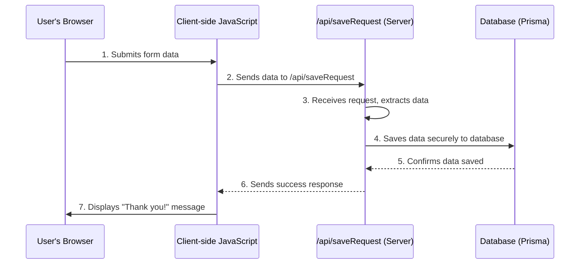

# Chapter 6: Backend API Endpoints

In [Chapter 5: Client-side Form Handling](05_client_side_form_handling_.md), we learned how our website's "receptionist" (our JavaScript code) gathers information from a form, like the "Request Pilot" form, and sends it off. We saw how it packages the data and uses `fetch()` to send it to an "address" like `/api/saveRequest`. But what happens at that address? Who receives the package and what do they do with it?

Imagine your website needs to do tasks that are too sensitive or too complex to handle directly in the user's browser. For example:

*   **Saving data:** You wouldn't want your browser to directly access and change your website's database. That would be a huge security risk!
*   **Processing sensitive information:** Payments, user logins, or complex calculations often need to happen in a secure, controlled environment.
*   **Integrating with other services:** Sending emails, generating reports, or communicating with external systems.

For these kinds of "behind-the-scenes" tasks, we need a **"secret office"** or a **"back-office"** built into our web application. This is where **Backend API Endpoints** come in!

## What are Backend API Endpoints?

Think of Backend API Endpoints as **dedicated "back-office" services** or **specific mailboxes** on your website's server. When your client-side code (running in the user's browser) sends data, it's like mailing a letter to one of these specific mailboxes.

Each mailbox (or "endpoint") is designed to handle a particular type of request. For example, our `/api/saveRequest` endpoint is like a mailbox specifically for "new contact requests."

In `codalytix-web`, we use **Next.js API Routes** to create these backend endpoints. They live directly within the `src/app/api` directory of our Next.js project. This makes it really convenient because our "front office" (the web pages you see) and our "back office" (the API endpoints) are all part of the same project!

These API routes **run on the server**, not in the user's browser. This is crucial for security and handling tasks that require server-side logic, such as talking to a database.

## How `codalytix-web` Uses Backend API Endpoints

Let's revisit our "Request Pilot" contact form from the homepage. When you filled it out and clicked "Submit," our client-side JavaScript sent a "package" of data to the `/api/saveRequest` endpoint.

This `/api/saveRequest` endpoint is responsible for taking that data (name, email, message, etc.) and securely saving it into our database. The user's browser never sees or interacts directly with the database; it just sends the data to the API endpoint, and the endpoint handles the rest.

### The `/api/saveRequest` Endpoint

In Next.js, API routes are created by making files inside the `src/app/api` directory. The name of the folder and file determines the URL path.

For our `saveRequest` endpoint, we have:

```
src/app/
└── api/
    └── saveRequest/
        └── route.ts  // This creates the "/api/saveRequest" endpoint
```

The `route.ts` file is special. It's where we define how our server should respond to different types of requests (like `POST`, `GET`, etc.). For our contact form, we're sending new data, which typically uses the `POST` method.

## How the API Endpoint Works Under the Hood

Let's trace the journey of your contact form submission, now focusing on the server-side:



**Step-by-step:**

1.  **You submit the form:** You fill out the "Request Pilot" form and click "Submit."
2.  **Client-side JavaScript sends the data:** As we saw in [Chapter 5: Client-side Form Handling](05_client_side_form_handling_.md), your browser's JavaScript intercepts the form submission and uses `fetch()` to send the data to the `/api/saveRequest` endpoint.
3.  **The API Endpoint receives the request:** On the Next.js server, the `route.ts` file in `src/app/api/saveRequest` "wakes up." It receives the data package sent from your browser.
4.  **The API Endpoint processes the data:** Inside `route.ts`, the code takes the received data (your name, email, etc.) and performs the necessary server-side logic. In this case, it prepares the data to be saved.
5.  **Data is saved to the database:** The API endpoint then securely interacts with our database (using a tool called Prisma, which we'll learn about in [Chapter 7: Database Management with Prisma](07_database_management_with_prisma_.md)) to store your request.
6.  **The API Endpoint sends a response:** After successfully saving the data, the endpoint sends a simple "success" message back to your browser.
7.  **"Thank you!" message appears:** Your browser's JavaScript receives this "success" message and, as programmed, clears the form and displays the "Thank you!" confirmation.

All of this happens very quickly, providing a smooth experience while keeping sensitive operations (like database interactions) safely on the server.

### Diving into `src/app/api/saveRequest/route.ts`

Now, let's look at the simplified code inside `src/app/api/saveRequest/route.ts` that handles this process:

```typescript
// src/app/api/saveRequest/route.ts
import { NextResponse } from 'next/server' // (1) Helper to send responses
import { prisma } from '@/lib/prisma'     // (2) Tool to talk to our database

export async function POST(req: Request) { // (3) This function handles POST requests
  // (4) Get the data (like name, email) sent from the browser
  const data = await req.json()

  // (5) Use Prisma to securely save the data into our database
  const savedEntry = await prisma.request.create({
    data: {
      name: data.name,
      company: data.company,
      email: data.email,
      message: data.message,
      // ... other fields if they exist
    },
  })

  // (6) Send a success message back to the browser
  return NextResponse.json({ success: true, savedEntry })
}
```

**Explanation of the code:**

1.  **`import { NextResponse } from 'next/server'`**: `NextResponse` is a helper from Next.js that makes it easy to send responses back to the browser, like sending JSON data or setting statuses.
2.  **`import { prisma } from '@/lib/prisma'`**: This line imports `prisma`, which is our tool for interacting with the database. We'll dive much deeper into Prisma in [Chapter 7: Database Management with Prisma](07_database_management_with_prisma_.md). For now, just know it's how our server securely talks to the database.
3.  **`export async function POST(req: Request)`**: This is the core of our API endpoint.
    *   `export async function POST`: Next.js automatically recognizes functions named `GET`, `POST`, `PUT`, `DELETE`, etc., inside `route.ts` files. Since our form is sending new data, we use `POST`. `async` means this function can perform operations that take a little time, like waiting for database operations to finish.
    *   `req: Request`: This `req` object contains all the details of the incoming request from the browser, including the data sent in the form.
4.  **`const data = await req.json()`**: This line reads the "package" of data sent from the browser. Remember in [Chapter 5: Client-side Form Handling](05_client_side_form_handling_.md) how we sent `JSON.stringify(entry)`? This line converts that JSON text back into a usable JavaScript object, so we can access `data.name`, `data.email`, etc.
5.  **`const savedEntry = await prisma.request.create({ ... })`**: This is where the database magic happens. `prisma.request.create` tells Prisma to create a new "request" entry in our database. The `data` property contains the information we extracted from the incoming request. The `await` keyword means the code will pause here until Prisma confirms that the data has been successfully saved to the database.
6.  **`return NextResponse.json({ success: true, savedEntry })`**: Finally, after the data is saved, this line sends a response back to the browser. `NextResponse.json()` sends data formatted as JSON. We send `{ success: true }` to tell the client-side JavaScript that everything worked, and `savedEntry` might include details of the newly created entry.

This `route.ts` file is a simple but powerful example of a backend API endpoint, securely handling data submission for `codalytix-web`.

## Conclusion

In this chapter, we've explored **Backend API Endpoints** and how they serve as the "secret office" for our `codalytix-web` application. We learned that Next.js API Routes, located in `src/app/api`, provide server-side functionality for tasks like saving data securely to a database. The `POST` endpoint at `/api/saveRequest` takes the contact form submission, processes it on the server, and then interacts with our database without exposing sensitive logic to the user's browser.

Now that we know how data gets sent to and processed by our backend, the next logical step is to understand how that data is actually stored and managed. In the next chapter, we'll dive into **Database Management with Prisma**.

[Database Management with Prisma](07_database_management_with_prisma_.md)

---

Generated by [AI Codebase Knowledge Builder](https://github.com/The-Pocket/Tutorial-Codebase-Knowledge)