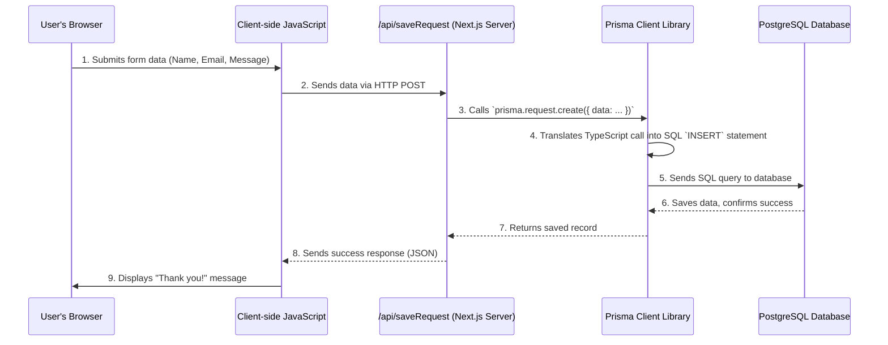

# Chapter 7: Database Management with Prisma

In [Chapter 6: Backend API Endpoints](06_backend_api_endpoints_.md), we learned how our website's "secret office" (the backend API endpoint) receives data from the browser, like the information submitted through our "Request Pilot" form. We saw how the endpoint prepared this data. But where does this data actually go for long-term storage? How does our server safely put it away and retrieve it later?

Imagine you have a huge library filled with books of all kinds. If you want to add a new book or find an existing one, you wouldn't just throw it on a pile or rummage through everything yourself. You'd need a **librarian** who knows exactly how to organize, store, and find books efficiently, making sure everything is in its right place and easily accessible.

In our `codalytix-web` project, we need a reliable way to store important information, like the "Request Pilot" form submissions. This information needs to stay even if the server restarts. This is where a **database** comes in. A database is like that highly organized library – a place to store, manage, and retrieve large amounts of structured data. For `codalytix-web`, we use a powerful database called **PostgreSQL**.

However, directly talking to a database using its special "language" (called **SQL**) can be complicated. It's like having to learn all the complex rules and codes of the library's internal system just to get one book. This is where **Prisma** steps in!

## What is Prisma? (Your Database Librarian & Translator)

Prisma acts as our **universal translator and assistant for database operations**. It's an **Object-Relational Mapper (ORM)**. Don't worry about the big name! Just think of it like this:

*   **Translator:** Instead of writing complex SQL queries (the database's language), you write normal **TypeScript code** (the language our application uses). Prisma then translates your TypeScript instructions into the correct SQL commands that the PostgreSQL database understands.
*   **Assistant:** It helps you manage your database structure and makes sure your code matches what's actually in the database.
*   **Type-Safe Client:** Prisma generates a special **Prisma Client** for our project. This client is like a personalized "guidebook" for our database. It understands the exact types of data we store, helping us avoid common errors (like trying to save a number where text should be) and making database interactions much more intuitive.

Essentially, Prisma handles all the tricky parts of talking to the database, allowing us to focus on building features for `codalytix-web` using familiar TypeScript code, without needing to become SQL experts!

## How `codalytix-web` Uses Prisma

For our "Request Pilot" form, Prisma helps us define what a "Request" looks like and then allows our backend API endpoint to save new requests into the database.

### 1. Defining Your Database Structure: `prisma/schema.prisma`

Before we can save any data, we need to tell Prisma what kind of data we want to store and how it should be organized. This is done in a special file called `prisma/schema.prisma`. Think of this as the **"blueprint"** for our database library. It defines the "types of books" (data models) and what information each "book" contains.

Here's the relevant part of `src/prisma/schema.prisma` for our "Request" data:

```prisma
// prisma/schema.prisma (simplified)
datasource db {
  provider = "postgresql"
  url      = env("DATABASE_URL") // Where our database is located
}

model Request { // (1) This defines a "Request" type in our database
  id        String   @id @default(cuid()) // (2) Unique ID for each request
  name      String                      // (3) Person's name (text)
  email     String                      // (4) Person's email (text)
  phone     String?                     // (5) Optional phone number (text, might be empty)
  company   String                      // (6) Company name (text)
  message   String                      // (7) Their message (text)
  createdAt DateTime @default(now()) // (8) When this request was created (date/time)
}
```

**Explanation:**
1.  **`model Request { ... }`**: This line declares a "model" named `Request`. In database terms, this is like defining a new table where each row will represent one submitted form request.
2.  **`id String @id @default(cuid())`**: Every record in a database needs a unique identifier. `id` is a `String` (text). `@id` marks it as the primary key. `@default(cuid())` tells Prisma to automatically generate a unique ID for each new request (like a librarian assigning a unique barcode).
3.  **`name String`**: This defines a `name` field, which will store text (`String`).
4.  **`email String`**: Defines an `email` field for text.
5.  **`phone String?`**: This is also a `String`, but the `?` means it's **optional**. If a user doesn't provide a phone number, this field can be empty (or `null` in database terms).
6.  **`company String`**: Defines a `company` field for text.
7.  **`message String`**: Defines a `message` field for text.
8.  **`createdAt DateTime @default(now())`**: This field stores a date and time (`DateTime`). `@default(now())` automatically sets the current date and time when a new request is created, so we know exactly when it was submitted.

This `schema.prisma` file is like writing down the precise rules for our "Request" books in the library.

### 2. The Prisma Client: Your Database Guidebook

Once we've defined our schema, we need a way for our TypeScript code to actually use it. This is where the **Prisma Client** comes in.

When you run `npm install` (or specifically `prisma generate`), Prisma reads your `schema.prisma` file and automatically generates a special TypeScript library called the Prisma Client. This client is incredibly smart because it knows all about your `Request` model and how to interact with it.

You can see this process mentioned in our `package.json` file:

```json
// package.json (simplified)
{
  "scripts": {
    "dev": "next dev",
    "build": "next build",
    "start": "next start",
    "postinstall": "prisma generate" // (1) This command runs after npm install
  },
  "devDependencies": {
    "prisma": "^6.11.1",
    // ...
  },
  "dependencies": {
    "@prisma/client": "^6.11.1", // (2) This is the Prisma Client library
    // ...
  }
}
```

**Explanation:**
1.  **`"postinstall": "prisma generate"`**: This line in `package.json` is a special script that tells npm: "After you've finished installing all the project's dependencies, please run `prisma generate`." This ensures that our Prisma Client is always up-to-date with our `schema.prisma` file.
2.  **`@prisma/client`**: This is the actual library that contains the generated Prisma Client. Our application uses this library to talk to the database.

### 3. Setting Up Prisma Client for Your Application (`src/lib/prisma.ts`)

To use the generated Prisma Client in our Next.js application, we set it up in a central place (`src/lib/prisma.ts`). This file ensures that we only create *one* connection to our database, which is good for performance and stability.

```typescript
// src/lib/prisma.ts
import { PrismaClient } from '@prisma/client' // (1) Import the Prisma Client

// (2) Store PrismaClient instance globally for development
const globalForPrisma = globalThis as unknown as {
  prisma: PrismaClient | undefined
}

export const prisma =
  globalForPrisma.prisma ?? // (3) Reuse existing client if available
  new PrismaClient({       // (4) Otherwise, create a new one
    log: ['query'],         // (5) Optional: log database queries for debugging
  })

// (6) In development, save the client for reuse across hot reloads
if (process.env.NODE_ENV !== 'production') globalForPrisma.prisma = prisma
```

**Explanation:**
1.  **`import { PrismaClient } from '@prisma/client'`**: We import the `PrismaClient` class that was generated by Prisma.
2.  **`globalForPrisma`**: This little trick ensures that in development mode (when Next.js restarts parts of your code frequently), we don't accidentally create many separate connections to the database. It stores the `PrismaClient` instance on a global object.
3.  **`globalForPrisma.prisma ?? new PrismaClient()`**: This line is saying: "If there's already a Prisma Client stored globally, use that one. Otherwise, create a brand new `PrismaClient`."
4.  **`new PrismaClient({ ... })`**: This creates the actual connection object that we'll use to send commands to our database.
5.  **`log: ['query']`**: This is an optional but helpful setting. It tells Prisma to print out the actual SQL queries it's running in your development console, which can be great for understanding and debugging.
6.  **`if (process.env.NODE_ENV !== 'production') globalForPrisma.prisma = prisma`**: This line stores the newly created `prisma` client instance globally, but *only* in development mode. In a live production environment, this special handling isn't needed.

The `export const prisma` at the end makes this single, well-managed Prisma Client instance available to other parts of our application, like our API endpoints.

### 4. Using Prisma Client in Backend API Endpoints

Now, let's connect all the dots! In [Chapter 6: Backend API Endpoints](06_backend_api_endpoints_.md), we saw `src/app/api/saveRequest/route.ts` sending data to the database. That's where our `prisma` client is used.

```typescript
// src/app/api/saveRequest/route.ts (simplified)
import { NextResponse } from 'next/server'
import { prisma } from '@/lib/prisma'  // (1) We import our managed Prisma Client

export async function POST(req: Request) {
  const data = await req.json()

  // (2) Use the prisma client to CREATE a new 'Request' entry
  const saved = await prisma.request.create({
    data: { // (3) Provide the data that matches our Request model blueprint
      name: data.name,
      company: data.company,
      email: data.email,
      phone: data.phone || null, // Handle optional phone number
      message: data.message,
    },
  })

  return NextResponse.json({ success: true, saved })
}
```

**Explanation:**
1.  **`import { prisma } from '@/lib/prisma'`**: We bring in the `prisma` client instance we carefully set up in `src/lib/prisma.ts`.
2.  **`await prisma.request.create({ ... })`**: This is the core line!
    *   `prisma.request`: Because we defined a `Request` model in `schema.prisma`, the generated Prisma Client now has a `request` property. This property gives us methods to interact with the `Request` table.
    *   `.create()`: This is a method provided by Prisma Client specifically for inserting new records into the database.
    *   `await`: This keyword means "wait until the database operation is complete before moving on."
3.  **`data: { ... }`**: This is an object where we provide the actual values for each field of our `Request` model (`name`, `company`, `email`, `message`, etc.). Notice how the names (`name`, `company`, `email`) directly match the fields we defined in `schema.prisma`. This is the **type-safe** part – if we tried to add a field that wasn't in our schema, TypeScript would immediately tell us it's an error!

This is how Prisma makes database operations intuitive and reliable. We define our data structure once, generate the client, and then use simple, type-safe TypeScript methods to interact with our database.

## How Prisma Works Under the Hood (The Data Journey)

Let's put it all together to see how your "Request Pilot" form data journeys from your browser, through our backend API, and into the database, with Prisma acting as the crucial middleman:



**Step-by-step:**

1.  **You submit the form:** On the `codalytix-web` homepage, you fill out and submit the "Request Pilot" form.
2.  **Client-side JavaScript sends data:** The JavaScript in your browser (from [Chapter 5: Client-side Form Handling](05_client_side_form_handling_.md)) collects the form data and sends it as a `POST` request to our backend API endpoint (`/api/saveRequest`).
3.  **API Endpoint calls Prisma:** On the Next.js server, the `route.ts` file for `/api/saveRequest` receives this data. It then calls `prisma.request.create(...)`, passing the form data to Prisma Client.
4.  **Prisma Client translates:** This is Prisma's core job! It takes your TypeScript instruction (`prisma.request.create`) and automatically translates it into the precise SQL `INSERT` command that the PostgreSQL database needs to create a new row with your data.
5.  **Prisma Client sends SQL:** Prisma Client then sends this generated SQL query over the network to the PostgreSQL database.
6.  **PostgreSQL saves data & confirms:** The database executes the SQL query, stores the new request, and sends a confirmation back to Prisma Client that the operation was successful.
7.  **Prisma Client returns data:** Prisma Client receives the confirmation (and optionally the newly created record) and passes it back to our API endpoint.
8.  **API Endpoint sends response:** The API endpoint then sends a `success: true` response back to your browser.
9.  **"Thank you!" message:** Your browser's JavaScript receives this success message and updates the page to show "Thank you! We will get back to you shortly."

This entire process, from your click to the data being securely stored, happens incredibly fast, thanks to Prisma handling the database complexity behind the scenes.

## Conclusion

In this chapter, we've explored **Database Management with Prisma** in `codalytix-web`. We learned that databases like PostgreSQL are essential for reliable data storage, and that Prisma acts as our powerful "librarian and translator," simplifying how our TypeScript application interacts with the database. We saw how `schema.prisma` defines our data structure (like the `Request` model), how the Prisma Client is generated and managed, and how our backend API endpoints use simple, type-safe Prisma commands (like `prisma.request.create`) to save data without needing to write complex SQL.

This concludes our tutorial on `codalytix-web`. You now have a foundational understanding of how this powerful web application is built, from its Next.js framework and styling to its interactive components, form handling, backend APIs, and robust database management.

---

Generated by [AI Codebase Knowledge Builder](https://github.com/The-Pocket/Tutorial-Codebase-Knowledge)