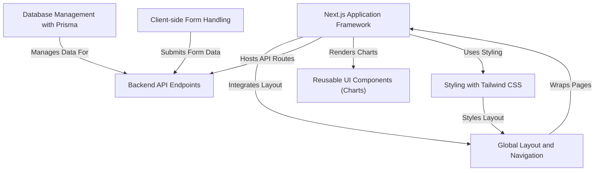

# Tutorial: codalytix-web

This project is the marketing website for **Codalytix 360 IQ™**, an *AI-powered code intelligence platform*. It showcases the platform's *features* and capabilities, including data visualizations like *IFRS readiness* and *tech debt breakdowns*. Users can explore the product and **book a demo** via a client-side form which saves inquiries to a database.

**Source Repository:** [https://github.com/kmishra1204/codalytix-web](https://github.com/kmishra1204/codalytix-web)

## Chapters

1. [Next.js Application Framework
](01_next_js_application_framework_.md)
2. [Global Layout and Navigation
](02_global_layout_and_navigation_.md)
3. [Styling with Tailwind CSS
](03_styling_with_tailwind_css_.md)
4. [Reusable UI Components (Charts)
](04_reusable_ui_components__charts__.md)
5. [Client-side Form Handling
](05_client_side_form_handling_.md)
6. [Backend API Endpoints
](06_backend_api_endpoints_.md)
7. [Database Management with Prisma
](07_database_management_with_prisma_.md)

---

Generated by [AI Codebase Knowledge Builder](https://github.com/The-Pocket/Tutorial-Codebase-Knowledge)