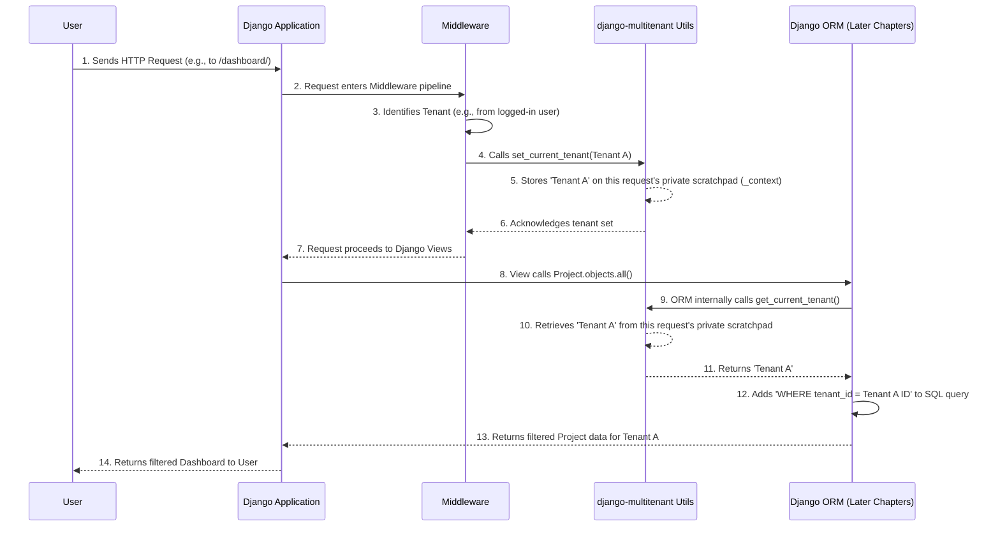

# Chapter 1: Tenant Context Management

Welcome to the `django-multitenant` tutorial! In this first chapter, we'll dive into a fundamental concept that makes building multi-tenant applications much, much easier: **Tenant Context Management**.

## What Problem Are We Solving?

Imagine you're building a Software-as-a-Service (SaaS) application, like a project management tool. Many different companies (let's call them "tenants") will use your single application. "Company A" will have its projects and tasks, and "Company B" will have its own, completely separate projects and tasks.

The big challenge is: **How do you make sure that when someone from "Company A" logs in, they only see "Company A"'s data, and never accidentally see "Company B"'s data?**

Without `django-multitenant`, you'd have to manually add a filter to *every single database query* you make. For example, to get Company A's projects, you'd write something like `Project.objects.filter(company_id=company_A.id)`. Doing this for every query, everywhere in your app, would be a huge headache and prone to errors!

`django-multitenant` solves this by introducing **Tenant Context Management**. Think of it like this:

**Analogy:** Imagine your application is a restaurant, and each "tenant" (company) is a different table of customers. When a waiter (your Django code) goes to take an order or deliver food, they need to know *which table* they are currently serving. They don't want to bring Company A's order to Company B's table!

Tenant Context Management is like telling the waiter: "Okay, for the next few moments, you are serving Table A." Once the waiter knows they are serving Table A, all their actions (like fetching food or taking new orders) are automatically directed to Table A, without needing to be reminded for every single action.

In our Django application, this means we tell `django-multitenant` which tenant is currently active. Once set, `django-multitenant` automatically modifies your database queries so that they *only* retrieve data for that specific tenant. This ensures perfect data isolation without you needing to manually filter every query!

## How Does It Work? The Core Idea

The main idea behind Tenant Context Management is simple:
1.  **Set the current tenant**: At the beginning of a user's interaction (e.g., when they log in or make a web request), you tell `django-multitenant` which tenant they belong to.
2.  **Get the current tenant**: Later, when your application needs to talk to the database, `django-multitenant` *automatically* figures out which tenant is active and adds the necessary filters to your database queries.

The two key functions for this are `set_current_tenant()` and `get_current_tenant()`.

### `set_current_tenant(tenant_object)`

This function is how you "tell the waiter which table to serve." You pass it an object that represents your current tenant (e.g., a `Company` model instance, or whatever model you define as your tenant).

```python
from django_multitenant.utils import set_current_tenant

# Imagine 'my_company_object' is an instance of your Company model
# representing the tenant currently interacting with the app.
set_current_tenant(my_company_object)
```
After this line runs, `django-multitenant` remembers `my_company_object` as the active tenant for this specific web request (or thread).

### `get_current_tenant()`

This function lets you retrieve the tenant object that was previously set. While `django-multitenant` uses this internally, you might find it useful if your application logic needs to know the current tenant.

```python
from django_multitenant.utils import get_current_tenant

current_active_tenant = get_current_tenant()

if current_active_tenant:
    print(f"The current tenant is: {current_active_tenant.name}")
else:
    print("No tenant is currently set.")
```
This would output `The current tenant is: Company A` if `Company A` was set previously.

## Putting It into Practice: Where to Set the Tenant?

The most common and recommended place to set the current tenant is in a Django **Middleware**. Middleware is a special component that processes every incoming web request before it reaches your view functions, and also processes every outgoing response. This makes it a perfect spot to identify the user's tenant and set it globally for that request.

Let's look at a simplified example of how you might create a middleware for this:

```python
# appname/middleware.py

from django_multitenant.utils import set_current_tenant

class MultitenantMiddleware:
    def __init__(self, get_response):
        self.get_response = get_response

    def __call__(self, request):
        # 1. Check if the user is logged in
        if request.user and not request.user.is_anonymous:
            # 2. Identify the tenant associated with the logged-in user
            #    (e.g., if a user belongs to a 'Company' model)
            current_tenant = request.user.employee.company # Example: Get company from user's employee profile
            
            # 3. Tell django-multitenant which tenant is active!
            set_current_tenant(current_tenant)
        
        # 4. Let the request continue to your Django views
        response = self.get_response(request)
        
        # You might unset the tenant here if needed, but often not necessary
        # unset_current_tenant()
        
        return response
```
**Explanation:**

1.  When a web request comes in, this `MultitenantMiddleware` runs.
2.  It checks if a user is logged in (`request.user` exists and is not anonymous).
3.  If a user is logged in, it finds the tenant associated with that user. (The example `request.user.employee.company` is just one way; your application might have `request.user.company` directly, or a different lookup.)
4.  Crucially, it calls `set_current_tenant()` with the identified tenant object. This tells `django-multitenant` that all operations for *this specific request* should be scoped to `current_tenant`.
5.  After the `set_current_tenant` call, any database query involving [Tenant-Aware Models](02_tenant_aware_models_.md) will automatically be filtered for this tenant. This automatic filtering is something we'll explore in detail in [Automatic Query Modification](03_automatic_query_modification_.md).

To make Django use this middleware, you need to add it to your `settings.py` file:

```python
# your_project/settings.py

MIDDLEWARE = [
    # ... other Django middleware ...
    'appname.middleware.MultitenantMiddleware', # Add your custom middleware here
]
```
Make sure to replace `appname` with the actual name of your Django app where you placed the `middleware.py` file.

## Under the Hood: How `set_current_tenant` Works

You might be wondering, how does `django-multitenant` "remember" the current tenant for *just this request* and not mix it up with other requests happening at the same time?

The magic happens using something called **thread-local storage** (or async-local storage in newer Django versions). Imagine each web request that your Django application handles is like a separate "thread" of execution. Each thread gets its own tiny, private scratchpad.

Here's a simplified sequence of events:



Let's look at the actual (simplified) code inside `django_multitenant/utils.py` that makes this happen:

```python
# django_multitenant/utils.py

# This creates a special storage that's unique for each request (thread/ASGI context)
_context = local() # 'local' comes from threading or asgiref, creating a "per-request" storage

def get_current_tenant():
    """
    Retrieves the tenant object stored for the current request.
    """
    return getattr(_context, "tenant", None)

def set_current_tenant(tenant):
    """
    Stores the given tenant object for the current request.
    """
    setattr(_context, "tenant", tenant)

def unset_current_tenant():
    """
    Clears the tenant context for the current request.
    """
    setattr(_context, "tenant", None)
```
As you can see, `_context` is the "scratchpad" object. `set_current_tenant` puts your tenant object onto this scratchpad, and `get_current_tenant` retrieves it. Because `_context` is `local()`, each incoming web request gets its *own* separate scratchpad, so requests don't interfere with each other's current tenant!

## Conclusion

In this chapter, you learned that **Tenant Context Management** is the crucial first step in using `django-multitenant`. It's how you tell your application which customer (tenant) is currently interacting with it. By setting the tenant context, usually in a middleware, you enable `django-multitenant` to automatically ensure data isolation.

This global "current tenant" setting is incredibly powerful because it means you no longer have to manually add `tenant_id` filters to your database queries. But how does `django-multitenant` actually *use* this set tenant to filter queries? That's where [Tenant-Aware Models](02_tenant_aware_models_.md) come in, which we'll explore in the next chapter!

[Next Chapter: Tenant-Aware Models](02_tenant_aware_models_.md)

---

Generated by [AI Codebase Knowledge Builder](https://github.com/The-Pocket/Tutorial-Codebase-Knowledge)