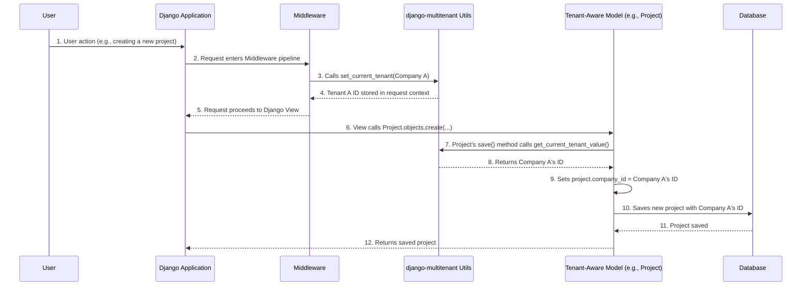
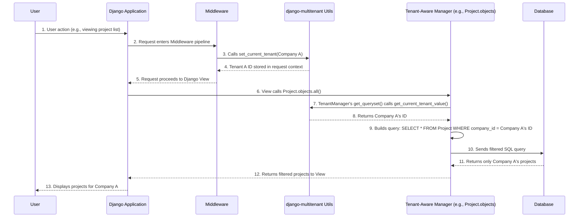

# Chapter 2: Tenant-Aware Models

In [Chapter 1: Tenant Context Management](01_tenant_context_management_.md), you learned how `django-multitenant` can "remember" which customer (or "tenant") is currently using your application. This is like telling a waiter which table they're serving. But how does this "remembered" tenant information actually *affect* your data? How do you make sure that the products shown to "Company A" are *only* Company A's products, and not accidentally Company B's?

This is where **Tenant-Aware Models** come in! They are the special blueprints for your data that automatically understand and respect your current tenant.

## What Problem Are We Solving?

Imagine our project management tool again. We have a `Project` model in Django, and many different companies will create projects.

```python
# A regular Django model
from django.db import models

class Project(models.Model):
    name = models.CharField(max_length=255)
    description = models.TextField()
    # ... other fields ...
```

If "Company A" creates a project called "Website Redesign" and "Company B" also creates a project called "Website Redesign", how do we tell them apart in the database? And how do we ensure that when someone from "Company A" asks for all projects, they *only* get "Company A"'s "Website Redesign," not Company B's?

Without Tenant-Aware Models, you'd have to manually add a `company_id` field to `Project` and filter every query:

```python
# Manually filtering every time - tedious and error-prone!
company_A_id = 1
company_B_id = 2

# To get Company A's projects:
company_a_projects = Project.objects.filter(company_id=company_A_id)

# To get Company B's projects:
company_b_projects = Project.objects.filter(company_id=company_B_id)
```

This is exactly what Tenant-Aware Models help you avoid!

## What Are Tenant-Aware Models?

Tenant-Aware Models are your regular Django models, but they come with a super-power: they automatically include a **tenant ID column** (like `company_id` or `store_id`) and ensure all data operations (saving, fetching, updating, deleting) respect the currently set tenant.

Think of it like this: your application is a big shared warehouse. Each product in the warehouse needs to belong to a specific customer. A Tenant-Aware Model is like adding a **unique "customer ID" sticker** to every single product as soon as it enters the warehouse. This sticker makes sure each customer's products are easily identifiable.

`django-multitenant` provides two main ways to make your models "tenant-aware":

1.  **`TenantModel` class:** This is the simplest way. You just make your model inherit from `TenantModel` instead of `models.Model`.
2.  **`TenantModelMixin` and `TenantManagerMixin`:** For more advanced scenarios where your model might already inherit from something else, you can use these mixins.

Let's look at how to use them.

## Making Your Models Tenant-Aware

First, you need a model that represents your "tenant" itself (e.g., your `Company` model). This model often defines the `tenant_id` field that other models will use.

### Step 1: Define Your Tenant Model

Let's say our tenant is a `Company`. This `Company` model itself will also be tenant-aware. It defines its own unique ID as the "tenant field".

```python
# your_app/models.py
from django.db import models
from django_multitenant.models import TenantModel

class Company(TenantModel):
    name = models.CharField(max_length=100)
    # The 'id' field of this Company model will be our tenant ID.
    # We tell django-multitenant this using TenantMeta.
    class TenantMeta:
        tenant_field_name = "id"

    def __str__(self):
        return self.name
```
**Explanation:**
- We import `TenantModel` from `django_multitenant.models`.
- Our `Company` model inherits from `TenantModel`.
- Inside `Company`, we define a special `TenantMeta` class. This is where we tell `django-multitenant` *which field* in this model represents the tenant's unique identifier. Here, it's `tenant_field_name = "id"`, meaning the `id` of a `Company` instance (e.g., Company A's ID is 1, Company B's ID is 2) will be used as the tenant identifier.

### Step 2: Define Other Tenant-Aware Models

Now, let's make our `Project` model tenant-aware. This means every `Project` needs to know which `Company` it belongs to.

```python
# your_app/models.py
from django.db import models
from django_multitenant.models import TenantModel
# from django_multitenant.fields import TenantForeignKey # We'll cover this in Chapter 4

# ... (Company model defined above) ...

class Project(TenantModel):
    name = models.CharField(max_length=255)
    description = models.TextField()
    # This foreign key links Project to Company.
    # The 'company' field will store the Company object,
    # and 'company_id' will store the ID (our tenant ID).
    company = models.ForeignKey(Company, on_delete=models.CASCADE)

    # Tell django-multitenant that 'company_id' is the tenant identifier for Project.
    class TenantMeta:
        tenant_field_name = "company_id"

    def __str__(self):
        return self.name
```

**Explanation:**
- Like `Company`, `Project` also inherits from `TenantModel`.
- We add a regular `models.ForeignKey` to `Company`. This automatically creates a `company_id` column in our `Project` database table.
- Crucially, in `TenantMeta`, we set `tenant_field_name = "company_id"`. This tells `django-multitenant`: "For any `Project` record, the value in its `company_id` column is its 'customer ID sticker'."

**Using Mixins (Alternative)**

If your `Project` model already needs to inherit from another base class, you can use `TenantModelMixin` and `TenantManagerMixin`:

```python
# your_app/models.py
from django.db import models
from django_multitenant.mixins import TenantModelMixin, TenantManagerMixin

# ... (Company model defined above as TenantModel) ...

# You also need a custom manager for mixin-based models
class ProjectManager(TenantManagerMixin, models.Manager):
    pass

class Project(TenantModelMixin, models.Model): # Inherits from TenantModelMixin and models.Model
    name = models.CharField(max_length=255)
    description = models.TextField()
    company = models.ForeignKey(Company, on_delete=models.CASCADE)

    # For mixins, you define tenant_id directly as a class variable
    tenant_id = 'company_id'

    # You MUST set your objects manager to your custom TenantManagerMixin
    objects = ProjectManager()

    def __str__(self):
        return self.name
```
**Explanation:**
- `TenantModelMixin` provides the tenant-aware behavior for the model instance.
- `TenantManagerMixin` provides the tenant-aware behavior for queries (like `Project.objects.all()`).
- You define `tenant_id = 'company_id'` directly on the class.
- You must assign `objects = ProjectManager()` to tell Django to use your tenant-aware manager.

For simplicity in this tutorial, we will primarily use the `TenantModel` inheritance approach.

### Step 3: Run Migrations!

After defining these models, you need to run Django migrations. This creates the necessary tables in your database, including the `tenant_id` columns (like `company_id` in our `Project` table).

```bash
python manage.py makemigrations
python manage.py migrate
```

## How Tenant-Aware Models Work in Practice

Now that our models are set up, let's see them in action. Remember [Chapter 1: Tenant Context Management](01_tenant_context_management_.md)? We set the current tenant using `set_current_tenant()`. Tenant-Aware Models use this context!

Let's assume "Company A" has an ID of `1` and "Company B" has an ID of `2`.

```python
# In your Django shell or a view function
from django_multitenant.utils import set_current_tenant
from your_app.models import Company, Project # Replace 'your_app' with your actual app name

# 1. Get the tenant objects
company_a = Company.objects.get(id=1)
company_b = Company.objects.get(id=2)

# 2. Set the current tenant to Company A
set_current_tenant(company_a)
print(f"Current tenant set to: {company_a.name}")
# Output: Current tenant set to: Company A

# 3. Create a project while Company A is active
project_for_a = Project.objects.create(
    name="Website Redesign A",
    description="Redesigning Company A's website.",
    company=company_a # This links the project to Company A
)
print(f"Created project: '{project_for_a.name}' (ID: {project_for_a.id}), for company ID: {project_for_a.company_id}")
# Output: Created project: 'Website Redesign A' (ID: X), for company ID: 1

# 4. Now, set the current tenant to Company B
set_current_tenant(company_b)
print(f"\nCurrent tenant set to: {company_b.name}")
# Output: Current tenant set to: Company B

# 5. Create a project while Company B is active
project_for_b = Project.objects.create(
    name="Website Redesign B",
    description="Redesigning Company B's website.",
    company=company_b # This links the project to Company B
)
print(f"Created project: '{project_for_b.name}' (ID: {project_for_b.id}), for company ID: {project_for_b.company_id}")
# Output: Created project: 'Website Redesign B' (ID: Y), for company ID: 2

# 6. Now, try to query all projects while Company A is active again
set_current_tenant(company_a)
print(f"\nCurrent tenant set to: {company_a.name}")
# Output: Current tenant set to: Company A

all_projects_for_a = Project.objects.all()
print(f"Projects visible to {company_a.name}:")
for p in all_projects_for_a:
    print(f"- {p.name} (Company ID: {p.company_id})")
# Output:
# Projects visible to Company A:
# - Website Redesign A (Company ID: 1)

# Notice: 'Website Redesign B' is *not* shown!

# 7. And for Company B...
set_current_tenant(company_b)
print(f"\nCurrent tenant set to: {company_b.name}")
# Output: Current tenant set to: Company B

all_projects_for_b = Project.objects.all()
print(f"Projects visible to {company_b.name}:")
for p in all_projects_for_b:
    print(f"- {p.name} (Company ID: {p.company_id})")
# Output:
# Projects visible to Company B:
# - Website Redesign B (Company ID: 2)

```

This is the core magic! You didn't write `Project.objects.filter(company_id=company_a.id)` anywhere in steps 6 or 7. `django-multitenant` *automatically* added that filter for you because `Project` is a Tenant-Aware Model and `company_a` (or `company_b`) was set as the current tenant.

## Under the Hood: How It Works

How do Tenant-Aware Models achieve this? They override some core Django functionalities:

### 1. Auto-Populating `tenant_id` on Save

When you save a new object (`Project.objects.create(...)` or `project_instance.save()`), the Tenant-Aware Model (specifically, its `TenantModelMixin`) checks the [Tenant Context Management](01_tenant_context_management_.md) to see if a tenant is currently set. If it is, it automatically fills in the `tenant_id` column of the new object with the ID of that current tenant.

Here's a simplified flow:



Let's look at the simplified code snippet from `django_multitenant/mixins.py` that handles this for the `save()` method:

```python
# Simplified from django_multitenant/mixins.py (TenantModelMixin)

from .utils import set_current_tenant, get_current_tenant, get_current_tenant_value, set_object_tenant

class TenantModelMixin:
    # ... (other methods) ...

    def save(self, *args, **kwargs):
        # 1. Get the current tenant from the global context
        current_tenant = get_current_tenant()
        tenant_value = get_current_tenant_value()

        # 2. If a tenant is set, automatically populate the object's tenant_id field
        #    (e.g., self.company_id = tenant_value)
        set_object_tenant(self, tenant_value)

        # 3. Call the original Django save method to save to the database
        try:
            obj = super().save(*args, **kwargs)
        finally:
            # Important: Ensure the tenant context is reset correctly
            # (especially in complex scenarios)
            set_current_tenant(current_tenant)

        return obj
```
**Explanation:**
- When `save()` is called on a Tenant-Aware Model instance, it first gets the ID of the current tenant (e.g., Company A's ID).
- `set_object_tenant(self, tenant_value)` is a helper that intelligently sets the correct tenant ID field on your model instance (e.g., `self.company_id = 1`).
- Finally, it calls the original Django `save()` method, which now writes the record to the database with the correct `company_id` already populated.

### 2. Auto-Filtering Queries

This is the other half of the magic. When you query a Tenant-Aware Model (like `Project.objects.all()`), the `TenantManager` (which comes with `TenantModel` or `TenantManagerMixin`) steps in. It checks the current tenant context and automatically adds a `WHERE tenant_id = current_tenant_id` clause to your database query.

Here's a simplified flow:



Let's look at the simplified code snippet from `django_multitenant/mixins.py` that handles this for the `get_queryset()` method:

```python
# Simplified from django_multitenant/mixins.py (TenantManagerMixin)

from django.db import models
from .utils import get_current_tenant, get_tenant_filters

class TenantManagerMixin(models.Manager):
    def get_queryset(self):
        # 1. Get the default queryset (like models.Manager normally would)
        queryset = self._queryset_class(self.model)

        # 2. Get the current tenant from the global context
        current_tenant = get_current_tenant()

        # 3. If a tenant is set, add the tenant filter
        if current_tenant:
            # get_tenant_filters constructs the filter, e.g., {'company_id': 1}
            kwargs = get_tenant_filters(self.model)
            return queryset.filter(**kwargs) # This adds the WHERE clause!

        # 4. If no tenant is set, return the unfiltered queryset
        return queryset
```
**Explanation:**
- Every time you do `Project.objects.some_method()`, it first goes through `get_queryset()`.
- If a tenant is active, `get_tenant_filters()` creates a dictionary like `{'company_id': 1}` (if Company A is active).
- `queryset.filter(**kwargs)` then applies this filter to the query, ensuring only records belonging to the current tenant are retrieved from the database.

## Conclusion

**Tenant-Aware Models** are the backbone of data isolation in `django-multitenant`. By inheriting from `TenantModel` (or using its mixins), your models automatically gain the ability to store a `tenant_id` and, more importantly, to **automatically filter all queries** based on the currently active tenant set by [Tenant Context Management](01_tenant_context_management_.md). This means you write simple `Project.objects.all()` and `django-multitenant` handles the complex filtering for you!

In the next chapter, we'll dive deeper into how this "automatic query modification" works, especially when you start performing more complex queries involving joins and relationships.

[Next Chapter: Automatic Query Modification](03_automatic_query_modification_.md)

---

Generated by [AI Codebase Knowledge Builder](https://github.com/The-Pocket/Tutorial-Codebase-Knowledge)