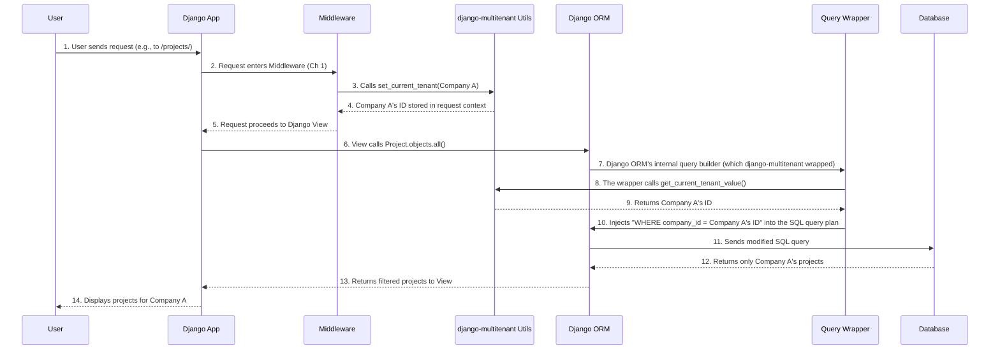

# Chapter 3: Automatic Query Modification

In [Chapter 1: Tenant Context Management](01_tenant_context_management_.md), you learned how to tell `django-multitenant` which customer (tenant) is currently using your application. Then, in [Chapter 2: Tenant-Aware Models](02_tenant_aware_models_.md), you saw how making your models "tenant-aware" automatically adds a `tenant_id` column and uses that context to filter basic `objects.all()` queries.

But how exactly does `django-multitenant` achieve this "magic" of automatically adding filters to *all* your database queries? This is where **Automatic Query Modification** comes into play! It's the powerful abstraction that handles the behind-the-scenes work, so you don't have to remember to filter every single query manually.

## What Problem Are We Solving (Again)?

Let's revisit our project management tool. You have `Project` and `Task` models, and many companies use your single application.

If "Company A" logs in, they should *only* see "Company A"'s projects and tasks. If they try to delete a project, it should *only* delete one of "Company A"'s projects.

Without `django-multitenant`, you'd write:

```python
# To get Company A's projects
projects_a = Project.objects.filter(company_id=company_a.id)

# To update Company A's tasks
Task.objects.filter(company_id=company_a.id).update(status='Completed')

# To delete Company A's old projects
Project.objects.filter(company_id=company_a.id, created_at__lt=old_date).delete()
```

Imagine doing this for every single `filter()`, `get()`, `update()`, `delete()`, `count()`, etc., across your entire application! It's a massive amount of repetitive code, easy to forget, and a nightmare for security if you miss one.

**Automatic Query Modification** is the solution. It's the "magic switch" that ensures *every* database operation on a [Tenant-Aware Model](02_tenant_aware_models_.md) automatically includes the correct `tenant_id` filter based on the tenant set in [Tenant Context Management](01_tenant_context_management_.md).

**Analogy:** Think of it like this: you're sending instructions to a smart warehouse. You just say "Get me all the red widgets" or "Update the status of Widget #123." The warehouse has a helpful, unseen assistant who *automatically* adds "and make sure it belongs to Customer X" to every single one of your instructions. You never have to say "Customer X" yourself, the assistant just knows because you told them *once* (when you set the current tenant) who you are working for.

## How Does It Work? The Core Idea

The core idea is that `django-multitenant` intercepts Django's Object-Relational Mapper (ORM) calls. Before Django turns your Python code (like `Project.objects.all()`) into a SQL query, `django-multitenant` steps in and injects the necessary `tenant_id` filter.

This happens for:
*   **Reading data:** (`SELECT` queries like `filter()`, `get()`, `all()`, `count()`)
*   **Creating data:** (`INSERT` queries like `create()`, `save()`) - *covered in Chapter 2, but worth noting it respects the tenant context.*
*   **Updating data:** (`UPDATE` queries like `update()`, `save()`)
*   **Deleting data:** (`DELETE` queries like `delete()`)

Let's see it in action with our `Company` and `Project` models from Chapter 2.

```python
# Assume Company A has ID 1, Company B has ID 2
from django_multitenant.utils import set_current_tenant
from your_app.models import Company, Project # Replace 'your_app'

# Get the tenant objects (we'd typically get this from the logged-in user)
company_a = Company.objects.get(id=1)
company_b = Company.objects.get(id=2)

# --- Scenario 1: Company A is active ---
set_current_tenant(company_a)
print(f"Current tenant: {company_a.name}")

# This will ONLY retrieve projects belonging to Company A
company_a_projects = Project.objects.filter(name__icontains="website")
print(f"Company A's projects containing 'website': {len(company_a_projects)}")

# If Company A had a project with ID 10, this will update it.
# If Project ID 10 belongs to Company B, this update will *not* affect it.
Project.objects.filter(id=10).update(status='In Progress')
print("Attempted to update Project ID 10 (only if it belongs to Company A).")

# If Company A had a project with ID 11, this will delete it.
# If Project ID 11 belongs to Company B, this delete will *not* affect it.
Project.objects.get(id=11).delete()
print("Attempted to delete Project ID 11 (only if it belongs to Company A).")

# --- Scenario 2: Switch to Company B ---
set_current_tenant(company_b)
print(f"\nCurrent tenant: {company_b.name}")

# This will ONLY retrieve projects belonging to Company B
company_b_projects = Project.objects.all()
print(f"Company B's total projects: {len(company_b_projects)}")

# This will ONLY delete projects belonging to Company B
Project.objects.filter(status='Completed').delete()
print("Deleted completed projects (only if they belong to Company B).")
```

Notice that in all the examples above (e.g., `Project.objects.filter(name__icontains="website")`, `Project.objects.filter(id=10).update(...)`, `Project.objects.get(id=11).delete()`), you *never* explicitly added `company_id=company_a.id` or `company_id=company_b.id`. `django-multitenant` handled that for you!

## Under the Hood: How the Magic Happens

Automatic Query Modification happens by `django-multitenant` intelligently modifying the low-level SQL query that Django's ORM generates, *before* it's sent to the database.

Let's break down the process for a typical `SELECT` query (`Project.objects.all()`) using our "warehouse assistant" analogy:



Here's a look at the simplified code snippets that enable this:

### 1. Intercepting the Queryset (`TenantManagerMixin`)

As you saw in Chapter 2, our [Tenant-Aware Models](02_tenant_aware_models_.md) use a `TenantManagerMixin`. This mixin overrides the `get_queryset` method, which is the very first step when you do `Model.objects.anything()`.

```python
# Simplified from django_multitenant/mixins.py

from django.db import models
from .utils import get_current_tenant, get_tenant_filters

class TenantManagerMixin(models.Manager):
    def get_queryset(self):
        queryset = self._queryset_class(self.model)
        current_tenant = get_current_tenant()

        # If a tenant is set, apply the tenant filter
        if current_tenant:
            # get_tenant_filters creates the filter like {'company_id': 1}
            kwargs = get_tenant_filters(self.model)
            return queryset.filter(**kwargs) # <-- This adds the filter!

        # If no tenant is set, return the unfiltered queryset
        return queryset
```
**Explanation:** This part ensures that *any* query on a tenant-aware model *starts* with a tenant filter if a tenant is active. It's like the initial screening at the warehouse door: "Only bring me items for Customer X."

### 2. Modifying the SQL Query (`Query` object hooks)

Django's ORM represents your query internally using a `Query` object before it's translated into SQL. `django-multitenant` "hooks" into this process to ensure the tenant filter is present even in more complex scenarios (like updates or deletes).

It does this by "wrapping" some core Django methods that prepare the query for execution. The `add_tenant_filters_on_query` function is central to this:

```python
# Simplified from django_multitenant/query.py

from django.db.models import Q
from .utils import get_current_tenant, get_tenant_filters

def add_tenant_filters_on_query(query_obj):
    """
    Injects the tenant_id filter directly into Django's internal Query object.
    """
    current_tenant = get_current_tenant()

    if current_tenant:
        try:
            filters = get_tenant_filters(query_obj.model)
            # Add the filter to the query object's WHERE clause
            query_obj.add_q(Q(**filters))
        except ValueError:
            pass # No tenant field found for this model, ignore
```
**Explanation:** This function is the actual workhorse that takes the `tenant_id` from the context and adds it as a `Q` object (a Django query expression) to the `query_obj`'s internal filtering criteria. This happens at a very low level, just before the SQL is generated.

This `add_tenant_filters_on_query` function is then called by various wrapped methods in `django-multitenant` to ensure that tenant filters are applied across different ORM operations:

*   **For `SELECT` queries:** The `get_compiler` method of Django's `Query` object (which turns the query into SQL) is wrapped. Before compilation, `add_tenant_filters_on_query` is called.
    ```python
    # Simplified from django_multitenant/mixins.py -> django_multitenant/query.py

    from django.db.models.sql import DeleteQuery, UpdateQuery
    # ... other imports ...

    class TenantModelMixin:
        def __init__(self, *args, **kwargs):
            # Hook into Django's internal query compilation for SELECTs
            if not hasattr(DeleteQuery.get_compiler, "_sign"): # A unique marker
                # This line makes sure add_tenant_filters_on_query is called
                # whenever a query is about to be compiled into SQL.
                DeleteQuery.get_compiler = wrap_get_compiler(DeleteQuery.get_compiler)
                # ... other hooks for delete operations ...
            # ... other initializations ...
    ```
    **Explanation:** This code snippet (part of `TenantModelMixin.__init__`) is a bit advanced, but it essentially tells Django: "Every time you're about to turn a query into SQL, let `django-multitenant` take a look first." `wrap_get_compiler` then makes sure `add_tenant_filters_on_query` is run.

*   **For `UPDATE` and `DELETE` queries:** Similar wrapping happens for Django's internal `UpdateQuery.update_batch` and `Collector.delete` methods. This ensures that even when you perform batch updates or deletes, the `tenant_id` filter is *automatically* included, preventing accidental modification or deletion of data belonging to other tenants.

    ```python
    # Simplified from django_multitenant/mixins.py

    from django.db.models.sql import UpdateQuery, DeleteQuery
    from django.db.models.deletion import Collector
    from .query import wrap_update_batch, wrap_delete # These wrappers call add_tenant_filters_on_query

    class TenantModelMixin:
        def __init__(self, *args, **kwargs):
            # ... (code for SELECT queries and delete compiler) ...

            # Hook into Django's internal batch update mechanism
            if not hasattr(UpdateQuery.get_compiler, "_sign"):
                UpdateQuery.update_batch = wrap_update_batch(UpdateQuery.update_batch)

            # Hook into Django's internal deletion mechanism
            # Collector.delete = wrap_delete(Collector.delete) # Already shown above briefly

            super().__init__(*args, **kwargs)
    ```
    **Explanation:** These lines ensure that when Django is preparing an `UPDATE` or `DELETE` command, `django-multitenant` inserts the `tenant_id` condition. This is crucial for data isolation, as it prevents a user from one tenant from accidentally modifying or deleting another tenant's data, even if they somehow got hold of the object's ID.

## Conclusion

**Automatic Query Modification** is the core power of `django-multitenant`. By transparently injecting the `tenant_id` filter into almost all Django ORM operations (read, create, update, delete), it completely frees you from the burden of manually ensuring data isolation. You set the tenant context once, define your models as tenant-aware, and the library handles the rest, making your multi-tenant application secure and scalable with minimal effort from your side.

In the next chapter, we'll explore how `django-multitenant` handles **Tenant-Aware Foreign Keys**, ensuring that relationships between your models also respect the current tenant, adding another layer of magic and convenience.

[Next Chapter: Tenant-Aware Foreign Keys](04_tenant_aware_foreign_keys_.md)

---

Generated by [AI Codebase Knowledge Builder](https://github.com/The-Pocket/Tutorial-Codebase-Knowledge)