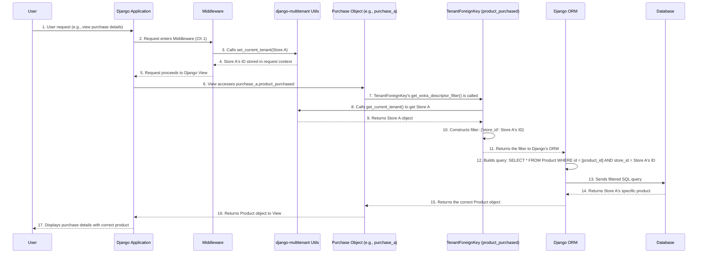

# Chapter 4: Tenant-Aware Foreign Keys

In [Chapter 1: Tenant Context Management](01_tenant_context_management_.md), we learned how `django-multitenant` remembers the current "tenant" (like a specific company). Then, in [Chapter 2: Tenant-Aware Models](02_tenant_aware_models_.md), you saw how your models can automatically include a `tenant_id` and filter queries based on the active tenant. And in [Chapter 3: Automatic Query Modification](03_automatic_query_modification_.md), we explored how this filtering happens transparently for all basic ORM operations.

But what happens when your models have relationships with each other? For example, if a `Purchase` belongs to a `Product`, and that `Product` belongs to a `Store` (our tenant)? How do we ensure these relationships also respect the tenant, especially in a distributed database setup like Citus?

This is where **Tenant-Aware Foreign Keys** come into play!

## What Problem Are We Solving?

Imagine our e-commerce platform where different "stores" (our tenants) sell `Product`s, and customers make `Purchase`s of those products.

We have our `Store` (tenant model), and `Product` models (tenant-aware, linked to `Store`). Now, let's introduce a `Purchase` model:

```python
# Regular Django foreign key setup
from django.db import models
from django_multitenant.models import TenantModel

class Store(TenantModel): # Our tenant model
    name = models.CharField(max_length=100)
    class TenantMeta:
        tenant_field_name = "id"

class Product(TenantModel): # Tenant-aware model
    name = models.CharField(max_length=255)
    store = models.ForeignKey(Store, on_delete=models.CASCADE)
    class Meta:
        # Important for TenantForeignKey: ensures 'id' + 'store' is unique
        unique_together = ["id", "store"] 
    class TenantMeta:
        tenant_field_name = "store_id"

class Purchase(TenantModel): # Another tenant-aware model
    # Link to the Store (tenant)
    store = models.ForeignKey(Store, on_delete=models.CASCADE) 
    
    # Link to the Product that was purchased
    # !!! If we use models.ForeignKey here, we have a problem!
    # product_purchased = models.ForeignKey(Product, on_delete=models.CASCADE) 

    class TenantMeta:
        tenant_field_name = "store_id"
```

Consider "Store A" which sells a "Laptop" (Product ID 100) and "Store B" which also sells a "Laptop" (Product ID 100). Because `Product` is a [Tenant-Aware Model](02_tenant_aware_models_.md), its primary key (`id`) is only unique *within* a tenant. So, `(id=100, store_id=A_ID)` is one product, and `(id=100, store_id=B_ID)` is another.

If we use a regular `models.ForeignKey` for `product_purchased` on the `Purchase` model, it would only try to link by `product_id` (e.g., `100`). In a distributed multi-tenant database (like Postgres with Citus, which `django-multitenant` is designed for), this is problematic:

1.  **Correctness:** A purchase made by a customer of Store A should *never* link to a product sold by Store B, even if they coincidentally have the same `id`.
2.  **Performance (Distributed Databases):** For databases that distribute data based on the tenant ID (like Citus), an efficient join between `Purchase` and `Product` requires joining on *both* `product_id` AND `store_id`. If you only join on `product_id`, the database might have to do a very slow, full-table scan across all tenants.

`TenantForeignKey` solves this by making sure the `tenant_id` is *always* part of the foreign key relationship.

**Analogy:** Imagine a safe deposit box system. Each box has a number, but you also need to know *which bank branch* it belongs to to open it. A regular `ForeignKey` is like only having the box number. `TenantForeignKey` is like having *both* the box number and the bank branch ID, ensuring you always access the correct box at the correct branch.

## What is `TenantForeignKey`?

`TenantForeignKey` is a specialized Django foreign key field provided by `django-multitenant`. It behaves very much like `models.ForeignKey`, but it has a crucial enhancement:

When you use `TenantForeignKey` to link two [Tenant-Aware Models](02_tenant_aware_models_.md), it ensures that the relationship considers *both* the primary key of the related model *and* its `tenant_id`.

For example, if `Purchase` links to `Product` using `TenantForeignKey`, it's not just "link to Product ID 100," but "link to Product ID 100 *that belongs to the current store*."

## How to Use `TenantForeignKey`

Using `TenantForeignKey` is straightforward: you simply replace `models.ForeignKey` with `TenantForeignKey` when linking to another [Tenant-Aware Model](02_tenant_aware_models_.md).

Let's fix our `Purchase` model:

```python
# your_app/models.py
from django.db import models
from django_multitenant.models import TenantModel
from django_multitenant.fields import TenantForeignKey # <--- Import this!

class Store(TenantModel):
    name = models.CharField(max_length=100)
    class TenantMeta:
        tenant_field_name = "id"

class Product(TenantModel):
    name = models.CharField(max_length=255)
    store = models.ForeignKey(Store, on_delete=models.CASCADE)
    class Meta:
        # REQUIRED for TenantForeignKey: The referenced model MUST have a unique constraint
        # across its primary key AND its tenant_id.
        unique_together = ["id", "store"] 
    class TenantMeta:
        tenant_field_name = "store_id"

class Purchase(TenantModel):
    store = models.ForeignKey(Store, on_delete=models.CASCADE) 
    
    # Use TenantForeignKey here instead of models.ForeignKey!
    product_purchased = TenantForeignKey(Product, on_delete=models.CASCADE) 

    class TenantMeta:
        tenant_field_name = "store_id"

```

**Important Note for `TenantForeignKey`!**
For `TenantForeignKey` to work correctly and, more importantly, for your database to efficiently enforce and optimize these tenant-aware relationships (especially with distributed databases like Citus), the model you are linking *to* (the `Product` in `product_purchased = TenantForeignKey(Product)`) **must have a `unique_together` constraint on its primary key and its tenant ID field.**

In our `Product` example, this means:
```python
    class Meta:
        unique_together = ["id", "store"] # Or ["id", "store_id"]
```
This tells Django (and your database during migrations) that the combination of `Product`'s `id` and its `store_id` is unique. This is vital because `TenantForeignKey` implicitly creates a *composite* key (a key made of multiple columns) that includes the tenant ID.

### Automating Composite Foreign Keys at the Database Layer

While `TenantForeignKey` handles the ORM side, you can also make your database enforce these composite foreign keys directly. This is particularly useful for databases like Citus, where co-locating data by tenant ID is key to performance.

To do this, you need to change your database engine in `settings.py`:

```python
# your_project/settings.py

DATABASES = {
    'default': {
        'ENGINE': 'django_multitenant.backends.postgresql', # <-- Change this!
        'NAME': 'your_database_name',
        # ... other database settings ...
    }
}
```
By using `django_multitenant.backends.postgresql`, `django-multitenant` will modify the SQL generated during migrations to create foreign key constraints that include *both* the primary key and the `tenant_id` for `TenantForeignKey` relationships. This makes your database relations robust and performant for multi-tenancy.

## How Tenant-Aware Foreign Keys Work in Practice

Let's see how `TenantForeignKey` simplifies your code. Assume "Store A" has `id=1` and "Store B" has `id=2`.

```python
from django_multitenant.utils import set_current_tenant
from your_app.models import Store, Product, Purchase 

# Get tenant objects
store_a = Store.objects.get(id=1)
store_b = Store.objects.get(id=2)

# Create some products and purchases
# First, for Store A
set_current_tenant(store_a)
product_a_laptop = Product.objects.create(name="Laptop A", store=store_a)
purchase_a = Purchase.objects.create(store=store_a, product_purchased=product_a_laptop)
print(f"Store A's product: {product_a_laptop.name} (ID: {product_a_laptop.id}, Store ID: {product_a_laptop.store_id})")
print(f"Store A's purchase links to Product ID: {purchase_a.product_purchased.id}, Store ID: {purchase_a.product_purchased.store_id}")
# Output for Purchase: ... Product ID: X, Store ID: 1

# Now, for Store B
set_current_tenant(store_b)
product_b_laptop = Product.objects.create(name="Laptop B", store=store_b)
purchase_b = Purchase.objects.create(store=store_b, product_purchased=product_b_laptop)
print(f"\nStore B's product: {product_b_laptop.name} (ID: {product_b_laptop.id}, Store ID: {product_b_laptop.store_id})")
print(f"Store B's purchase links to Product ID: {purchase_b.product_purchased.id}, Store ID: {purchase_b.product_purchased.store_id}")
# Output for Purchase: ... Product ID: Y, Store ID: 2

# Querying through the relationship:
set_current_tenant(store_a)
print(f"\nCurrently viewing data for: {store_a.name}")

# Get all purchases made for products in Store A
# Django-multitenant automatically filters this to Store A's data
store_a_purchases = Purchase.objects.all()
print(f"Total purchases visible to {store_a.name}: {store_a_purchases.count()}")

# Accessing the related product for a purchase:
first_purchase_a = store_a_purchases.first()
if first_purchase_a:
    print(f"First purchase is for product: {first_purchase_a.product_purchased.name} (Store ID: {first_purchase_a.product_purchased.store_id})")
    # Output: ... (Store ID: 1) - Correctly linked to Store A's product
else:
    print("No purchases for Store A yet.")


set_current_tenant(store_b)
print(f"\nCurrently viewing data for: {store_b.name}")

store_b_purchases = Purchase.objects.all()
print(f"Total purchases visible to {store_b.name}: {store_b_purchases.count()}")

first_purchase_b = store_b_purchases.first()
if first_purchase_b:
    print(f"First purchase is for product: {first_purchase_b.product_purchased.name} (Store ID: {first_purchase_b.product_purchased.store_id})")
    # Output: ... (Store ID: 2) - Correctly linked to Store B's product
else:
    print("No purchases for Store B yet.")
```

Notice that in `first_purchase_a.product_purchased.name`, you just accessed the related `Product` object. `django-multitenant` *automatically* ensured that the `Product` found belongs to `Store A`. You didn't have to add any `filter(store=store_a)` conditions! This is the magic of `TenantForeignKey` working with [Automatic Query Modification](03_automatic_query_modification_.md).

## Under the Hood: How the Magic Happens

`TenantForeignKey` achieves its magic by overriding two specific methods in Django's `ForeignKey` class:

1.  **`get_extra_descriptor_filter()`**: This method controls what happens when you access a related object directly, like `purchase_instance.product_purchased`.
2.  **`get_extra_restriction()`**: This method controls how `tenant_id` filters are added to database JOINs (e.g., when you do `Purchase.objects.filter(product_purchased__name='Laptop')`).

Let's trace what happens when you access `purchase_instance.product_purchased`:



Now, let's look at simplified code snippets from `django_multitenant/fields.py` that enable this:

### 1. `get_extra_descriptor_filter()` (Direct Access)

This part ensures that when you access `purchase_instance.product_purchased`, the lookup for the related `Product` automatically includes the current tenant's ID.

```python
# Simplified from django_multitenant/fields.py (TenantForeignKey)

from django.conf import settings
from .utils import get_current_tenant, get_tenant_filters

class TenantForeignKey(models.ForeignKey):
    def get_extra_descriptor_filter(self, instance):
        current_tenant = get_current_tenant()
        if current_tenant:
            # If a tenant is set, get the tenant filter for the related model
            # (e.g., {'store_id': Store A's ID} for the Product model)
            return get_tenant_filters(self.related_model)

        # Handle cases where no tenant is set (e.g., in strict mode, raise an error)
        # ... (error handling omitted for brevity) ...

        return super().get_extra_descriptor_filter(instance)
```
**Explanation:** When `purchase_instance.product_purchased` is accessed, this method runs. It checks the active tenant and, if one is found, it adds a filter like `Product.objects.filter(store_id=current_store_id)` *in addition* to the default filter by primary key. This ensures the correct, tenant-specific product is retrieved.

### 2. `get_extra_restriction()` (JOINs)

This part is crucial for making database JOINs tenant-aware. When you perform queries that involve traversing relationships (like `Purchase.objects.filter(product_purchased__name='Laptop')`), `django-multitenant` ensures that the `tenant_id` is included in the JOIN condition.

```python
# Simplified from django_multitenant/fields.py (TenantForeignKey)

from django.db.models.sql.where import WhereNode
from .utils import get_tenant_column

class TenantForeignKey(models.ForeignKey):
    # ... (get_extra_descriptor_filter and other methods) ...

    def get_extra_restriction(self, alias, related_alias):
        # 'alias' is the table alias for the current model (e.g., Purchase)
        # 'related_alias' is the table alias for the related model (e.g., Product)

        if not (related_alias and alias):
            return None

        # 1. Get the tenant column name for both models in the JOIN
        lhs_model = self.model # e.g., Purchase
        rhs_model = self.related_model # e.g., Product
        lhs_tenant_id = get_tenant_column(lhs_model) # e.g., 'store_id'
        rhs_tenant_id = get_tenant_column(rhs_model) # e.g., 'store_id'

        # 2. Get the actual column references for the JOIN (e.g., Purchase.store_id, Product.store_id)
        lhs_tenant_field = lhs_model._meta.get_field(lhs_tenant_id)
        rhs_tenant_field = rhs_model._meta.get_field(rhs_tenant_id)
        lookup_lhs = lhs_tenant_field.get_col(related_alias) # Product.store_id (on the related side)
        lookup_rhs = rhs_tenant_field.get_col(alias) # Purchase.store_id (on the current side)

        # 3. Create the condition: "current_model_alias.tenant_id = related_model_alias.tenant_id"
        # Example: "T1.store_id = T2.store_id"
        lookup = lhs_tenant_field.get_lookup("exact")(lookup_lhs, lookup_rhs)
        condition = WhereNode()
        condition.add(lookup, "AND")
        return condition
```
**Explanation:** This method is called when Django's ORM is building a SQL query that involves a JOIN over a `TenantForeignKey`. It adds an extra `AND` condition to the `JOIN` clause that compares the `tenant_id` columns of both tables. For example, a query like `Purchase.objects.filter(product_purchased__name='Laptop')` might result in SQL like:
`SELECT ... FROM "your_app_purchase" INNER JOIN "your_app_product" ON ("your_app_purchase"."product_purchased_id" = "your_app_product"."id" AND "your_app_purchase"."store_id" = "your_app_product"."store_id") WHERE ...`

This ensures that the join happens correctly across tenants, providing accurate results and enabling database performance optimizations specific to distributed multi-tenant architectures.

## Conclusion

**Tenant-Aware Foreign Keys** (`TenantForeignKey`) are the final piece of the puzzle for robust data isolation in `django-multitenant`. By using them, you guarantee that relationships between your tenant-aware models automatically respect the current tenant. This prevents data leakage and, critically for distributed databases like Citus, allows the database to efficiently route and process queries by ensuring all joins are `tenant_id`-aware. Remember to always add `unique_together` on `(id, tenant_id_field)` to your referenced models for best results!

With `TenantForeignKey`, you can build complex relationships in your multi-tenant application with confidence, knowing that `django-multitenant` handles the underlying complexity.

Next, we'll briefly look at how this all ties into [Citus Database Integration](05_citus_database_integration_.md), which is the specific distributed database solution that `django-multitenant` is optimized for.

[Next Chapter: Citus Database Integration](05_citus_database_integration_.md)

---

Generated by [AI Codebase Knowledge Builder](https://github.com/The-Pocket/Tutorial-Codebase-Knowledge)