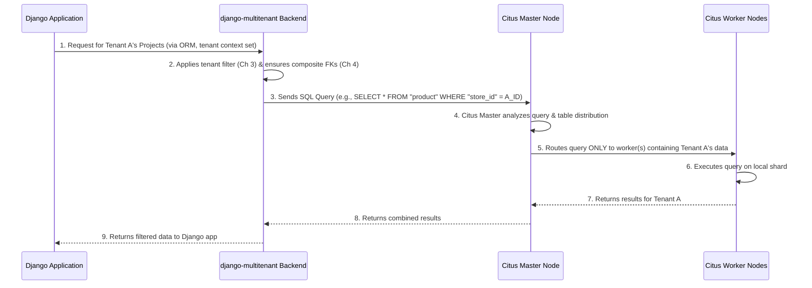

# Chapter 5: Citus Database Integration

In our journey so far, we've explored how `django-multitenant` helps your Django application understand and respect different tenants. We started with [Tenant Context Management](01_tenant_context_management_.md) to identify the active tenant. Then, we made our [Tenant-Aware Models](02_tenant_aware_models_.md) automatically filter data. We delved into the powerful [Automatic Query Modification](03_automatic_query_modification_.md) that handles this filtering behind the scenes. Finally, we learned about [Tenant-Aware Foreign Keys](04_tenant_aware_foreign_keys_.md) to ensure relationships also respect tenant boundaries.

All these chapters focused on making your *Django application* tenant-aware. But what about the *database* itself? If you're building a large-scale multi-tenant application, you'll eventually need a database that can handle massive amounts of data and traffic for many tenants efficiently. This is where **Citus Database Integration** comes into play.

## What Problem Are We Solving?

Imagine your multi-tenant application becomes incredibly popular, with thousands or even millions of tenants. A single, traditional PostgreSQL database might struggle to keep up with the sheer volume of data and queries.

This is where **Citus** comes in. Citus is a powerful open-source extension to PostgreSQL that transforms it into a **distributed database**. Think of it like this: instead of keeping all your data on one giant hard drive, Citus allows you to spread your data across many smaller hard drives (called "nodes" or "servers"). This means you can scale your database almost infinitely, by just adding more servers.

For a multi-tenant application, this is perfect! You can tell Citus: "Put all of Tenant A's data on Server 1, Tenant B's data on Server 2," and so on. This is called **sharding by tenant ID**. When a query for Tenant A comes in, Citus knows exactly which server to go to, instead of searching the entire huge database. This makes queries incredibly fast for specific tenants.

The problem `django-multitenant` solves here is: **How do you tell Django to communicate these special Citus instructions to your PostgreSQL database, and how does it ensure your multi-tenant Django application works seamlessly with a distributed Citus database?**

`django-multitenant` acts as the bridge. It extends Django's database backend to understand Citus-specific commands and concepts, allowing your Django application to leverage Citus's power for scaling multi-tenant data.

**Analogy:** Imagine your multi-tenant data is a huge library. A traditional database is one giant room with all the books. Citus is like having many smaller rooms, each dedicated to a few "authors" (tenants). When someone asks for a book by "Author A," you don't search the whole library; you go straight to "Author A's room." `django-multitenant` helps Django tell the library manager where to put new books and where to find old ones efficiently in this distributed setup.

## Key Concepts of Citus Integration

`django-multitenant`'s Citus integration revolves around these core ideas:

1.  **Distributed Table Creation (`create_distributed_table`)**: This is the most common command. It tells Citus to "shard" a table (split its data) across different servers based on a specific column, which for us is always the `tenant_id`. For example, your `Product` table would be distributed by `store_id`.
2.  **Reference Table Creation (`create_reference_table`)**: Some smaller tables (like a `Country` list or `TaxRate` definitions) don't belong to a specific tenant but are needed by *all* tenants. Citus can "replicate" these tables across all servers. This means every server has a full copy, making joins with them very fast.
3.  **Composite Foreign Keys at the Database Level**: Remember [Tenant-Aware Foreign Keys](04_tenant_aware_foreign_keys_.md)? `django-multitenant` ensures that when you run migrations, the actual database foreign key constraints include *both* the primary key and the `tenant_id`. This is crucial for Citus to perform efficient joins between distributed tables.
4.  **Special Transaction Modes for Updates/Deletions**: Sometimes, you might need to update or delete data across tables that are both distributed (by tenant ID) and reference (replicated). Citus has a special mode (`citus.multi_shard_modify_mode`) to handle these complex operations correctly, and `django-multitenant` manages this for you.

## How to Use It: Connecting Django to Citus

To enable `django-multitenant`'s Citus superpowers, you need to make a few configurations:

### Step 1: Change Your Database Engine in `settings.py`

This is the most critical step. You need to tell Django to use `django-multitenant`'s custom PostgreSQL backend, which includes the Citus-specific logic.

```python
# your_project/settings.py

DATABASES = {
    'default': {
        'ENGINE': 'django_multitenant.backends.postgresql', # <-- Change this line!
        'NAME': 'your_database_name',
        'USER': 'your_db_user',
        'PASSWORD': 'your_db_password',
        'HOST': 'master', # For Citus, this would be your Citus master node
        'PORT': '5432',
    }
}
```
**Explanation:** By setting `'ENGINE': 'django_multitenant.backends.postgresql'`, you replace Django's default PostgreSQL backend with one that `django-multitenant` has extended. This custom backend understands how to generate Citus-specific SQL commands (like composite foreign keys during migrations) and manage transactions for distributed tables.

### Step 2: Define Citus Distribution with Migration Operations

Once you've changed the database engine, you can tell Citus *how* to distribute your tables. You do this by creating a special migration operation called `Distribute`.

Let's assume our `Store` model is our tenant, and `Product` is sharded by `store_id`. `django-multitenant` does not provide an `auto_add` option for `Distribute` operations. Therefore, you need to manually add new migration files using the `Distribute` operation:

```bash
python manage.py makemigrations your_app --empty
```
This command creates an empty migration file (e.g., `your_app/migrations/000X_distribute.py`). Open this file and add the `Distribute` operations:

```python
# your_app/migrations/000X_distribute.py
from django.db import migrations
from django_multitenant.db.migrations.distribute import Distribute

class Migration(migrations.Migration):

    dependencies = [
        ('your_app', '000X_previous_migration_name'), # Ensure this depends on your model creation migration
    ]

    operations = [
        # Distribute the 'Product' table by its 'store_id'
        Distribute('Product', reference=False), 
        # Make the 'Store' table a reference table (replicated on all nodes)
        Distribute('Store', reference=True),
        # You would also distribute 'Purchase' by its 'store_id' if it's tenant-aware
        Distribute('Purchase', reference=False), 
    ]
```
**Explanation:**
*   `Distribute('Product', reference=False)`: This tells Citus to distribute the `Product` table across your worker nodes, using the `tenant_id` (which is `store_id` for `Product`) as the distribution column. This means all products for `Store A` will be on one shard (server), and all products for `Store B` on another, making queries for a single tenant very fast.
*   `Distribute('Store', reference=True)`: The `Store` table is our tenant model itself. It's usually small and needed frequently, so we make it a "reference table." Citus will copy the entire `Store` table to *every* worker node, so joins with it are super efficient.

After adding this migration, run `python manage.py migrate` to apply these distribution changes to your Citus database.

### Step 3: Setting Up a Citus Cluster (Brief Context)

While `django-multitenant` handles the *integration*, you still need a running Citus database cluster. This typically involves a "master" node and one or more "worker" nodes. Tools like Docker Compose can help you set up a local Citus cluster for development.

Here's a simplified `docker-compose.yml` to give you an idea of a basic Citus setup:

```yaml
# Simplified docker-compose.yml for a local Citus cluster
version: '2.1'
services:
  master:
    image: 'citusdata/citus:11.2' # Citus master node
    ports: ['5432:5432'] # Expose standard PostgreSQL port
    environment:
      - POSTGRES_HOST_AUTH_METHOD=trust
  worker1:
    image: 'citusdata/citus:11.2' # Citus worker node 1
    environment:
      - POSTGRES_HOST_AUTH_METHOD=trust
  worker2:
    image: 'citusdata/citus:11.2' # Citus worker node 2
    environment:
      - POSTGRES_HOST_AUTH_METHOD=trust
  # ... (other services like manager for production, not shown for simplicity)
```
**Explanation:** This `docker-compose.yml` defines a `master` service (your main Citus coordinator) and `worker1`, `worker2` services (where the data shards will live). When Django connects to `master:5432`, `django-multitenant` helps it send commands that Citus then uses to manage data across `worker1` and `worker2`.

## Under the Hood: How the Magic Happens

The `django-multitenant` Citus integration magic primarily happens in two places:

### 1. The Custom PostgreSQL Database Backend

When you configure `'ENGINE': 'django_multitenant.backends.postgresql'`, `django-multitenant` swaps out Django's default database schema editor with its own. This custom schema editor (`DatabaseSchemaEditor` in `django_multitenant/backends/postgresql/base.py`) overrides key methods related to creating foreign keys.

Let's look at a simplified snippet that handles composite foreign keys:

```python
# Simplified from django_multitenant/backends/postgresql/base.py

class DatabaseSchemaEditor(PostgresqlDatabaseSchemaEditor):
    # ... other methods ...

    def _create_fk_sql(self, model, field, suffix):
        """
        Overrides Django's FK creation to include the tenant column.
        """
        if isinstance(field, TenantForeignKey):
            from_model = get_model_by_db_table(model._meta.db_table)
            to_model = get_model_by_db_table(field.target_field.model._meta.db_table)

            # Define the columns for the composite foreign key
            from_columns = field.column, get_tenant_column(from_model) # e.g., ('product_purchased_id', 'store_id')
            to_columns = field.target_field.column, get_tenant_column(to_model) # e.g., ('id', 'store_id')

            # Generate SQL like: FOREIGN KEY (product_purchased_id, store_id) REFERENCES product (id, store_id)
            return self.sql_create_fk % {
                "column": ", ".join([self.quote_name(col) for col in from_columns]),
                "to_column": ", ".join([self.quote_name(col) for col in to_columns]),
                # ... rest of the SQL parameters ...
            }
        return super()._create_fk_sql(model, field, suffix)
```
**Explanation:** When Django prepares the SQL to create a foreign key for a `TenantForeignKey` (from [Chapter 4](04_tenant_aware_foreign_keys_.md)), this overridden method steps in. Instead of just adding a foreign key on `product_purchased_id`, it adds it on `(product_purchased_id, store_id)`. This creates a **composite foreign key** directly in the database, which is crucial for Citus to optimize joins between distributed tables.

The backend also handles special transaction modes. For instance, when you perform `DELETE` operations that might involve both distributed tables and reference tables, Citus needs to perform these operations sequentially to avoid conflicts. `django-multitenant` automatically sets the `citus.multi_shard_modify_mode` to `'sequential'` temporarily for such transactions, then reverts it.

```python
# Simplified from django_multitenant/query.py (part of wrap_delete)
from django.db import connections, transaction
from django_multitenant.utils import is_distributed_model
from django.conf import settings

def wrap_delete(base_delete):
    def delete(obj):
        # Check if deletion involves a mix of distributed and reference tables
        obj_are_distributed = [is_distributed_model(instance) for instance in obj.data.keys()]

        if len(set(obj_are_distributed)) > 1 and getattr(settings, "CITUS_EXTENSION_INSTALLED", False):
            # If so, temporarily set Citus to sequential modify mode
            with transaction.atomic(using=obj.using, savepoint=False):
                connections[obj.using].cursor().execute("SET LOCAL citus.multi_shard_modify_mode TO 'sequential';")
                result = base_delete(obj) # Execute the actual delete
                connections[obj.using].cursor().execute("SET LOCAL citus.multi_shard_modify_mode TO 'parallel';")
                return result
        return base_delete(obj)
    return delete
```
**Explanation:** This snippet (which is applied by `TenantModelMixin` internally) demonstrates how `django-multitenant` intercepts `DELETE` operations. If the objects being deleted come from a mix of distributed and reference tables, it sets a special Citus configuration (`citus.multi_shard_modify_mode`) to ensure the operation completes without errors due to the distributed nature of the database.

### 2. The `Distribute` Migration Operation

The `Distribute` operation (`django_multitenant.db.migrations.distribute.py`) is responsible for generating the actual `create_distributed_table` or `create_reference_table` SQL commands that Citus understands.

```python
# Simplified from django_multitenant/db/migrations/distribute.py

from django.db.migrations.operations.base import Operation
from django_multitenant.utils import get_tenant_column

class Distribute(Operation):
    def __init__(self, model_name, reference=False, reverse_ignore=False):
        self.model_name = model_name
        self.reference = reference # Is it a reference table?

    def get_query(self):
        if self.reference:
            return "SELECT create_reference_table(%s)"
        return "SELECT create_distributed_table(%s, %s)"

    def database_forwards(self, app_label, schema_editor, from_state, to_state):
        fake_model = self.get_fake_model(app_label, from_state)
        table_name = fake_model._meta.db_table # Get the actual table name

        self.args = [table_name] # Always provide the table name
        if not self.reference:
            # If it's a distributed table, also provide the tenant column
            real_model = self.get_real_model(app_label) # Get the actual Model class to find tenant_id
            self.args.append(get_tenant_column(real_model))

        schema_editor.execute(self.get_query(), params=self.args)
```
**Explanation:** When you run `python manage.py migrate`, Django processes this `Distribute` operation. It constructs the correct Citus SQL query (either `create_distributed_table` or `create_reference_table`) and then executes it against your database. This is how you literally tell Citus how to organize your data.

Here's a high-level sequence of how Django, `django-multitenant`, and Citus work together for a tenant-aware query:



## Conclusion

**Citus Database Integration** is the final, powerful layer of `django-multitenant`. By configuring the custom database backend and using the `Distribute` migration operation, you enable your Django application to effectively communicate with and leverage a distributed Citus database. This allows for massive scalability by sharding your data by tenant ID, ensuring efficient queries and robust data isolation even as your multi-tenant application grows to serve millions of customers. You can build on a single, shared database infrastructure, while enjoying the performance benefits of a distributed system that understands and optimizes for your multi-tenant data.

---

Generated by [AI Codebase Knowledge Builder](https://github.com/The-Pocket/Tutorial-Codebase-Knowledge)