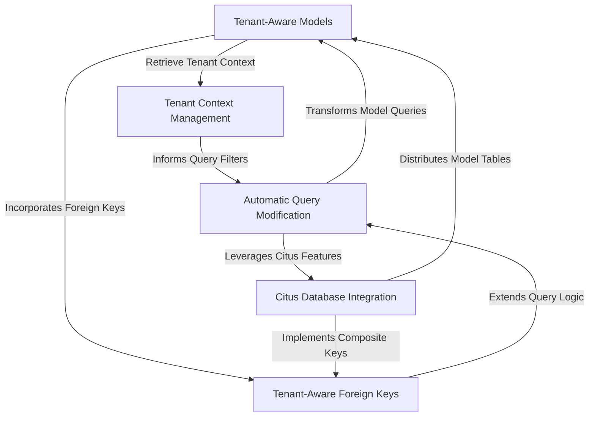

# Tutorial: django-multitenant

`django-multitenant` is a Django library designed to build **scalable multi-tenant SaaS applications** on shared database tables, specifically leveraging *Postgres and Citus*. It *automates* the crucial task of associating data with the correct tenant by injecting `tenant_id` filters into database queries, ensuring robust data isolation and efficient performance across tenants.

**Source Repository:** [https://github.com/citusdata/django-multitenant](https://github.com/citusdata/django-multitenant)

## Chapters

1. [Tenant Context Management
](01_tenant_context_management_.md)
2. [Tenant-Aware Models
](02_tenant_aware_models_.md)
3. [Automatic Query Modification
](03_automatic_query_modification_.md)
4. [Tenant-Aware Foreign Keys
](04_tenant_aware_foreign_keys_.md)
5. [Citus Database Integration
](05_citus_database_integration_.md)

---

Generated by [AI Codebase Knowledge Builder](https://github.com/The-Pocket/Tutorial-Codebase-Knowledge)