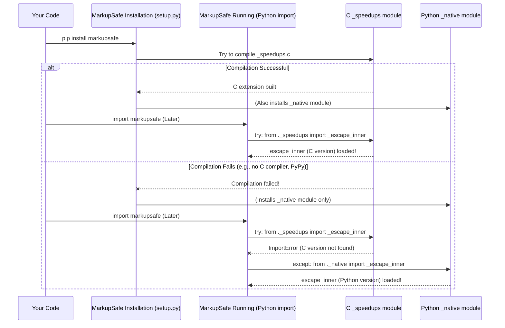

# Chapter 5: Performance Optimization (Speedups)

Welcome back! In [Chapter 4: Core Escaping Logic (`_escape_inner`)](04_core_escaping_logic____escape_inner___.md), we peeled back the layers to reveal `_escape_inner`, the hardworking function that actually replaces special HTML characters like `<` with `&lt;`. This little function is crucial because it does the heavy lifting of making your text safe.

But imagine you're running a very popular website. Every time a user's comment, a blog post, or any piece of dynamic text is shown on a page, it needs to be escaped. This `_escape_inner` function might be called thousands, even millions of times a second! Even a tiny fraction of a second saved on each call can add up to a huge difference in how fast your website feels to users.

## The Need for Speed: Why Optimize Escaping?

Think of it like a very busy cashier at a popular store. Each customer transaction is quick, but if there are hundreds of customers in line, even a tiny delay in processing each one will make the line grow very long.

Similarly, in a web application:
*   Escaping is a very common operation.
*   Python, while wonderful and easy to use, isn't always the fastest language for highly repetitive, low-level tasks compared to languages like C.

For `markupsafe` to be truly effective in high-performance web frameworks, it needs to perform its core escaping task as quickly as possible. This is where "speedups" come in.

## What are "Speedups" in `markupsafe`?

"Speedups" refers to a clever trick `markupsafe` uses to make the `_escape_inner` function incredibly fast. Instead of relying solely on the pure Python version of `_escape_inner` we saw in the last chapter, `markupsafe` tries to use a version of `_escape_inner` that's written in a much faster programming language: **C**.

Imagine you have a common task, like cutting wood.
*   The pure Python `_escape_inner` is like a reliable, well-crafted **hand saw**. It gets the job done accurately.
*   The C version of `_escape_inner` is like a powerful, specialized **electric saw**. It does the *exact same job* but much, much faster!

`markupsafe` tries to use this "electric saw" (the C version) whenever it can. If the "electric saw" isn't available or can't be set up, it gracefully falls back to the reliable "hand saw" (the pure Python version). You, as the user, don't have to worry about this – `markupsafe` handles it all automatically!

## How `markupsafe` Chooses the Fast Version (Under the Hood)

Let's look at a key part of `markupsafe`'s main file (`src/markupsafe/__init__.py`) to see how it decides which `_escape_inner` to use:

```python
# From src/markupsafe/__init__.py

try:
    from ._speedups import _escape_inner # Try to import the super fast C version
except ImportError:
    from ._native import _escape_inner # If it fails, use the reliable Python version

# ... rest of the markupsafe code
```

**Explanation:**

*   `try...except ImportError`: This is a standard Python way to "try" something and "catch" an error if it doesn't work.
*   `from ._speedups import _escape_inner`: `markupsafe` first attempts to import `_escape_inner` from a module called `_speedups`. This `_speedups` module is where the C version of the escaping logic lives. If this import is successful, `markupsafe` will use the super-fast C implementation.
*   `from ._native import _escape_inner`: If the import from `_speedups` fails (meaning the C version couldn't be found or built), an `ImportError` occurs. The `except` block then kicks in, and `markupsafe` automatically imports `_escape_inner` from the `_native` module. The `_native` module contains the pure Python version of `_escape_inner` we examined in [Chapter 4](04_core_escaping_logic____escape_inner___.md).

This mechanism ensures that `markupsafe` always has a working `_escape_inner` function, prioritizing the fastest one available.

### Why Might the C Version Not Be Available?

The C version of `_escape_inner` needs to be "compiled" into machine code when `markupsafe` is installed. This usually happens automatically, but sometimes it can fail for a few reasons:

*   **Missing C Compiler:** Your system might not have a C compiler (like GCC on Linux/macOS or MSVC on Windows) installed.
*   **Specific Python Environments:** Some alternative Python implementations, like PyPy, Jython, or GraalVM, do not directly support C extensions written for standard Python (CPython). In these environments, `markupsafe` will always fall back to the pure Python version.

## How the Speedups Are Built (During Installation)

When you install `markupsafe` (e.g., using `pip install markupsafe`), a special script called `setup.py` runs. This script is responsible for setting up the package. Part of its job is to try and build that C extension.

Here's a simplified look at what `setup.py` does:

```python
# From setup.py (simplified)

from setuptools import Extension, setup
from setuptools.command.build_ext import build_ext
from setuptools.errors import BuildFailed # A custom error

# This lists the C extension to be built
ext_modules = [Extension("markupsafe._speedups", ["src/markupsafe/_speedups.c"])]

# ... (other setup details) ...

try:
    # Try to build markupsafe with the C extension
    run_setup(True) 
except BuildFailed:
    # If building the C extension fails, try again without it
    show_message("WARNING: The C extension could not be compiled, speedups are not enabled.")
    run_setup(False) # Build the pure Python version
else:
    # Or if on a platform that doesn't support C extensions
    run_setup(False)
    show_message("WARNING: C extensions are not supported on this Python platform.")
```

**Explanation:**

1.  `ext_modules = [Extension("markupsafe._speedups", ["src/markupsafe/_speedups.c"])]`: This line tells the installation tool (`setuptools`) that there's a C source file (`_speedups.c`) that needs to be compiled into a Python extension module named `markupsafe._speedups`.
2.  `try...except BuildFailed`: This block attempts to run the installation process *with* the C extension. If the C compiler isn't found or there's another issue during compilation, it "catches" the `BuildFailed` error.
3.  `run_setup(False)`: If the C extension fails to build, `setup.py` is smart enough to retry the installation *without* trying to build the C extension. It then proceeds with installing only the pure Python parts of `markupsafe`. This is why `markupsafe` always works, even if it can't achieve maximum speed.

This is the behind-the-scenes magic that makes `markupsafe` both fast and robust!

## The Automatic Fallback Process

Here's a sequence diagram showing how `markupsafe` handles the speedup selection:



No matter what happens during installation or what Python environment you're using, `markupsafe` ensures that the `escape()` function will always work, even if it has to use the slightly slower pure Python version.

## Conclusion

`markupsafe` is designed with performance in mind. By attempting to compile and use a C extension for its core `_escape_inner` logic, it can achieve significant speedups for common escaping operations. This makes your web applications faster and more responsive.

Crucially, this optimization happens automatically. `markupsafe` intelligently tries to use the fastest available implementation and gracefully falls back to a pure Python version if the C extension cannot be built. This provides the best of both worlds: high performance when possible, and guaranteed reliability always.

Next, we'll explore another powerful feature of `markupsafe`: how it helps you safely format strings for HTML.

[Safe String Formatting](06_safe_string_formatting_.md)

---

Generated by [AI Codebase Knowledge Builder](https://github.com/The-Pocket/Tutorial-Codebase-Knowledge)