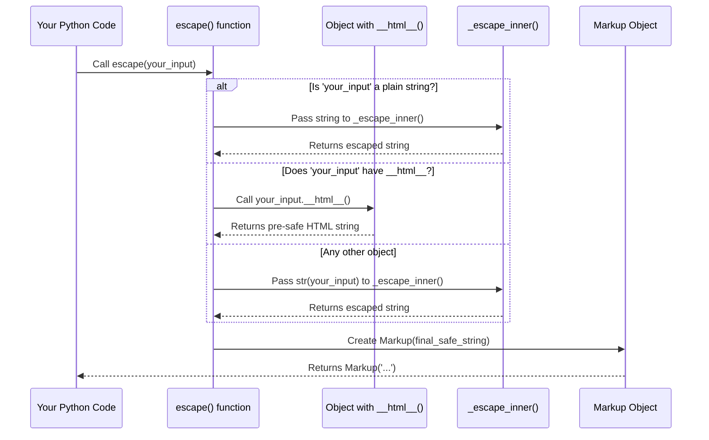

# Chapter 4: Core Escaping Logic (`_escape_inner`)

Welcome back! In [Chapter 3: HTML Safety Protocol (`__html__`)](03_html_safety_protocol_____html_____.md), we learned how objects can tell `markupsafe` that they already know how to make themselves safe for HTML using the special `__html__` method. Before that, in [Chapter 2: Escape Function](02_escape_function_.md), we explored the `escape()` function, which acts as your main security guard, taking potentially unsafe text and turning it into a safe `Markup` string.

But how exactly does `escape()` perform its "magic" of changing characters like `<` into `&lt;`? It's not `escape()` itself that does the character-by-character replacement. That heavy lifting is handled by a specialized, low-level function called `_escape_inner`.

## What Problem Does `_escape_inner` Solve?

Think of a busy repair shop for electronics. The main `escape()` function is like the **receptionist**: it takes your device, listens to your problem, and decides what kind of repair is needed (e.g., "Is this device already pre-certified as safe?" or "Does it need a full inspection and part replacement?").

Once `escape()` decides that a piece of text *does* need its special characters replaced, it hands that text over to the **specialized repair tool** – that's `_escape_inner`. `_escape_inner` is the function that knows *exactly* how to take an `&` and turn it into `&amp;`, or a `<` and turn it into `&lt;`. It's the worker that does the actual, precise "fixing" of individual characters.

It's a low-level, focused function. Its only job is to perform the character replacements, making sure all those risky HTML characters are transformed into harmless text.

## How `_escape_inner` Works (The Specialized Repair Tool in Action)

The `_escape_inner` function is designed to be very efficient at one specific task: replacing the five most common characters that can cause trouble in HTML with their "entity" equivalents.

These characters and their replacements are:

*   `&` (ampersand) becomes `&amp;`
*   `<` (less than) becomes `&lt;`
*   `>` (greater than) becomes `&gt;`
*   `'` (single quote/apostrophe) becomes `&#39;`
*   `"` (double quote) becomes `&#34;`

It processes the string from left to right, finding these characters and replacing them one by one.

You won't directly call `_escape_inner` in your code. It's an internal helper function that `markupsafe` uses behind the scenes. When you use `escape()` (or `Markup.escape()`), `markupsafe` will eventually call `_escape_inner` if the input needs escaping.

Let's revisit an example from [Chapter 2: Escape Function](02_escape_function_.md) and understand where `_escape_inner` fits in:

```python
from markupsafe import escape

user_input = "Hello! My name is <script>alert('XSS Attack!')</script>."
safe_comment = escape(user_input)

print(safe_comment)
```

**What happens behind the scenes here?**

1.  You call `escape(user_input)`.
2.  The `escape()` function receives `"Hello! My name is <script>alert('XSS Attack!')</script>."`.
3.  `escape()` checks: "Is this a plain Python string?" Yes, it is!
4.  So, `escape()` passes this string directly to `_escape_inner`.
5.  `_escape_inner` then goes to work, replacing `&`, `<`, `>`, `'`, and `"` characters.
6.  It returns the fully transformed string: `Hello! My name is &lt;script&gt;alert(&#39;XSS Attack!&#39;)&lt;/script&gt;.`
7.  Finally, `escape()` wraps this result in a `Markup` object and returns it to you.

So, while `escape()` is your main entry point for safety, `_escape_inner` is the silent workhorse that does the actual character-level transformation.

## Under the Hood: How `_escape_inner` is Called

Let's look at the simplified flow of the `escape()` function again, but this time, specifically highlighting when `_escape_inner` is called:



As the diagram shows, `_escape_inner` is called in two main scenarios within `escape()`:
1.  When the input is a plain Python string. This is the fastest path.
2.  When the input is any other kind of object *without* a `__html__` method. In this case, `markupsafe` first converts the object to a string using `str()`, and then passes that string to `_escape_inner`.

## The `_escape_inner` Code (Pure Python Version)

`markupsafe` actually has two versions of `_escape_inner`: one written in pure Python for compatibility, and a much faster one written in C (which we'll discuss in the next chapter). The Python version is very straightforward and shows exactly how the character replacement works.

Here's the simplified code for `_escape_inner` from `src/markupsafe/_native.py`:

```python
# From src/markupsafe/_native.py

def _escape_inner(s: str, /) -> str:
    return (
        s.replace("&", "&amp;")  # Replace & first!
        .replace(">", "&gt;")
        .replace("<", "&lt;")
        .replace("'", "&#39;")
        .replace('"', "&#34;")
    )
```

**Explanation:**

This little function just takes a string `s` and performs a series of `.replace()` operations:

1.  `s.replace("&", "&amp;")`: It first replaces all `&` characters with `&amp;`. This is very important to do *first* to prevent `&` in the *replacement strings* (like `&lt;`) from being double-escaped into `&amp;lt;`.
2.  `.replace(">", "&gt;")`: Then, it replaces all `>` characters with `&gt;`.
3.  `.replace("<", "&lt;")`: Next, all `<` characters become `&lt;`.
4.  `.replace("'", "&#39;")`: Single quotes are replaced with `&#39;`.
5.  `.replace('"', "&#34;")`: Finally, double quotes are replaced with `&#34;`.

The result of this chain of replacements is a brand-new string where all the problematic characters are safely converted into their HTML entity forms. This safe string is then returned to the `escape()` function, which wraps it in a `Markup` object.

This simplicity is beautiful because it directly shows the core logic of HTML escaping.

## Conclusion

The `_escape_inner` function is the fundamental, low-level component within `markupsafe` that performs the actual character replacement (e.g., `&` to `&amp;`). While you don't call it directly, it's the engine that powers the `escape()` function, ensuring that special HTML characters in your text are transformed into their harmless entity equivalents, making your web applications secure.

In the next chapter, we'll look at how `markupsafe` makes this vital process incredibly fast by using "speedups" – a C version of `_escape_inner`.

[Performance Optimization (Speedups)](05_performance_optimization__speedups__.md)

---

Generated by [AI Codebase Knowledge Builder](https://github.com/The-Pocket/Tutorial-Codebase-Knowledge)