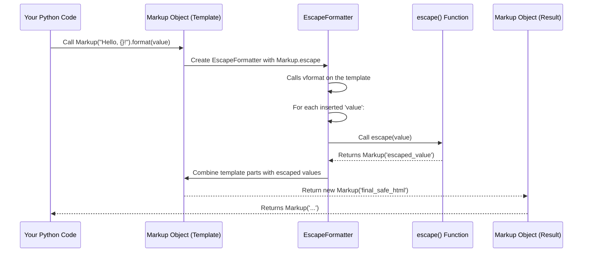

# Chapter 6: Safe String Formatting

Welcome back! In [Chapter 5: Performance Optimization (Speedups)](05_performance_optimization__speedups__.md), we explored how `markupsafe` ensures its core escaping logic is incredibly fast, thanks to optimized "speedups." Now, let's look at another powerful feature that makes building dynamic HTML much safer and easier: **Safe String Formatting**.

## The Problem: Unsafe Dynamic HTML

Imagine you're building a webpage that shows user-generated content, like comments or profile information. You often need to mix static HTML (like `<b>` or `<em>` tags) with dynamic data (like a username or a comment body from your database).

A common way to combine strings in Python is using string formatting, such as the `%` operator or the `.format()` method. For example:

```python
# Imagine 'name' comes from user input or a database
user_name = "<script>alert('Hacked!');</script>"
html_template = "Hello, <b>{}</b>!"

# Creating the final HTML string
final_html = html_template.format(user_name)

print(final_html)
```

**What's the danger here?**
If `user_name` contains special HTML characters (like `<`, `>`, `&`, `'`, `"`), and you insert it directly into your `html_template`, those characters are *not* automatically escaped. The browser would then interpret `<script>` as actual code, leading to security vulnerabilities like Cross-Site Scripting (XSS). This is a big problem!

You could manually `escape()` every piece of dynamic data:

```python
from markupsafe import escape

user_name = "<script>alert('Hacked!');</script>"
html_template = "Hello, <b>{}</b>!"

# Manually escaping before formatting
safe_user_name = escape(user_name)
final_safe_html = html_template.format(safe_user_name)

print(final_safe_html)
```
This works, but it's easy to forget to call `escape()` every single time, especially in complex templates or when many variables are involved.

## The Solution: `Markup` as a Smart Template

`markupsafe` provides a much safer and more convenient way to handle this: **use a `Markup` object as your template string!**

When you use Python's standard string formatting methods (`%` operator or `.format()`) on a `Markup` object, `markupsafe` acts as a "smart HTML filter." It automatically takes any values you try to insert into the template and passes them through the `escape()` function *for you*. This ensures that all inserted data is automatically made HTML-safe, preventing injection vulnerabilities.

It's like having a built-in security checker for every piece of data you plug into your HTML template.

## How to Use Safe String Formatting

Let's see how `Markup` objects make string formatting safe:

### 1. Using the `%` Operator with `Markup`

If you prefer the older `%` operator for string formatting, `Markup` objects handle it safely.

```python
from markupsafe import Markup

# This time, our template is a Markup object
template = Markup("Hello, <b>%s</b>! Your balance: $%.2f")

# User-provided data (potentially unsafe)
username_from_db = "Alice & Bob <friends>"
account_balance = 123.456

# The Markup template automatically escapes the inserted values
safe_output = template % (username_from_db, account_balance)

print(safe_output)
print(type(safe_output))
```

**What happened here?**
The `username_from_db` string, which contained `&` and `<` characters, was **automatically escaped** by `markupsafe` before being inserted into the `Markup` template. Notice how `Alice & Bob <friends>` became `Alice &amp; Bob &lt;friends&gt;`. The number `account_balance` was also safely formatted. The final result is a `Markup` string, indicating it's ready for display.

### 2. Using the `.format()` Method with `Markup`

The `.format()` method is a more modern way to format strings in Python, and `Markup` objects handle it just as safely.

```python
from markupsafe import Markup

# Our template is a Markup object
template = Markup("<h3>Welcome, {user_name}!</h3><p>Your comment: {comment}</p>")

# User-provided data
user_name_input = "John Doe <admin>"
user_comment_input = "This is great! <3"

# Markup's .format() method automatically escapes inserted values
safe_output = template.format(user_name=user_name_input, comment=user_comment_input)

print(safe_output)
print(type(safe_output))
```

**What happened here?**
Both `user_name_input` and `user_comment_input` were automatically passed through `markupsafe`'s escaping logic because the template (`template`) was a `Markup` object. This ensures `John Doe &lt;admin&gt;` and `This is great! &lt;3` are displayed, not interpreted as HTML code. The result is a safe `Markup` string.

### A Note on F-strings

It's important to understand that standard Python f-strings (like `f"..."`) do *not* automatically trigger `markupsafe`'s escaping unless the value you're inserting *itself* is a `Markup` object or has an `__html__` method.

If you have a regular string template, f-strings will not automatically escape inserted values:

```python
user_input = "<script>alert('XSS')</script>"
# This does NOT auto-escape 'user_input'
unsafe_html = f"<div>{user_input}</div>"
print(unsafe_html) # Output: <div><script>alert('XSS')</script></div> (VULNERABLE!)
```

To use f-strings safely with `markupsafe`, you either need to ensure the values are already `Markup` objects, manually escape them, or use the `Markup.format()` method as shown above:

```python
from markupsafe import Markup, escape

user_input = "<script>alert('XSS')</script>"

# Option 1: Manually escape inside the f-string
safe_html_1 = f"<div>{escape(user_input)}</div>"
print(safe_html_1) # Output: <div>&lt;script&gt;alert(&#39;XSS&#39;)&lt;/script&gt;</div>

# Option 2: Use a Markup template with .format() (as demonstrated earlier)
safe_html_2 = Markup("<div>{}</div>").format(user_input)
print(safe_html_2) # Output: Markup('<div>&lt;script&gt;alert(&#39;XSS&#39;)&lt;/script&gt;</div>')
```

The key takeaway is that the automatic escaping for string formatting happens when the *template itself* is a `Markup` object and you use its `format()` or `%` operator methods.

## Under the Hood: How `Markup` Handles Formatting

How does `markupsafe` achieve this magic? The `Markup` class is a clever subclass of Python's built-in `str` type. This means it can override some of the standard string methods to add its own special behavior.

Specifically, `Markup` overrides:
*   The `__mod__` method, which is what gets called when you use the `%` operator.
*   The `format()` method.
*   The `format_map()` method.

When you call one of these formatting methods on a `Markup` object, it intercepts the call and ensures that the arguments you pass in are made safe before being inserted into the string.

Let's look at a simplified flow for `Markup(...).format(...)`:



### Simplified Code Snippets

Let's peek at the actual (simplified) code from `src/markupsafe/__init__.py`:

**1. `Markup.format()` Method:**

```python
class Markup(str):
    # ... other methods ...

    def format(self, *args: t.Any, **kwargs: t.Any) -> te.Self:
        # Create a special formatter that uses Markup's escape logic
        formatter = EscapeFormatter(self.escape) 
        # Use the formatter to process the template and arguments
        return self.__class__(formatter.vformat(self, args, kwargs))

    # ...
```
When you call `template.format()`, it creates an `EscapeFormatter` instance. This `EscapeFormatter` is crucial because it's built to understand `markupsafe`'s escaping rules.

**2. `EscapeFormatter.format_field()` Method:**

The `EscapeFormatter` is a custom version of Python's built-in `string.Formatter`. Its key method is `format_field`, which decides how each value inserted into the template should be handled:

```python
import string
# ... other imports ...

class EscapeFormatter(string.Formatter):
    __slots__ = ("escape",)

    def __init__(self, escape: _TPEscape) -> None:
        self.escape: _TPEscape = escape # Store markupsafe's escape function
        super().__init__()

    def format_field(self, value: t.Any, format_spec: str) -> str:
        # If the value has __html_format__ (advanced, for custom formatting logic)
        if hasattr(value, "__html_format__"):
            rv = value.__html_format__(format_spec)
        # If the value has __html__ (as seen in Chapter 3)
        elif hasattr(value, "__html__"):
            rv = value.__html__()
        # Otherwise, the default path: perform standard formatting, THEN escape it!
        else:
            rv = super().format_field(value, str(format_spec))
        
        # This is the crucial step: whatever the value is, it gets escaped!
        return str(self.escape(rv)) 
```
**Explanation:**
The `EscapeFormatter`'s `format_field` method is where the magic happens for each placeholder (`{}`) in your template:
*   It first checks if the `value` has a special `__html_format__` or `__html__` method. If so, it trusts that method to produce safe HTML (as discussed in [Chapter 3: HTML Safety Protocol (`__html__`)](03_html_safety_protocol_____html_____.md)).
*   **Most importantly**, if the value doesn't have these special methods (meaning it's a regular string, number, or other object), `EscapeFormatter` first formats it into a string (using `super().format_field`) and **then immediately passes that result to `self.escape()`**.
*   The `self.escape` in `EscapeFormatter` is actually `Markup.escape` (which internally calls `markupsafe.escape()`), ensuring that the value is properly escaped before being put into the final string.

This robust mechanism guarantees that when you format a `Markup` string, all injected values are automatically sanitized for HTML safety.

## Conclusion

Safe string formatting is a cornerstone feature of `markupsafe`. By simply making your template string a `Markup` object and using its `.format()` or `%` operator methods, you gain automatic HTML escaping for all inserted values. This drastically reduces the risk of XSS vulnerabilities and makes your code cleaner and less error-prone, as you don't have to remember to manually call `escape()` everywhere.

This concludes our journey through the core concepts of `markupsafe`. You now have a solid understanding of `Markup` strings, the `escape` function, the `__html__` protocol, the underlying `_escape_inner` logic, performance optimizations, and how to safely format your dynamic HTML.

---

Generated by [AI Codebase Knowledge Builder](https://github.com/The-Pocket/Tutorial-Codebase-Knowledge)