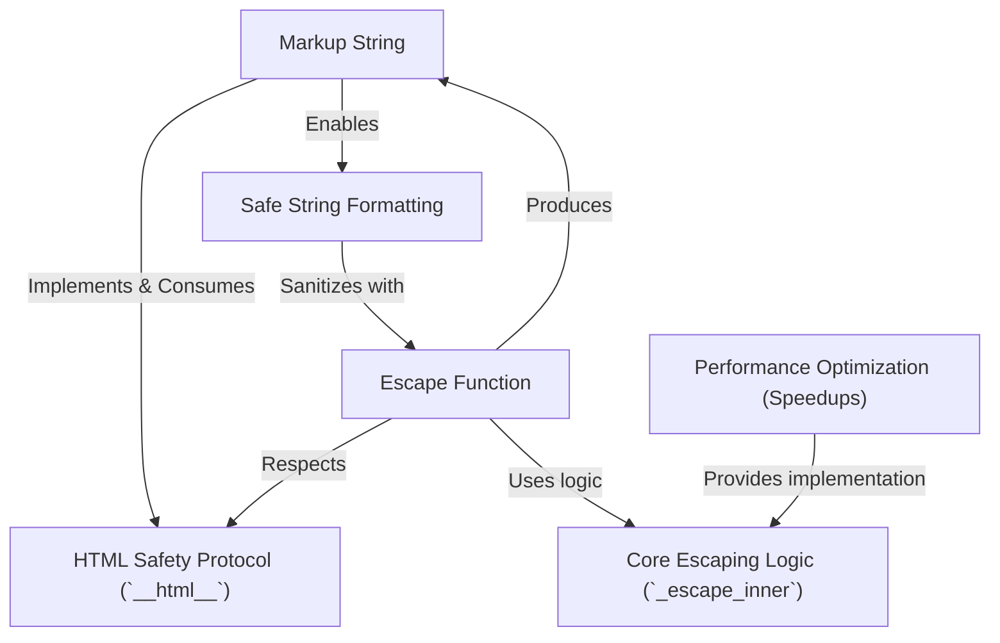

# Tutorial: markupsafe
`markupsafe` is a Python library designed to keep your web applications secure from *cross-site scripting (XSS)* attacks. It provides a special **Markup string** type that marks content as *already safe* for HTML, and an **escape function** that converts potentially dangerous text into safe HTML entities, ensuring your user-provided data doesn't accidentally become malicious code.

**Source Repository:** [https://github.com/mitsuhiko/markupsafe](https://github.com/mitsuhiko/markupsafe)

## Chapters

1. [Markup String
](01_markup_string_.md)
2. [Escape Function
](02_escape_function_.md)
3. [HTML Safety Protocol (`__html__`)
](03_html_safety_protocol_____html_____.md)
4. [Core Escaping Logic (`_escape_inner`)
](04_core_escaping_logic____escape_inner___.md)
5. [Performance Optimization (Speedups)
](05_performance_optimization__speedups__.md)
6. [Safe String Formatting
](06_safe_string_formatting_.md)

---

Generated by [AI Codebase Knowledge Builder](https://github.com/The-Pocket/Tutorial-Codebase-Knowledge)