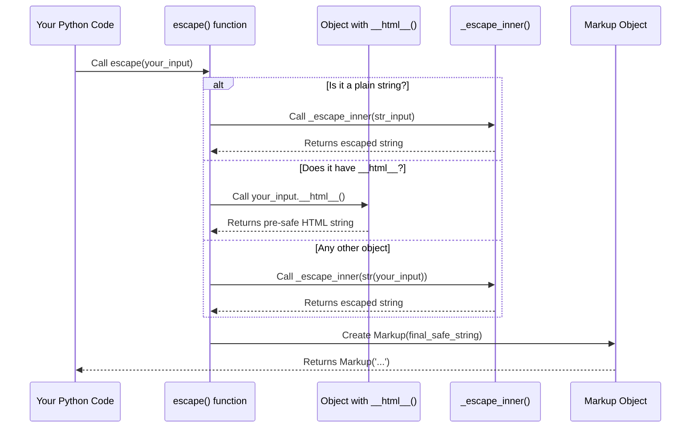

# Chapter 2: Escape Function

Welcome back! In [Chapter 1: Markup String](01_markup_string_.md), we learned about `Markup` strings – special strings in `markupsafe` that are marked as "certified safe" for display in HTML. We also briefly touched upon `Markup.escape()`, one of the ways to create a safe `Markup` string from potentially dangerous input.

Now, let's dive deeper into the core engine behind that safety: the `escape` function.

## What Problem Does `escape` Solve?

Imagine you're still building that website with user comments. Users are typing all sorts of things, and some of them might try to be tricky or accidentally include characters that HTML sees as special instructions.

For example, a user might type:

```
I love cats & dogs! <3
```

If you put this directly into your webpage, `&` might be misinterpreted, or `<3` might cause issues if HTML tried to parse it as an incomplete tag. Even worse, as we saw, they could try to insert malicious `<script>` tags.

The `escape` function is your **security guard** for text. Its job is to meticulously inspect any incoming text and replace specific problematic characters with their harmless, display-only versions. This process is called **escaping**.

## How `escape` Works (The Security Guard in Action)

The `escape` function scans for characters like `&` (ampersand), `<` (less than), `>` (greater than), `'` (single quote), and `"` (double quote). When it finds one of these, it replaces it with a special HTML entity. These entities start with `&` and end with `;`, telling the browser: "Hey, this isn't a special instruction, it's just a character I want you to display!"

Here's what some common characters become after escaping:

*   `<` becomes `&lt;` (less than)
*   `>` becomes `&gt;` (greater than)
*   `&` becomes `&amp;` (ampersand)
*   `'` becomes `&apos;` (apostrophe/single quote)
*   `"` becomes `&quot;` (double quote)

By doing this, `escape` prevents your user's input from accidentally becoming active HTML code and protects your site from security attacks like Cross-Site Scripting (XSS).

## Using the `escape` Function

You can import and use the `escape` function directly from `markupsafe`.

Let's see it in action:

```python
from markupsafe import escape

# Example 1: Simple text
text1 = "I love cats & dogs!"
safe_text1 = escape(text1)

print(safe_text1)
print(type(safe_text1))
```

**Output:**

```
I love cats &amp; dogs!
<class 'markupsafe.Markup'>
```

**What happened?**
The `&` in our `text1` was replaced by `&amp;`. The result is a `Markup` string, which means it's now safe to put directly into your HTML.

Now for a more dangerous example:

```python
from markupsafe import escape

# Example 2: Potentially unsafe user input
user_comment = "Hello! My name is <script>alert('XSS Attack!')</script>."
safe_comment = escape(user_comment)

print(safe_comment)
```

**Output:**

```
Hello! My name is &lt;script&gt;alert(&#39;XSS Attack!&#39;)&lt;/script&gt;.
```

**What happened?**
The `escape` function diligently replaced all the `&`, `<`, `>`, and `'` characters with their safe HTML entity versions. Now, instead of executing a script, the browser will simply display the text "&lt;script&gt;alert(&#39;XSS Attack!&#39;)&lt;/script&gt;." as part of the comment – harmless plain text!

### `escape()` vs. `Markup.escape()`

In [Chapter 1](01_markup_string_.md), we also saw `Markup.escape()`. It's important to know that `Markup.escape()` is actually just a convenient way to call the main `escape()` function.

Look at this snippet from `src/markupsafe/__init__.py`:

```python
class Markup(str):
    # ...
    @classmethod
    def escape(cls, s: t.Any, /) -> te.Self:
        """Escape a string. Calls :func:`escape` and ensures that for
        subclasses the correct type is returned.
        """
        rv = escape(s) # Calls the global escape function
        if rv.__class__ is not cls:
            return cls(rv) # Ensure it's a Markup object
        return rv
```

As you can see, `Markup.escape()` simply calls `escape(s)` and then makes sure the result is truly a `Markup` object. So, when you're looking to make something safe for HTML, using `escape()` directly or `Markup.escape()` will both achieve the same secure result.

## Under the Hood: How `escape` Works

Let's peek behind the scenes to understand the steps `escape` takes when you call it.

When you pass a value to `escape()`, it follows a small set of rules:

1.  **Is it already a basic Python string?** If it is, it goes directly to the part that replaces special characters. This is the fastest path.
2.  **Does it have a special `__html__` method?** If the object knows how to represent itself as HTML (via `__html__`), `escape` trusts that method's output and uses it directly. It assumes the `__html__` method *itself* produces safe HTML. (We'll explore `__html__` in detail in [Chapter 3: HTML Safety Protocol (`__html__`)](03_html_safety_protocol_____html_____.md).)
3.  **Otherwise**: The object is converted to a regular string, and then its characters are replaced.

Finally, no matter which path it takes, the result is wrapped in a `Markup` object, marking it as safe.

Here's a simple diagram to visualize this flow:



Now, let's look at the actual `escape` function code from `src/markupsafe/__init__.py`. We'll simplify it to focus on the key parts:

```python
# From src/markupsafe/__init__.py

# _escape_inner is where the actual character replacement happens.
# We'll learn more about it in Chapter 4!
try:
    from ._speedups import _escape_inner # Faster version
except ImportError:
    from ._native import _escape_inner # Python-only version

def escape(s: t.Any, /) -> Markup:
    """Replace the characters &,<,>,', and " in the string with HTML-safe sequences."""
    # Path 1: Fastest for plain strings
    if type(s) is str:
        return Markup(_escape_inner(s))

    # Path 2: Object has its own HTML representation
    if hasattr(s, "__html__"):
        return Markup(s.__html__())

    # Path 3: Convert to string, then escape
    return Markup(_escape_inner(str(s)))
```

**Explanation of the code:**

*   `try...except...`: This part simply picks the fastest available version of `_escape_inner`. You don't need to worry about this for now, just know that `_escape_inner` is the function that does the heavy lifting of replacing characters. We'll dive into `_escape_inner` in [Chapter 4: Core Escaping Logic (`_escape_inner`)](04_core_escaping_logic____escape_inner___.md).
*   `if type(s) is str:`: This is the first check. If the input `s` is already a plain Python string, `markupsafe` is smart enough to send it directly to `_escape_inner` for character replacement. The result is then wrapped in `Markup()`.
*   `if hasattr(s, "__html__"):`: If the first check fails, `markupsafe` looks for a `__html__` method on the object. If found, it calls `s.__html__()` and takes the result directly, wrapping it in `Markup()`. This means `markupsafe` trusts that the `__html__` method itself has already produced safe HTML.
*   `return Markup(_escape_inner(str(s)))`: If neither of the above conditions is met (meaning it's not a plain string and doesn't have `__html__`), `markupsafe` converts the object to a string using `str(s)` and then passes that string to `_escape_inner` for escaping. The final result is again wrapped in `Markup()`.

In all cases, the goal is to end up with a `Markup` object containing safe text.

## Conclusion

The `escape` function is the cornerstone of `markupsafe`'s security features. It's the primary tool you'll use to transform any potentially unsafe text, especially user input, into a `Markup` string that is safe to display in HTML. By meticulously replacing special characters with their harmless HTML entities, `escape` protects your applications from common vulnerabilities like XSS attacks.

Remember that `Markup.escape()` is just a convenient wrapper for this powerful `escape()` function.

Next, we'll explore another important concept that `escape` leverages: the `__html__` method, which allows objects to declare their own HTML-safe representation.

[HTML Safety Protocol (`__html__`)](03_html_safety_protocol_____html_____.md)

---

Generated by **Codalytix AI Codebase Tutor**
(https://codalytix.com)
