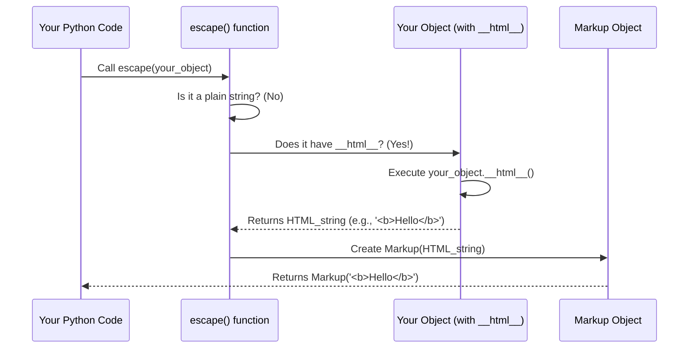
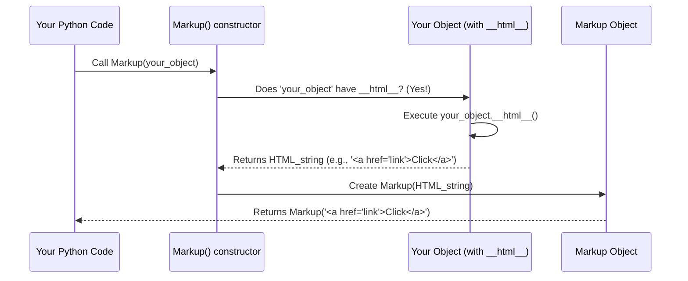

# Chapter 3: HTML Safety Protocol (`__html__`)

Welcome back! In [Chapter 1: Markup String](01_markup_string_.md), we learned about `Markup` strings, which are "certified safe" for HTML. In [Chapter 2: Escape Function](02_escape_function_.md), we explored the powerful `escape()` function, your security guard that transforms unsafe text into `Markup` strings. We briefly saw how `escape()` and the `Markup()` constructor checked for something called `__html__` on objects.

Now, let's unlock the secret of that special `__html__` method!

## What Problem Does `__html__` Solve?

Imagine you have a Python object that represents something complex, like a blog post or a user's profile. You want to display this object directly on your webpage, but its content might be a mix of plain text (like a username) and already formatted HTML (like a rich-text bio from an editor).

For example, let's say you have a `BlogPost` object:

```python
class BlogPost:
    def __init__(self, title, content, author_name):
        self.title = title
        self.content = content  # This might already contain HTML!
        self.author_name = author_name

# A blog post where content might have trusted HTML
post = BlogPost(
    "My First Post",
    "<p>This is <b>exciting</b>!</p>", # Trusted HTML
    "Alice"
)

# Or content from user input (potentially unsafe)
user_post = BlogPost(
    "User Comment",
    "Hello! <script>alert('malicious')</script>", # Untrusted!
    "Bob"
)
```

If you simply pass `post` or `user_post` directly to `escape()`, `markupsafe` will convert the *entire object* to a string (usually by calling `__str__` on it) and then escape *everything*. This means even your trusted `<b>` tags in `post.content` would become `&lt;b&gt;`! That's not what you want.

You need a way to tell `markupsafe`: "Hey, this object knows how to make itself into HTML. Trust its output, but I'll make sure it handles its own parts safely." This is exactly what the `__html__` protocol is for.

## What is the `__html__` Protocol?

The `__html__` protocol is a special method that a Python object can implement. When `markupsafe` functions (like `escape()` or the `Markup()` constructor) encounter an object that has this method, they don't convert the object to a string and then escape it. Instead, they **call the `__html__` method** on the object and **trust its return value** as already-safe HTML.

Think of it like this:
*   When you give `markupsafe` a regular string, it's like an "unknown package" – `markupsafe` carefully inspects and escapes it.
*   When you give `markupsafe` an object with `__html__`, it's like a "certified package" – the object itself says, "I've handled my contents, this is ready to go!" `markupsafe` then just takes what the object gives back.

This prevents unnecessary transformations and accidental double-escaping, giving you more control over how your custom objects are rendered in HTML.

## How to Implement `__html__`

Let's modify our `BlogPost` example to use `__html__`. Inside `__html__`, we'll combine the different parts of the post. Crucially, any part that comes from an **untrusted source** (like `author_name` or `user_post.content` if we didn't trust it) **must still be escaped** using `markupsafe.escape()`. Parts that are **already trusted HTML** can be wrapped in `Markup()` directly.

```python
from markupsafe import Markup, escape

class BlogPost:
    def __init__(self, title, content, author_name):
        self.title = title
        self.content = content
        self.author_name = author_name

    def __html__(self):
        # The title and author_name are plain text, so escape them.
        # The content might be trusted HTML, so wrap it in Markup.
        # If content were untrusted, you'd use escape(self.content).
        
        safe_title = escape(self.title)
        safe_author = escape(self.author_name)
        
        # Assume self.content is already trusted HTML from a rich text editor.
        # If it wasn't, you would use 'escape(self.content)' here.
        safe_content = Markup(self.content) 

        # Now combine them into a safe HTML string
        return Markup(f"<h2>{safe_title}</h2>"
                      f"<p>By: {safe_author}</p>"
                      f"<div>{safe_content}</div>")

# Create a blog post instance
my_post = BlogPost(
    "My Exciting Adventure!",
    "<p>This is <b>really fun</b>! &copy; 2023</p>", # Trusted HTML
    "Alice & Wonderland"
)

# Now, let's see what happens when we use escape() or Markup() with our object
safe_html_output = escape(my_post) 

print(safe_html_output)
print(type(safe_html_output))
```

**Output:**

```
<h2>My Exciting Adventure!</h2><p>By: Alice &amp; Wonderland</p><div><p>This is <b>really fun</b>! &copy; 2023</p></div>
<class 'markupsafe.Markup'>
```

**What happened here?**

1.  We created a `BlogPost` object `my_post`.
2.  When `escape(my_post)` was called, `markupsafe` saw that `my_post` had a `__html__` method.
3.  `markupsafe` then called `my_post.__html__()`.
4.  Inside `__html__`:
    *   `self.title` and `self.author_name` (plain text) were correctly escaped using `escape()`. Notice `Alice & Wonderland` became `Alice &amp; Wonderland`.
    *   `self.content` (which we assumed was already trusted HTML) was wrapped directly with `Markup()`. This preserved the `<b>` and `&copy;` (which is `&copy;` in HTML).
    *   All these `Markup` parts were combined, resulting in a single, well-formed, and safe `Markup` string.
5.  This final `Markup` string was then returned by `escape(my_post)`.

If we had *not* implemented `__html__`, `escape(my_post)` would have just called `str(my_post)` (which by default shows the object's memory address) and escaped *that*, which is not useful. Or, if you implemented `__str__`, it would escape your string, including any HTML tags.

## `__html__` and the `Markup()` Constructor

The `Markup()` constructor also looks for `__html__`:

```python
from markupsafe import Markup, escape

class Signature:
    def __init__(self, name, title):
        self.name = name
        self.title = title

    def __html__(self):
        # Escape untrusted parts, keep trusted parts (e.g., the <strong> tag)
        return Markup(f"<strong>{escape(self.name)}</strong>, {escape(self.title)}")

# Create a signature object
my_signature = Signature("Dr. Smith & Co.", "Head of Research")

# Pass it directly to the Markup constructor
safe_signature_html = Markup(my_signature)

print(safe_signature_html)
print(type(safe_signature_html))
```

**Output:**

```
<strong>Dr. Smith &amp; Co.</strong>, Head of Research
<class 'markupsafe.Markup'>
```

Just like with `escape()`, the `Markup()` constructor saw the `__html__` method on `my_signature`, called it, and used its output directly as the content for the new `Markup` string.

## Under the Hood: How `__html__` is Used

Let's revisit the core logic we saw in previous chapters and highlight where `__html__` plays its role.

### The `escape()` Function's Logic

As we learned in [Chapter 2: Escape Function](02_escape_function_.md), `escape()` checks for `__html__` right after checking if the input is a plain string.



And here's a simplified snippet of the `escape` function from `src/markupsafe/__init__.py`:

```python
# From src/markupsafe/__init__.py (simplified)

def escape(s: t.Any, /) -> Markup:
    # ... (skipping 'if type(s) is str' for this explanation)

    # Path for objects with __html__!
    if hasattr(s, "__html__"):
        return Markup(s.__html__()) # Calls __html__ and trusts its output

    # ... (skipping other cases)
```
As you can see, if an object has `__html__`, `escape` simply calls it, and wraps the result in a `Markup` object. It does *not* try to escape the string returned by `__html__` again.

### The `Markup()` Constructor's Logic

Similarly, the `Markup` constructor itself checks for `__html__` when you create a `Markup` object directly from another object:



And a simplified snippet of the `Markup` constructor from `src/markupsafe/__init__.py`:

```python
# From src/markupsafe/__init__.py (simplified)

class Markup(str):
    def __new__(
        cls, object: t.Any = "", encoding: str | None = None, errors: str = "strict"
    ) -> te.Self:
        # Path for objects with __html__!
        if hasattr(object, "__html__"):
            object = object.__html__() # Calls __html__ and uses its output

        # If no __html__, or after __html__ is called, create the Markup string
        if encoding is None:
            return super().__new__(cls, object)
        # ... (encoding handling skipped)
```
This shows that when you `Markup(some_object)`, `markupsafe` will first check for `some_object.__html__()` and use its result before creating the actual `Markup` string.

## Conclusion

The `__html__` protocol is a powerful feature that allows your custom Python objects to define their own HTML-safe representation. It's the "certified safe" stamp that an object can apply to itself. When `markupsafe` encounters an object with `__html__`, it trusts the output implicitly, assuming it's already safe HTML.

This means you gain flexibility to render complex objects, but it also places the responsibility on you: if your `__html__` method combines different pieces of data, you *must* ensure that any untrusted parts are properly escaped using `markupsafe.escape()` *within* your `__html__` method.

In the next chapter, we'll dive into the very core of how `markupsafe` performs the actual character replacements, the `_escape_inner` function.

[Core Escaping Logic (`_escape_inner`)](04_core_escaping_logic____escape_inner___.md)

---

Generated by **Codalytix AI Codebase Tutor**
(https://codalytix.com)
